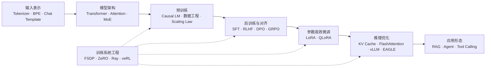

# LLM 学习地图

## 定位

这页用于把当前项目里的笔记串成一条学习路线。目标不是收集所有论文，而是围绕“大模型应用算法实习”建立可面试、可复盘、可扩展的知识结构。

一句话主线：

> 输入先被 tokenizer 和 chat template 组织成 token，再进入 Transformer；预训练形成基座能力，后训练塑造可用行为，微调适配场景，推理系统支撑上线，训练系统工程保证这些流程跑得动。

## 全流程图

## 推荐阅读顺序

1. [[输入表示/Tokenizer 和 BPE|Tokenizer 和 BPE]]：先理解文本如何变成 token。
2. [[输入表示/Chat Template 和 Tool Calling|Chat Template 和 Tool Calling]]：理解对话、函数调用、Agent 输入如何序列化。
3. [[模型架构/Transformer/Transformer 算法概述|Transformer 算法概述]]：建立模型结构总览。
4. [[模型架构/Transformer/注意力机制（MHA、MQA、GQA、MLA）|注意力机制]]、[[模型架构/Transformer/位置编码|位置编码]]、[[模型架构/Transformer/FFN|FFN]]、[[模型架构/Transformer/Layer Norm 和 RMS Norm|Norm]]：拆模块深入。
5. [[预训练/Causal LM Objective 和数据工程|预训练基础]]：理解基座模型能力来源。
6. [[预训练/Scaling Law 和资源预算|Scaling Law 和资源预算]]：理解参数、数据、算力的取舍。
7. [[后训练/SFT/LoRA 和 QLoRA|LoRA 和 QLoRA]]：掌握低成本适配。
8. [[后训练/RL 基础/RLHF 总览|RLHF 总览]]、[[后训练/RL 基础/Reward Return Value Advantage|Reward Return Value Advantage]]、[[后训练/RL 基础/Rollout 和采样|Rollout 和采样]]：打好 RL 后训练基础。
9. [[后训练/RL 算法/PPO/PPO 算法原理|PPO]]、[[后训练/RL 算法/DPO/DPO 算法原理|DPO]]、[[后训练/RL 算法/GRPO/GRPO 算法原理|GRPO]]、[[后训练/RL 算法/DAPO/DAPO 算法原理|DAPO]]、[[后训练/RL 算法/GSPO/GSPO 算法原理|GSPO]]、[[后训练/RL 算法/GiGPO/GiGPO 算法原理|GiGPO]]、[[后训练/RL 算法/Dr.GRPO/Dr.GRPO 算法原理|Dr.GRPO]]：按算法家族横向比较。
10. [[大模型推理/KV Cache|KV Cache]]、[[大模型推理/Flash Attention|Flash Attention]]、[[大模型推理/vLLM SGLang|vLLM SGLang]]、[[大模型推理/Speculative Decoding 和 EAGLE|Speculative Decoding 和 EAGLE]]：理解上线推理。
11. [[训练系统工程/FSDP ZeRO 和并行训练|FSDP ZeRO 和并行训练]]、[[训练系统工程/veRL Ray 后训练系统|veRL Ray 后训练系统]]：理解训练系统。

## 当前主题覆盖表

| 主题 | 当前覆盖 |
|---|---|
| 输入表示 | Tokenizer、BPE、Chat Template、Tool Calling |
| 基础架构 | Transformer、Attention、位置编码、FFN、Norm、MoE、多模态 |
| 预训练 | Causal LM、数据工程、Scaling Law、资源预算 |
| 后训练 | SFT、LoRA/QLoRA、RLHF、PPO、DPO、GRPO、DAPO、GSPO、GiGPO、Dr.GRPO |
| 推理优化 | FlashAttention、KV Cache、vLLM、SGLang、Speculative Decoding、EAGLE |
| 训练系统 | FSDP、ZeRO、Ray、veRL、资源估算 |
| 应用算法 | ReAct、Plan-and-Execute、Tool Calling |

## 面试复习方法

- 每个主题先能说出“一句话定位”。
- 每个算法至少掌握：解决什么问题、核心公式/流程、相比前一个方法改了什么、失败模式。
- 每个系统主题至少掌握：瓶颈是什么、优化的是显存/吞吐/延迟/稳定性的哪一项、和算法有什么接口。
- 每个应用主题至少掌握：输入输出协议、状态管理、评估指标、生产失败模式。

## 面试八股速查

1. [[后训练/大模型训练八股|大模型训练八股]]
2. [[后训练/RL 算法/RL 算法八股|RL 算法八股]]
3. [[后训练/RL 基础/Agentic RL 八股|Agentic RL 八股]]
4. [[训练系统工程/Infra 八股|Infra 八股]]
5. [[Agent 框架/Agent 框架八股|Agent 框架八股]]

## 缺口继续扩展方向

- RAG：召回、重排、上下文压缩、答案 groundedness。
- 评测：LLM-as-judge、偏好评测、Agent task success。
- 安全：越权工具调用、prompt injection、数据泄露。
- 多模态：视觉 token、视频采样、跨模态对齐。
- 长上下文：稀疏注意力、压缩记忆、上下文工程。
