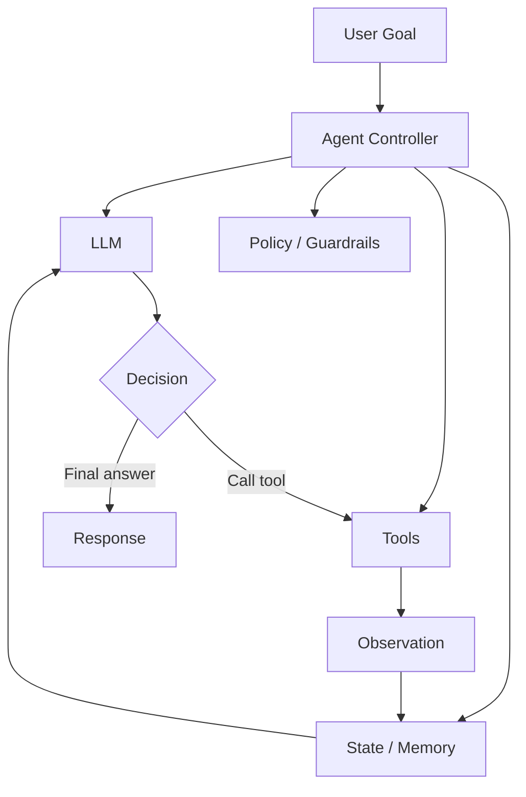
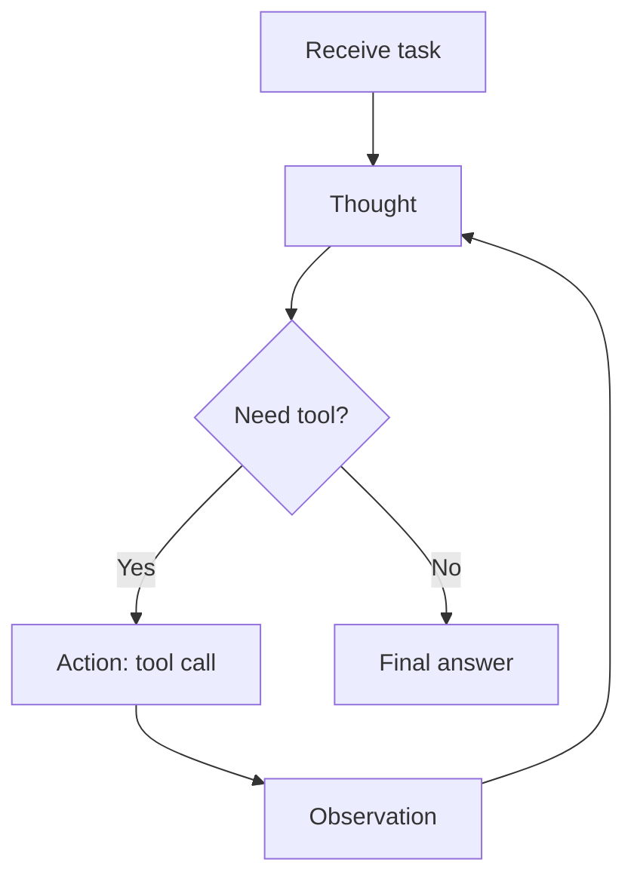
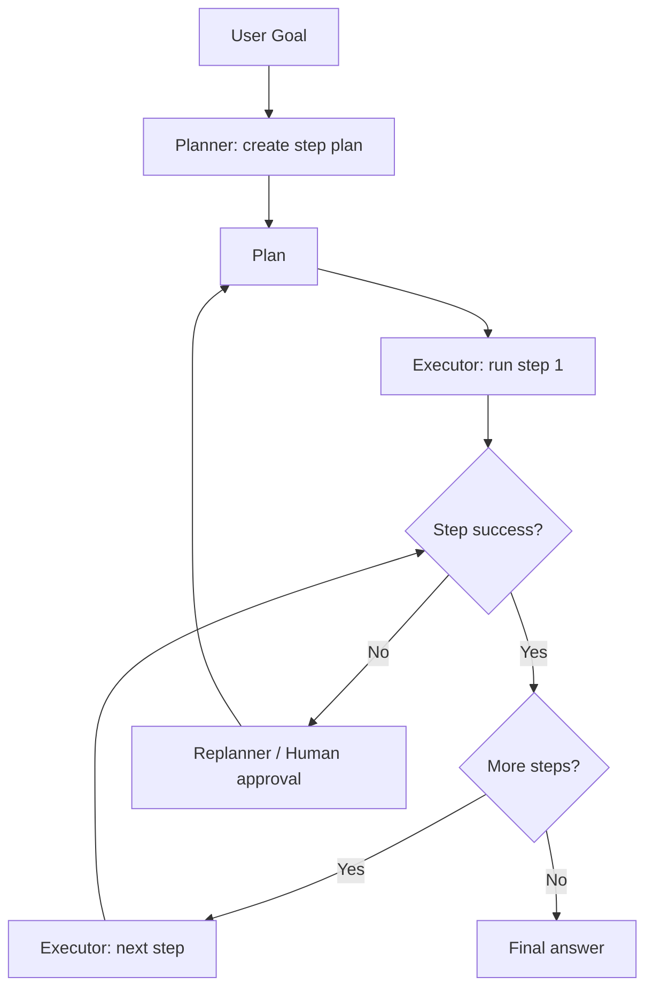
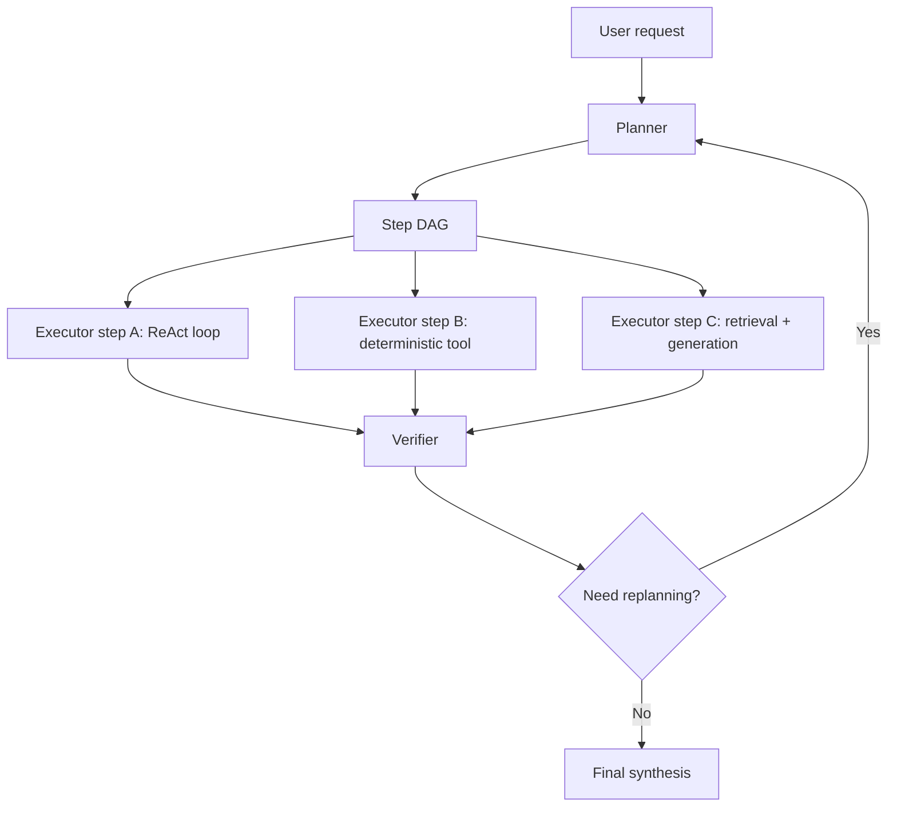

# ReAct 和 Plan-and-Execute

## 面试定位

大模型应用算法岗常见的 Agent 问题，不只是“会不会用 LangChain”。更重要的是能解释：

- LLM 为什么需要工具调用、记忆、规划和反思？
- ReAct 为什么适合短链路交互？
- Plan-and-Execute 为什么适合长任务？
- 如何避免工具误用、死循环、幻觉观察、权限越界和上下文膨胀？

一句话概括：

> ReAct 把推理和行动交替放在一个循环里；Plan-and-Execute 先生成较全局的计划，再按步骤执行，并在失败时重规划。

## Agent 的基本组成



基本模块：

| 模块         | 作用           | 常见实现                            |
| ---------- | ------------ | ------------------------------- |
| LLM        | 负责理解、推理、生成动作 | Chat model / reasoning model    |
| Tool       | 连接外部世界       | 搜索、数据库、代码执行、业务 API              |
| Memory     | 保存短期/长期状态    | 对话历史、向量库、任务状态                   |
| Controller | 管理循环和停止条件    | Agent loop / graph runtime      |
| Guardrails | 约束权限和格式      | schema、allowlist、human approval |

## ReAct 原理

ReAct = Reasoning + Acting。它让模型在每一步交替生成：

```text
Thought: 我需要知道什么 / 下一步怎么做
Action: 调用哪个工具以及参数
Observation: 工具返回了什么
...
Final: 最终回答
```

流程图：



ReAct 的核心价值：

- 推理轨迹帮助模型跟踪当前目标和中间状态。
- 工具调用让模型获取外部信息，减少纯参数记忆带来的幻觉。
- Observation 让模型能根据真实反馈修正下一步。
- 人可以审计 Thought/Action/Observation 轨迹，解释性更好。

## ReAct 示例

任务：查询某公司最新财报中的收入并换算同比增长。

```text
Thought: 我需要先找到该公司的最新财报数据。
Action: search_web({"query": "Company 2025 Q4 revenue"})
Observation: 找到官方 earnings release 页面。

Thought: 需要打开官方页面并提取 revenue 和 prior-year revenue。
Action: fetch_url({"url": "https://..."})
Observation: Revenue was $10.2B, compared with $8.9B last year.

Thought: 同比增长 = (10.2 - 8.9) / 8.9。
Action: calculator({"expression": "(10.2 - 8.9) / 8.9"})
Observation: 0.1461

Final: 最新季度收入为 10.2B，同比增长约 14.6%。
```

面试时可以强调：真实系统里不一定暴露 Thought 给用户，但内部可以保留结构化轨迹用于调试和评估。

## ReAct 的优缺点

| 方面 | 优点 | 缺点 |
|---|---|---|
| 灵活性 | 每一步根据观察动态决策 | 容易陷入局部循环 |
| 成本 | 简单任务成本低 | 长任务要多次调用大模型 |
| 可解释性 | 轨迹清晰 | 推理文本可能冗长 |
| 鲁棒性 | 能处理工具反馈 | 缺少全局计划时容易跑偏 |

适用场景：

- 需要边查边答。
- 工具反馈不确定。
- 任务步骤不长。
- 每一步动作依赖上一步观察。

不适用场景：

- 很长的多阶段项目。
- 明确需要全局任务拆解。
- 工具调用成本很高。
- 强合规流程，需要先审批计划再执行。

## Plan-and-Execute 原理

Plan-and-Execute 把 Agent 拆成两个阶段：

1. Planner：把目标拆成步骤。
2. Executor：逐步执行。

可选加入 Replanner：当执行失败或环境变化时重写计划。



典型计划：

```text
Goal: 生成一个竞品分析报告
Plan:
1. 确定竞品列表和分析维度
2. 收集每个竞品的官网、价格、核心功能
3. 对比目标用户、优势和限制
4. 生成结构化报告
5. 检查引用来源和事实一致性
```

## Plan-and-Execute 的优缺点

| 方面 | 优点 | 缺点 |
|---|---|---|
| 全局性 | 先拆解任务，减少跑偏 | 初始计划可能错误 |
| 成本 | 可让小模型执行子任务 | 规划和重规划有额外调用 |
| 并行 | 独立步骤可并行 | 步骤依赖需要管理 |
| 可控性 | 易做人审和权限控制 | 对动态环境响应不如 ReAct 自然 |

适用场景：

- 长任务、多阶段任务。
- 需要用户先确认计划。
- 可以把任务拆给不同工具或子 Agent。
- 对执行顺序、权限和审计要求高。

不适用场景：

- 任务很短，一两步就能完成。
- 每一步都高度依赖实时观察。
- 环境变化很快，计划很容易过期。

## ReAct vs Plan-and-Execute

| 维度 | ReAct | Plan-and-Execute |
|---|---|---|
| 决策方式 | 每步即时决策 | 先全局规划，再执行 |
| 适合任务 | 短链路、探索式 | 长链路、项目式 |
| 成本结构 | 每步都可能调用大模型 | planner 可大模型，executor 可小模型 |
| 风险 | 循环、上下文膨胀 | 计划不准、执行偏离计划 |
| 典型优化 | stop condition、tool schema、反思 | plan validation、replanning、DAG 并行 |

一句面试回答：

> ReAct 更像边走边看，适合信息获取和短任务；Plan-and-Execute 更像先做任务分解，适合长任务和需要审计的流程。生产系统常把二者结合：先规划，再让每个步骤内部用 ReAct 执行。

## 混合架构

实际系统中常见组合：



这种设计的好处：

- Planner 控制全局方向。
- ReAct 处理局部不确定性。
- Verifier 检查事实、格式和约束。
- DAG 让无依赖步骤并行执行。

## 工具调用设计

工具定义要清晰、窄接口、强 schema。

反例：

```json
{
  "name": "do_anything",
  "description": "执行任意任务",
  "parameters": {"input": "string"}
}
```

更好的设计：

```json
{
  "name": "search_docs",
  "description": "在内部知识库检索与问题相关的文档片段",
  "parameters": {
    "query": "string",
    "top_k": "integer",
    "filters": {
      "department": "string",
      "date_range": "string"
    }
  }
}
```

设计原则：

- 工具名表达动作。
- description 写清适用边界。
- 参数尽量结构化。
- 返回值包含状态码、摘要、原始引用。
- 危险操作必须有人审或权限校验。

## 记忆机制

Agent 里的 memory 分三类：

| 类型 | 内容 | 风险 |
|---|---|---|
| Working memory | 当前任务状态、中间结果 | 上下文过长 |
| Episodic memory | 历史任务经验 | 错误经验污染 |
| Semantic memory | 用户偏好、长期知识 | 隐私和过期问题 |

应用算法岗常见回答：

- 短期状态用结构化 state，不要只堆聊天记录。
- 长期记忆要可检索、可删除、可过期。
- 重要状态要由工具或数据库保存，不依赖模型“记得”。

## 常见失败模式

| 失败模式 | 表现 | 解决方法 |
|---|---|---|
| 工具幻觉 | 调用不存在的工具或参数 | function schema、工具白名单 |
| 观察幻觉 | 工具没返回却编造结果 | 强制引用 observation |
| 死循环 | 重复搜索/重试 | max iterations、失败计数 |
| 上下文膨胀 | 历史轨迹越来越长 | 状态摘要、检查点 |
| 权限越界 | 执行危险操作 | policy gate、human-in-the-loop |
| 计划漂移 | 执行偏离原目标 | plan lock、verifier |
| 错误恢复差 | 工具报错后继续乱试 | 分类错误、重规划 |

## 评估指标

Agent 不能只看最终文本质量，还要看过程指标：

| 指标 | 说明 |
|---|---|
| task success rate | 端到端任务成功率 |
| tool call accuracy | 工具选择和参数是否正确 |
| step efficiency | 完成任务所需步骤数 |
| cost / latency | token 成本和耗时 |
| groundedness | 最终回答是否被 observation 支撑 |
| safety violation rate | 是否触发越权或危险动作 |
| recovery rate | 工具失败后能否恢复 |

## 面试高频问题

1. **ReAct 和 CoT 的区别？**  
   CoT 主要是内部推理链；ReAct 把推理和外部动作交替起来，能通过工具获取新信息。

2. **为什么 Plan-and-Execute 可能比 ReAct 便宜？**  
   大模型只负责规划和关键重规划，普通步骤可以交给小模型或确定性工具执行。

3. **Agent 为什么容易不稳定？**  
   每一步输出都会影响后续状态，工具错误、上下文污染、计划偏移会级联放大。

4. **如何防止 Agent 乱调用工具？**  
   使用结构化 tool schema、权限白名单、参数校验、动作审批和工具结果验证。

5. **什么时候需要 human-in-the-loop？**  
   涉及付款、删除、外发消息、生产环境修改、隐私数据访问等不可轻易回滚的动作。

6. **Agent 和 RAG 的关系？**  
   RAG 是一种信息获取和 grounding 机制；Agent 可以把 RAG 当作工具，也可以动态决定是否检索、检索什么、如何使用结果。

## 生产落地清单

- 给每个工具定义输入/输出 schema。
- 每轮循环记录 state，而不是只追加自然语言历史。
- 设置最大步数、最大成本、超时和失败阈值。
- 对高风险动作做人审。
- 最终答案必须能追溯到 tool observation 或内部状态。
- 对常见任务建立离线 benchmark。
- 记录轨迹用于错误分析：目标、计划、动作、观察、最终回答。

## 参考资料

- [ReAct: Synergizing Reasoning and Acting in Language Models, Yao et al., 2022](https://arxiv.org/abs/2210.03629)
- [LangChain: Plan-and-Execute Agents](https://www.langchain.com/blog/plan-and-execute-agents)
- [LangGraph Plan-and-Execute Agent Architectures](https://www.langchain.com/blog/planning-agents)
