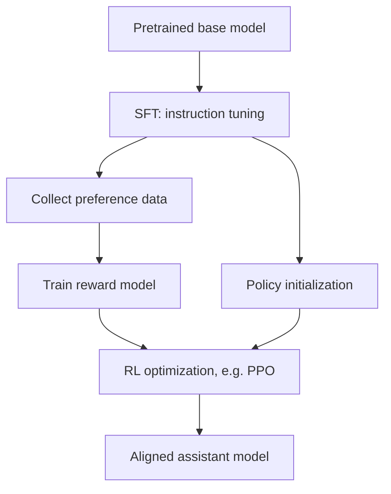

# RLHF 总览

## 面试定位

RLHF（Reinforcement Learning from Human Feedback）回答的是：模型已经会续写文本后，如何让它更符合人类偏好、更有帮助、更安全、更会遵循指令。

一句话概括：

> RLHF 先用 SFT 建立助手行为，再用偏好数据训练奖励信号，最后通过 PPO/DPO/GRPO 等方法让模型更偏向高质量回答。

## 经典 RLHF 流程



三个阶段：

| 阶段 | 输入 | 输出 | 目标 |
|---|---|---|---|
| SFT | 指令-答案数据 | SFT model | 学会基本对话格式和任务行为 |
| Reward Modeling | chosen/rejected 偏好对 | reward model | 学会给回答打偏好分 |
| RL / Preference Optimization | prompt、奖励或偏好 | aligned policy | 优化模型行为 |

## RLHF 和 SFT 的区别

SFT 是模仿学习：

$$
\max_\theta \log p_\theta(y_{\text{demo}}|x)
$$

它只告诉模型“这个答案应该学”，但不直接告诉模型多个候选答案中哪个更好。

RLHF/偏好优化关心排序：

```text
answer A > answer B
```

它让模型学会偏向更符合人类偏好的回答。

## 奖励模型

Reward model 输入 prompt 和回答，输出标量分数：

$$
r_\phi(x,y)
$$

偏好对训练常用 Bradley-Terry loss：

$$
\mathcal{L}_{RM}=
-\log\sigma(r_\phi(x,y_w)-r_\phi(x,y_l))
$$

其中 $y_w$ 是 chosen，$y_l$ 是 rejected。

## PPO、DPO、GRPO 的位置

| 方法 | 是否训练 reward model | 是否在线采样 | 是否需要 critic | 典型用途 |
|---|---|---|---|---|
| PPO | 通常需要 | 是 | 是 | 经典 RLHF |
| DPO | 不需要显式 RM | 否 | 否 | 离线偏好优化 |
| GRPO | 可用规则/RM | 是 | 否 | 可验证推理奖励 |

DPO 可以理解为把 reward modeling 和 policy optimization 合并到一个偏好 loss 中。GRPO 则更适合数学/代码这种可用规则验证的任务。

## KL 约束

只最大化 reward 很容易 reward hacking，因此常加 reference model 约束：

$$
R_{\text{total}}(x,y)=r(x,y)-\beta D_{\text{KL}}(\pi_\theta(\cdot|x)\|\pi_{\text{ref}}(\cdot|x))
$$

作用：

- 防止模型偏离 SFT 分布太远。
- 保持语言质量。
- 降低奖励模型漏洞被利用的风险。

## 失败模式

| 问题 | 表现 | 原因 |
|---|---|---|
| reward hacking | reward 高但人看差 | 奖励模型或规则有漏洞 |
| 过度拒答 | 安全但没帮助 | 偏好数据偏保守 |
| 长度偏置 | 越长越高分 | reward 未控制长度 |
| 风格过拟合 | 固定套话 | 偏好数据风格单一 |
| 分布漂移 | 输出变怪 | KL 约束不足或学习率过大 |

## 面试高频问题

1. **RLHF 为什么需要 SFT？**  
   SFT 提供基本可用的助手策略，否则 RL 初始策略太差，采样和奖励都不稳定。

2. **为什么需要 KL reference？**  
   防止 policy 为了高 reward 远离原模型分布，保持语言质量和安全边界。

3. **DPO 是 RLHF 吗？**  
   广义上属于偏好对齐方法；它不用显式 reward model 和在线 PPO，但目标仍是利用人类偏好优化模型。

4. **规则奖励和人类偏好奖励有什么区别？**  
   规则奖励适合数学/代码等可验证任务；人类偏好更适合开放式回答质量。

## 参考资料

- [Training language models to follow instructions with human feedback](https://arxiv.org/abs/2203.02155)
- [Direct Preference Optimization](https://arxiv.org/abs/2305.18290)
- [DeepSeekMath](https://arxiv.org/abs/2402.03300)
