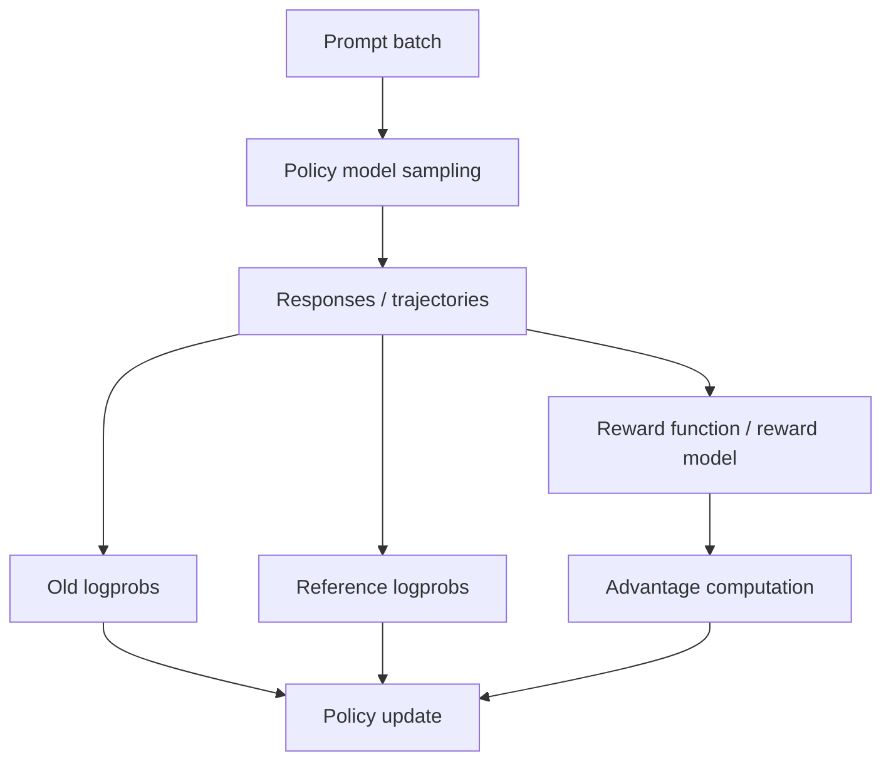

# Rollout 和采样

## 面试定位

Rollout 是在线 RL 后训练的核心数据生成环节。PPO、GRPO、DAPO、GiGPO 都需要让当前策略生成样本，再用奖励更新策略。

一句话概括：

> Rollout 是用当前或旧 policy 在 prompt/environment 上采样 response/trajectory，得到训练算法需要的 logprob、reward、advantage 和状态轨迹。

## Rollout 流程



Rollout 需要保存：

- prompt。
- generated tokens。
- attention mask。
- old policy logprobs。
- rewards。
- advantages。
- reference logprobs 或 KL。
- 对 Agent：tool actions、observations、environment states。

## 采样参数

| 参数 | 作用 |
|---|---|
| temperature | 控制随机性 |
| top_p | nucleus sampling |
| top_k | 限制候选 token 数 |
| max_new_tokens | 最大生成长度 |
| stop tokens | 停止条件 |
| num_samples / group_size | 每个 prompt 采样多少条 |

Reasoning RL 中常对每个 prompt 采多条回答，形成 group comparison。

## On-policy 与 Off-policy

PPO/GRPO 通常接近 on-policy：

- 用旧策略采样 rollout。
- 用当前策略更新若干 step。
- 不能让 policy 偏离旧策略太远。

importance ratio：

$$
\rho_t(\theta)=
\frac{\pi_\theta(a_t|s_t)}
\pi_{\theta_{\text{old}}}(a_t|s_t)}
$$

如果新旧策略差太远，ratio 会极端，训练不稳定。

## Rollout 与推理系统

大模型 RL 的 rollout 不是小成本操作：

- 需要高吞吐生成。
- 需要多样采样。
- 需要保存 logprob。
- 需要与训练 worker 同步。
- 对 Agent 还需要环境交互。

常见系统组合：

```text
actor/trainer: FSDP/Megatron
rollout engine: vLLM/SGLang
reward worker: rules/RM/API
controller: Ray/veRL
```

## GRPO/DAPO 中的 Group Rollout

对每个 prompt 采样 `G` 个回答：

```text
q -> o1, o2, ..., oG
```

再计算组内 reward：

```text
rewards = [0, 1, 0, 1]
advantage = normalize within group
```

DAPO 的 dynamic sampling 会尽量保留既有正确又有错误的 group，避免全对/全错无信号。

## Agent Rollout

Agent rollout 是多轮轨迹：

```text
state_0 -> action_0 -> observation_1
state_1 -> action_1 -> observation_2
...
final -> reward
```

需要额外记录：

- tool call JSON。
- tool result。
- action validity。
- step count。
- final success。
- intermediate rewards。

GiGPO 等算法就是针对这种多轮轨迹 credit assignment 设计的。

## 常见问题

| 问题 | 表现 | 处理 |
|---|---|---|
| 采样不够多样 | group 内全对/全错 | 调 temperature、group size、题目难度 |
| rollout 太慢 | GPU 等数据 | 使用 vLLM/SGLang、并行 rollout |
| logprob 不一致 | ratio 异常 | 保证 tokenizer/template/precision 一致 |
| 长度失控 | 长 CoT 无效增长 | max length、长度惩罚、Dr.GRPO/DAPO |
| reward 延迟 | 训练吞吐低 | reward 并行化、缓存、规则优化 |

## 面试高频问题

1. **Rollout 是训练还是推理？**  
   它用推理方式生成样本，但服务于训练更新。

2. **为什么 PPO/GRPO 要 old logprob？**  
   需要计算新旧策略概率比，限制更新幅度。

3. **为什么 rollout 系统常用 vLLM？**  
   RL 需要大量生成样本，vLLM 这类推理引擎能提高生成吞吐和 KV Cache 利用率。

4. **Agent rollout 比普通 response rollout 难在哪里？**  
   它包含环境状态、工具动作、观察结果和多步 credit assignment。

## 参考资料

- [Proximal Policy Optimization Algorithms](https://arxiv.org/abs/1707.06347)
- [DeepSeekMath](https://arxiv.org/abs/2402.03300)
- [veRL GitHub](https://github.com/verl-project/verl)
