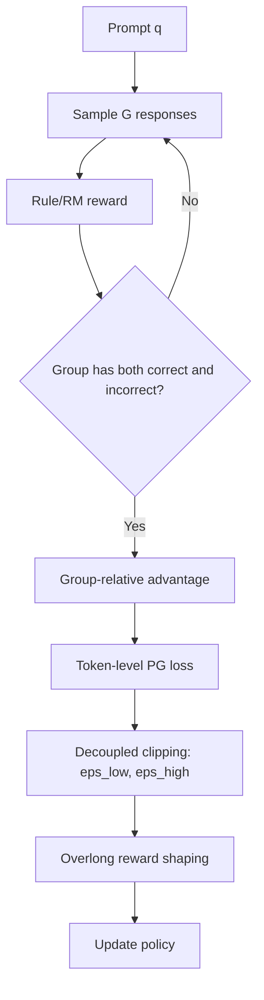

# DAPO 算法原理

## 面试定位

DAPO（Decoupled Clip and Dynamic sAmpling Policy Optimization）是 2025 年提出的面向大规模 LLM 推理强化学习的算法/系统方案。它建立在 GRPO 思路上，针对长 CoT 推理训练中的几个关键问题做了工程化改进。

面试重点：

- DAPO 和 GRPO 的关系是什么？
- Dynamic Sampling 解决什么问题？
- Clip-Higher 为什么是非对称 clip？
- Token-level policy gradient loss 和 sequence-level reward 怎么配合？
- Overlong Reward Shaping 为什么重要？

一句话概括：

> DAPO 是对 GRPO 的大规模推理 RL 改造：用动态采样保证组内有学习信号，用非对称裁剪保留正向探索，用 token-level loss 和长度惩罚稳定长 CoT 训练。

## 背景：GRPO 的几个痛点

GRPO 已经省掉 critic，但在长 CoT reasoning 中仍有问题：

| 痛点 | 表现 |
|---|---|
| 全对/全错组 | 同组 reward 没差异，advantage 无效 |
| clip 过保守 | 好样本的概率提升过早被压制 |
| 长度偏置 | 长回答可能主导梯度或产生无效超长推理 |
| token 归因难 | sequence reward 要分给很多 token |
| 可复现性弱 | 很多 reasoning RL 细节未公开 |

DAPO 论文声称其开源了算法、训练代码和数据处理流程，并在 Qwen2.5-32B base 上取得较强 AIME 2024 表现。

## 整体流程

## DAPO 目标函数

DAPO 的目标可以写成：

$$
J_{\mathrm{DAPO}}(\theta)=
\mathbb{E}\left[
\frac{1}{\sum_{i=1}^{G}|o_i|}
\sum_{i=1}^{G}\sum_{t=1}^{|o_i|}
\min\left(
r_{i,t}(\theta)\hat{A}_{i,t},
\text{clip}(r_{i,t}(\theta),1-\varepsilon_{\text{low}},1+\varepsilon_{\text{high}})\hat{A}_{i,t}
\right)
\right]
$$

其中：

$$
r_{i,t}(\theta)=
\frac{\pi_\theta(o_{i,t}|q,o_{i,<t})}
{\pi_{\theta_{\text{old}}}(o_{i,t}|q,o_{i,<t})}
$$

`ε_low` 和 `ε_high` 是解耦的上下裁剪边界，通常 `ε_high > ε_low`。

## 四个关键技术

### 1. Clip-Higher

GRPO/PPO 常用对称裁剪：

$$
[1-\epsilon,1+\epsilon]
$$

DAPO 使用非对称裁剪：

$$
[1-\epsilon_{\text{low}},1+\epsilon_{\text{high}}]
$$

并让：

$$
\epsilon_{\text{high}} > \epsilon_{\text{low}}
$$

直觉：

- 对负向样本，仍然限制策略过度降低概率，避免训练不稳。
- 对正向样本，允许更大的概率提升，避免“好推理路径”太早被 clip 掉。
- 这有利于保持探索和防止 entropy 过早坍缩。

面试表达：

> Clip-Higher 不是简单放大学习率，而是只放宽上界，让正 advantage 的有效更新空间更大，同时保留下界约束以控制坏样本方向的更新风险。

### 2. Dynamic Sampling

对于同一个 prompt 采样 G 个回答后，DAPO 希望组内既有正确也有错误：

$$
0 <
\left|\{o_i \mid \text{is\_equivalent}(a,o_i)\}\right|
< G
$$

如果一组全对或全错，就重新采样，直到满足条件或达到最大重采样次数。

为什么重要：

- GRPO 的 advantage 来自组内相对奖励。
- 全对/全错时 reward 方差为 0，没有有效学习方向。
- 动态采样把训练预算集中到“模型有能力但不稳定”的样本上。

代价：

- 增加采样成本。
- 对很容易或很难的问题可能频繁重采样。
- 需要设置最大重采样次数，避免无限等待。

### 3. Token-Level Policy Gradient Loss

DAPO 强调 token-level loss，按有效 token 归一：

$$
\frac{1}{\sum_i |o_i|}\sum_i\sum_t(\cdots)
$$

和简单 sequence 平均相比，这样对长短回答的梯度贡献更可控，特别适合长 CoT。

要点：

- reward 仍可来自 sequence-level correctness。
- advantage 可广播到 token。
- loss 聚合按 token 归一，降低 response 长度差异带来的偏置。

### 4. Overlong Reward Shaping

长 CoT 训练容易出现“越想越长”，甚至超出有效推理长度。DAPO 对过长回答加入惩罚：

- 低于 `safe_length` 不罚。
- 超过后线性惩罚。
- 到 `max_length` 或 cutoff 后强惩罚/丢弃。

直觉：

> 推理模型需要学会充分思考，但不能把无意义延长当成提高奖励的捷径。

## 与 GRPO 的对比

| 维度 | GRPO | DAPO |
|---|---|---|
| advantage | 组内相对 reward | 组内相对 reward |
| critic | 不需要 | 不需要 |
| 采样 | 固定采样 G 条 | 动态采样，尽量保留有差异的组 |
| clipping | 通常对称 | 上下界解耦，Clip-Higher |
| 长度处理 | 依实现而定 | 明确 overlong shaping |
| 长 CoT | 可用但不稳定因素多 | 专门针对长 CoT 稳定性优化 |

## 为什么 DAPO 适合 reasoning RL

数学、代码、逻辑推理任务的特点：

- 结果可以规则判定。
- 同一题可采样多条解题路径。
- 中间推理较长，长度变化大。
- 模型在“会/不会”之间有灰区，需要强化正确路径。

DAPO 的动态采样和非对称 clip 正好围绕这些特点设计。

## 工程配置关注点

常见关键超参：

| 参数 | 作用 |
|---|---|
| `group_size` | 每个 prompt 采样回答数 |
| `max_resample` | 动态采样最大重试次数 |
| `clip_ratio_low` | 下界裁剪 |
| `clip_ratio_high` | 上界裁剪 |
| `safe_length` | 不惩罚的安全长度 |
| `max_length` | 最大生成长度或截断长度 |
| `len_reward_penalty` | 长度惩罚强度 |
| `kl_beta` | reference KL 强度 |

监控指标：

- AIME/数学任务准确率。
- reward 均值和方差。
- response length 均值和分位数。
- 全对/全错 group 比例。
- 重采样次数分布。
- entropy。
- clip fraction。
- KL to reference。

## 可能的失败模式

| 问题 | 表现 | 处理 |
|---|---|---|
| 重采样成本过高 | 训练吞吐下降 | 过滤太难/太易样本，调 group size |
| 长度惩罚过强 | 模型不愿展开推理 | 提高 safe_length，降低惩罚 |
| clip high 过大 | KL 飙升，训练不稳 | 降低 `ε_high` 或学习率 |
| 奖励规则漏洞 | 模型学会投机格式 | 改 reward parser，加入人工/单测 |
| 数据过窄 | 只会特定题型 | 扩充 prompt 分布 |

## 面试高频问题

1. **DAPO 是不是全新 RL 框架？**  
   更准确说，它是基于 GRPO/PPO-style policy optimization 的大规模 LLM reasoning RL 改造，重点在动态采样、解耦裁剪、token-level loss 和长度 shaping。

2. **Dynamic Sampling 解决什么？**  
   解决组内全对/全错导致 advantage 无效的问题，提高每个 group 的训练信号密度。

3. **为什么 `ε_high` 要大于 `ε_low`？**  
   给正 advantage 样本更大上升空间，避免好样本概率提升过早被 clip，同时仍限制负向更新。

4. **Overlong Reward Shaping 会不会抑制推理？**  
   会有这个风险，所以需要设置 safe length，让合理长 CoT 不受罚，只惩罚异常超长。

5. **DAPO 和 DPO 有关系吗？**  
   名字相似但范式不同。DPO 是离线偏好优化；DAPO 是在线采样的 policy optimization。

## 参考资料

- [DAPO: An Open-Source LLM Reinforcement Learning System at Scale, Yu et al., 2025](https://arxiv.org/abs/2503.14476)
- [BytedTsinghua-SIA/DAPO GitHub](https://github.com/BytedTsinghua-SIA/DAPO)
- [RLinf DAPO Documentation](https://rlinf.readthedocs.io/en/latest/rst_source/tutorials/rlalg/dapo.html)
