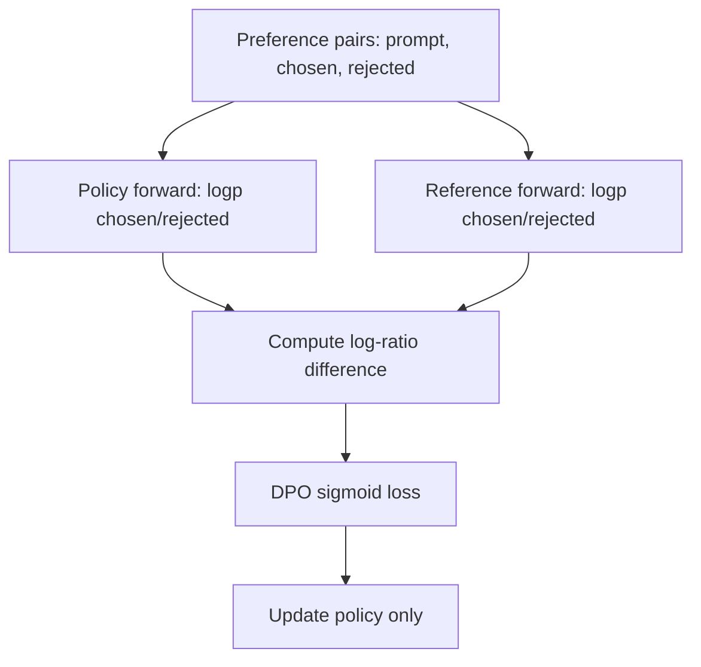

# DPO 算法原理

## 面试定位

DPO（Direct Preference Optimization）是偏好对齐中最常被问的算法之一。它的卖点是：不用训练显式 reward model，也不用 PPO 在线采样，直接用偏好数据优化 policy。

面试重点：

- DPO 如何从 RLHF 目标推出来？
- DPO loss 为什么像二分类？
- `β` 和 reference model 起什么作用？
- DPO 相比 PPO 的优势和局限是什么？

一句话概括：

> DPO 利用 KL 约束下最优策略和奖励函数之间的闭式关系，把“偏好学习 + RL 优化”合并成一个基于 chosen/rejected 的分类损失。

## 数据形式

DPO 训练数据是偏好对：

```json
{
  "prompt": "解释一下 Transformer 的 attention。",
  "chosen": "Attention 可以理解为...",
  "rejected": "Transformer 是一种数据库..."
}
```

记作：

- `x`：prompt。
- `y_w`：winner/chosen，被偏好的回答。
- `y_l`：loser/rejected，不被偏好的回答。

## 从 RLHF 到 DPO

经典 RLHF 的 KL 约束目标：

$$
\max_{\pi_\theta}\ \mathbb{E}_{y\sim\pi_\theta(\cdot|x)}[r(x,y)]
-\beta D_{\text{KL}}\left(\pi_\theta(y|x)\|\pi_{\text{ref}}(y|x)\right)
$$

这个目标的最优策略满足：

$$
\pi^*(y|x)=\frac{1}{Z(x)}\pi_{\text{ref}}(y|x)\exp\left(\frac{1}{\beta}r(x,y)\right)
$$

反过来可以把 reward 写成 policy 和 reference policy 的 log-ratio：

$$
r(x,y)=\beta \log \frac{\pi^*(y|x)}{\pi_{\text{ref}}(y|x)} + \beta \log Z(x)
$$

在偏好比较里，同一个 prompt 下的 `Z(x)` 会相互抵消。

## 偏好概率模型

DPO 使用 Bradley-Terry 形式建模偏好概率：

$$
p(y_w \succ y_l|x)=\sigma(r(x,y_w)-r(x,y_l))
$$

把上面的 reward 参数化代入，得到：

$$
p_\theta(y_w \succ y_l|x)=
\sigma\left(
\beta\left[
\log\frac{\pi_\theta(y_w|x)}{\pi_{\text{ref}}(y_w|x)}
-
\log\frac{\pi_\theta(y_l|x)}{\pi_{\text{ref}}(y_l|x)}
\right]
\right)
$$

DPO loss：

$$
\mathcal{L}_{\text{DPO}}(\theta)=
-\mathbb{E}_{(x,y_w,y_l)}
\log\sigma\left(
\beta\left[
\log\frac{\pi_\theta(y_w|x)}{\pi_{\text{ref}}(y_w|x)}
-
\log\frac{\pi_\theta(y_l|x)}{\pi_{\text{ref}}(y_l|x)}
\right]
\right)
$$

实现时通常计算 sequence log-prob：

$$
\log\pi_\theta(y|x)=\sum_{t=1}^{|y|}\log\pi_\theta(y_t|x,y_{<t})
$$

可按长度做归一化，也可不做，取决于实现和任务。

## 训练流程



reference model 冻结，policy model 更新。DPO 训练不需要在线 rollout，也不需要 reward model 打分。

## 直觉解释

DPO 优化的是：

```text
让 policy 相对 reference 更偏向 chosen，
同时相对 reference 更远离 rejected。
```

关键不是简单提高 `chosen` 概率、降低 `rejected` 概率，而是提高二者相对于 reference 的差距：

$$
\Delta_\theta =
\log\frac{\pi_\theta(y_w|x)}{\pi_{\text{ref}}(y_w|x)}
-
\log\frac{\pi_\theta(y_l|x)}{\pi_{\text{ref}}(y_l|x)}
$$

如果 policy 已经比 reference 更偏好 chosen，loss 会变小。

## β 的作用

`β` 来自 KL 约束目标，可以理解为 reference 约束强度/温度参数。理论上，原始 RLHF 目标里的 `β` 越大，最优策略越不容易远离 reference；`β` 越小，允许更大的 policy 偏移。实际 DPO 实现中，`β` 还会缩放 log-ratio margin，影响梯度尺度和 sigmoid 饱和速度，所以需要通过验证集调参。

| β | 效果 |
|---:|---|
| 较大 | 理论上更强 reference 约束；实现中 margin 更容易饱和 |
| 较小 | 允许更大 policy 偏移；过小可能训练信号弱或需要更多 step |

不同实现对默认值和长度归一方式可能不同，面试中抓住“reference 约束强度 / KL 温度 / log-ratio margin 缩放”即可。

## DPO 的优点

- 简单：一个 supervised-like loss。
- 稳定：没有 PPO 那样复杂的在线 RL loop。
- 成本低：不需要训练 reward model 和 value model。
- 易复现：直接用静态偏好数据训练。
- 工程友好：和 SFT 训练管线很像。

## DPO 的局限

| 局限 | 解释 |
|---|---|
| 依赖偏好数据质量 | chosen/rejected 噪声会直接影响 policy |
| 离线优化 | 不会主动探索新回答 |
| 对 hard negative 敏感 | rejected 太弱时学习信号有限 |
| 可能过优化风格 | 学会偏好数据的格式偏置 |
| 多轮/工具任务不直接 | 偏好对通常是静态 response，不覆盖交互轨迹 |

## DPO vs PPO

| 维度 | DPO | PPO |
|---|---|---|
| 数据 | 离线偏好对 | 在线 rollout + reward |
| reward model | 不需要显式 RM | 通常需要 RM |
| value model | 不需要 | 需要 critic |
| 训练稳定性 | 较稳定 | 超参敏感 |
| 探索能力 | 弱 | 强一些 |
| 工程复杂度 | 低 | 高 |

面试回答可以这样组织：

> 如果已经有高质量偏好对，DPO 是更简单的首选；如果目标需要在线探索、复杂奖励或多步环境反馈，PPO/GRPO 类在线 RL 更合适。

## 常见变体

| 算法 | 动机 |
|---|---|
| IPO | 改善 DPO 对偏好噪声和过优化的敏感性 |
| KTO | 不要求成对偏好，使用 desirable/undesirable 标签 |
| ORPO | 把 SFT 和偏好优化合并到一个目标 |
| SimPO | 去掉 reference model 或简化 reference 依赖 |

注意：面试中提变体时不要背名字，要说清它们试图解决什么问题。

## 实战注意点

- chosen/rejected 必须对应同一个 prompt。
- 两个回答长度差异很大时，要关注 length bias。
- reference model 通常是 SFT model，而不是 base model。
- DPO 前通常先做 SFT，否则模型可能连基本指令格式都不稳定。
- 固定 eval set 要包含 win rate、格式遵循、事实性和安全性。
- 不要只看 DPO loss，loss 下降不必然等于人类偏好提升。

## 面试高频问题

1. **DPO 为什么不需要 reward model？**  
   它利用 KL 约束下最优策略和 reward 的闭式关系，把 reward 差替换成 policy/reference 的 log-ratio 差。

2. **DPO 为什么不需要采样？**  
   训练数据已经给定 chosen/rejected，loss 可直接通过 teacher forcing 计算这些回答的 log-prob。

3. **DPO 是不是一定比 PPO 好？**  
   不是。DPO 工程简单且稳定，但探索能力弱；PPO 更适合在线奖励和复杂环境。

4. **reference model 的作用是什么？**  
   提供行为锚点，防止 policy 只为偏好数据过度偏移。

5. **DPO 会不会过拟合？**  
   会，尤其在偏好数据规模小、风格单一或 rejected 太弱时。

## 参考资料

- [Direct Preference Optimization: Your Language Model is Secretly a Reward Model, Rafailov et al., 2023](https://arxiv.org/abs/2305.18290)
- [NeurIPS 2023 DPO paper](https://papers.nips.cc/paper_files/paper/2023/hash/a85b405ed65c6477a4fe8302b5e06ce7-Abstract-Conference.html)
