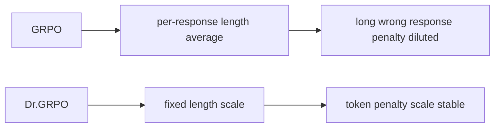

# Dr.GRPO 算法原理

## 面试定位

Dr.GRPO 通常指 “GRPO Done Right”，来自论文 *Understanding R1-Zero-Like Training: A Critical Perspective*。它不是重新发明一个完全不同的 RL 框架，而是指出标准 GRPO 实现中的两个偏置来源，并给出更无偏的修正。

面试重点：

- GRPO 为什么会鼓励 response 变长？
- `1/|o_i|` 长度归一化为什么会带来偏置？
- group std normalization 为什么可能带来难度偏置？
- Dr.GRPO 改了哪些项？
- Dr.GRPO 和 DAPO/GSPO 的改进方向有什么不同？

一句话概括：

> Dr.GRPO 去掉 GRPO 中的 per-response length normalization 和 group std normalization，用固定常数做 loss scale，减少训练中错误回答越变越长的偏置。

## 背景：R1-Zero-Like Training

R1-Zero-like 训练指直接对 base model 做 RLVR（Reinforcement Learning with Verifiable Rewards），用规则奖励提升推理能力：

```text
base model -> sample multiple reasoning responses -> verify answer -> GRPO-style update
```

这类训练常用于数学、代码等可验证任务。DeepSeek-R1-Zero 展示了这种路线的潜力，但复现过程中发现：

- base model 本身预训练能力很关键。
- prompt template 会显著影响效果。
- GRPO 目标中的某些归一化会引入优化偏置。

Dr.GRPO 关注第三点。

## 标准 GRPO 回顾

对同一 prompt `q` 采样 `G` 条回答：

$$
\{o_i\}_{i=1}^{G}\sim\pi_{\theta_{\text{old}}}(\cdot|q)
$$

奖励：

$$
r_i=R(q,o_i)
$$

标准 GRPO 常用组内标准化 advantage：

$$
\hat{A}_i=
\frac{r_i-\text{mean}(r_1,\ldots,r_G)}
{\text{std}(r_1,\ldots,r_G)}
$$

然后对每条回答做 token 平均：

$$
\frac{1}{|o_i|}\sum_{t=1}^{|o_i|}\ell_{i,t}
$$

这两个归一化就是 Dr.GRPO 重点讨论的偏置来源。

## 偏置 1：长度归一化

很多 GRPO 实现会对每条 response 的 token loss 取平均：

$$
L_i=\frac{1}{|o_i|}\sum_{t=1}^{|o_i|}\ell_{i,t}
$$

这样会让不同长度回答在样本级贡献相近，而不是让每个 token 的贡献相近。

问题直觉：

- 长回答的每个 token 梯度被 `1/|o_i|` 稀释。
- 短回答的每个 token 梯度更大。
- 对负 advantage 的错误回答，变长可能降低每个错误 token 受到的惩罚强度。
- 训练中可能出现错误回答越来越长的现象。

论文指出，这会导致 GRPO 人为增加 response length，尤其是 incorrect outputs。

## 偏置 2：std normalization

标准 GRPO 使用：

$$
\hat{A}_i=\frac{r_i-\mu}{\sigma}
$$

其中 `σ` 是同组 reward 标准差。

问题：

- 对 reward 方差很小的 group，除以很小的 `σ` 会放大梯度。
- 对 reward 方差大的 group，梯度被缩小。
- 这相当于根据题目难度/组内分布动态改变学习率。

在某些情况下，这会引入难度偏置：模型不是单纯按 reward 差学习，而是被 group std 额外调制。

## Dr.GRPO 的修改

Dr.GRPO 做两个核心修改：

1. 去掉 response-level 长度归一化 `1/|o_i|`。
2. 去掉 advantage 中的 std normalization，只保留 reward 减均值。

advantage 改为：

$$
\hat{A}_i = r_i - \text{mean}(r_1,\ldots,r_G)
$$

loss 聚合用固定尺度，例如最大生成长度 `L_max`：

$$
L_{\text{Dr.GRPO}} =
\frac{1}{G L_{\max}}
\sum_{i=1}^{G}\sum_{t=1}^{|o_i|}
\ell_{i,t}
$$

其中：

$$
\ell_{i,t}
=
-\min\left(
\rho_{i,t}\hat{A}_i,
\text{clip}(\rho_{i,t},1-\epsilon,1+\epsilon)\hat{A}_i
\right)
$$

## 为什么固定尺度更合理

固定 `L_max` 的含义：

- loss scale 不随单条回答长度变化。
- 每个 token 的梯度不会因为本条 response 变长而自动变小。
- 更接近固定 generation budget 下的无偏 policy gradient。



## Dr.GRPO 与 GRPO 对比

| 维度 | GRPO | Dr.GRPO |
|---|---|---|
| critic | 不需要 | 不需要 |
| advantage | `(r_i - mean) / std` | `r_i - mean` |
| loss scale | 常见为每条 response 长度平均 | 固定常数，如 `L_max` |
| 主要问题 | 可能鼓励错误回答变长 | 降低长度/std 偏置 |
| 适用场景 | 通用 RLVR 起点 | R1-Zero-like 训练、数学推理 |

## Dr.GRPO vs DAPO vs GSPO

| 算法 | 主要改进点 |
|---|---|
| Dr.GRPO | 修正 GRPO 的长度归一化和 std 归一化偏置 |
| DAPO | dynamic sampling、Clip-Higher、token-level loss、overlong shaping |
| GSPO | sequence-level importance ratio 和 sequence-level clipping |

三者都在改 GRPO，但关注点不同：

- Dr.GRPO：优化目标的无偏性和长度偏置。
- DAPO：训练信号密度、探索和长 CoT 长度控制。
- GSPO：reward 粒度与 policy ratio 粒度一致性。

## 实战监控指标

训练 Dr.GRPO 或 GRPO 变体时，应重点看：

- reward / accuracy。
- response length 均值和分位数。
- incorrect response length。
- correct response length。
- clip fraction。
- KL to reference。
- group reward variance。
- token efficiency：每消耗多少生成 token 换来多少准确率提升。

特别要画：

```text
training step -> incorrect response length
training step -> accuracy
```

如果错误回答越来越长但准确率不升，可能就是长度偏置或 reward hacking。

## 常见误解

### 误解 1：回答越长说明推理越强

不一定。长 CoT 可能是有效思考，也可能是重复、绕圈或错误推理变长。要同时看准确率和 token efficiency。

### 误解 2：std normalization 一定有害

不绝对。std normalization 有时能稳定尺度，但 Dr.GRPO 指出它可能引入偏置。实际要看任务、reward 分布和实现。

### 误解 3：Dr.GRPO 能替代所有 GRPO 变体

不能。它解决特定偏置，不等于解决动态采样、MoE 稳定性、sequence-level ratio 等问题。

## 面试高频问题

1. **Dr.GRPO 改了 GRPO 的哪两点？**  
   去掉 per-response length normalization，去掉 advantage 的 group std normalization。

2. **为什么长度归一化会鼓励错误回答变长？**  
   因为负 advantage 的长回答每个 token 惩罚被 `1/|o_i|` 稀释，变长可能降低单位 token 惩罚。

3. **为什么 std normalization 可能有偏？**  
   它根据组内 reward 方差缩放梯度，相当于不同题目/组获得不同学习率，可能引入难度偏置。

4. **Dr.GRPO 是否需要 critic？**  
   不需要，仍然是 critic-free group-based policy optimization。

5. **Dr.GRPO 和 DAPO 的关系？**  
   都是 GRPO 改进。Dr.GRPO 关注无偏目标；DAPO 关注动态采样、非对称 clip 和长 CoT 训练稳定性。

## 参考资料

- [Understanding R1-Zero-Like Training: A Critical Perspective](https://arxiv.org/abs/2503.20783)
- [sail-sg/understand-r1-zero GitHub](https://github.com/sail-sg/understand-r1-zero)
- [DeepSeekMath: Pushing the Limits of Mathematical Reasoning in Open Language Models](https://arxiv.org/abs/2402.03300)
