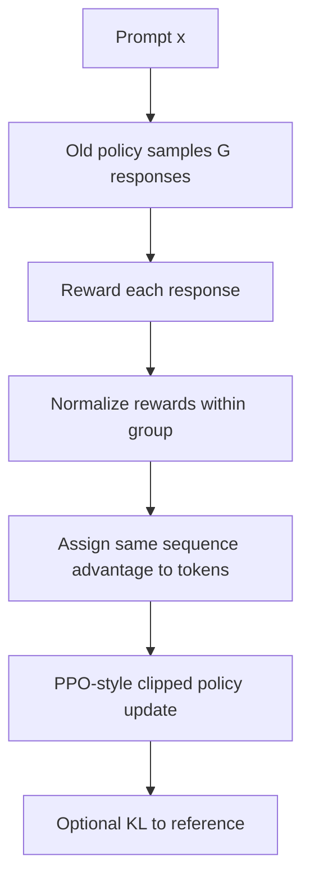

# GRPO 算法原理

## 面试定位

GRPO（Group Relative Policy Optimization）因 DeepSeekMath、DeepSeek-R1 系列推理训练而被广泛关注。它是 PPO 的一个变体，核心特点是：

- 不训练 value/critic model。
- 对同一个 prompt 采样一组回答。
- 用组内 reward 相对大小估计 advantage。
- 适合数学、代码等可用规则奖励的推理任务。

一句话概括：

> GRPO 用同一问题下多条回答的组内相对奖励替代 critic 估值，从而降低 PPO 在 LLM RL 中的显存和训练复杂度。

## PPO 的痛点

PPO 在 LLM RLHF 中需要 value model 估计 advantage。对于大模型，这带来明显成本：

- 额外模型或 value head。
- critic 训练不稳定。
- 长 CoT 回答的 token-level credit assignment 难。
- 多模型并行下显存和吞吐压力大。

GRPO 的思路是：既然很多推理任务可以对完整回答打分，那么对同一个问题采样多条回答，用组内均值作为 baseline。

## 核心流程



对于 prompt `q`，采样 `G` 个回答：

$$
\{o_1,o_2,\ldots,o_G\}\sim \pi_{\theta_{\text{old}}}(\cdot|q)
$$

每个回答得到奖励：

$$
r_i = R(q,o_i)
$$

组内 advantage：

$$
\hat{A}_i=\frac{r_i-\text{mean}(r_1,\ldots,r_G)}
{\text{std}(r_1,\ldots,r_G)}
$$

如果标准差为 0，说明组内回答奖励没有差异，训练信号会很弱或需要跳过/特殊处理。

## GRPO 目标函数

token-level importance ratio：

$$
\rho_{i,t}(\theta)=
\frac{\pi_\theta(o_{i,t}|q,o_{i,<t})}
{\pi_{\theta_{\text{old}}}(o_{i,t}|q,o_{i,<t})}
$$

PPO-style clipped objective：

$$
\mathcal{J}_{\text{GRPO}}(\theta)=
\mathbb{E}\left[
\frac{1}{G}\sum_{i=1}^{G}
\frac{1}{|o_i|}\sum_{t=1}^{|o_i|}
\min\left(
\rho_{i,t}(\theta)\hat{A}_i,
\text{clip}(\rho_{i,t}(\theta),1-\epsilon,1+\epsilon)\hat{A}_i
\right)
-\beta D_{\text{KL}}(\pi_\theta\|\pi_{\text{ref}})
\right]
$$

注意：

- 同一条 response 的所有 token 通常共享同一个 sequence-level advantage。
- 但 importance ratio 和 clipping 是 token-level 的。
- KL 项用于约束 policy 不要偏离 reference model。

## 为什么可以去掉 critic

PPO 的 advantage 需要 baseline：

$$
A = R - V(s)
$$

GRPO 用组内平均奖励近似 baseline：

$$
A_i \approx R_i - \bar{R}_{\text{group}}
$$

直觉：

- 同一个 prompt 下，多条回答面临同一问题难度。
- 组内均值可以作为“这个问题上的平均表现”。
- 比平均更好的回答 advantage 为正，比平均差的为负。

这不需要额外训练 value model，因此显存和复杂度下降。

## 奖励设计

GRPO 特别适合规则奖励明确的任务：

| 任务 | 奖励例子 |
|---|---|
| 数学 | 最终答案是否等价 |
| 代码 | 单测是否通过 |
| 格式遵循 | JSON/schema 是否合法 |
| 工具调用 | 工具选择和参数是否正确 |
| 多步推理 | 最终结果 + 过程约束 |

奖励可以是：

- 0/1 correctness。
- 部分分。
- reward model 分数。
- 多项规则加权。

但奖励越复杂，越要防 reward hacking。

## 与 PPO 的对比

| 维度 | PPO | GRPO |
|---|---|---|
| advantage | critic/value model | group-relative reward |
| 采样 | prompt 生成若干 response | 每个 prompt 生成 G 个 response |
| 模型组件 | policy、old、ref、RM、critic | policy、old、ref、reward |
| 显存成本 | 高 | 较低 |
| 适用奖励 | RM 或环境奖励 | 规则奖励尤其合适 |
| 局限 | critic 成本高 | 依赖组内差异和 group size |

## Group Size 的影响

`G` 越大：

- 组内 baseline 越稳定。
- 更容易出现好坏样本差异。
- 采样成本更高。

`G` 太小：

- advantage 噪声大。
- 如果全对或全错，学习信号弱。

数学推理任务中常见做法是每个 prompt 采多条回答，以制造可比较样本。

## 常见问题

### 全部回答都对或都错

如果一组回答奖励完全相同：

```text
rewards = [1, 1, 1, 1] or [0, 0, 0, 0]
std = 0
```

组内 advantage 无法提供有效方向。这也是后来 DAPO 引入 dynamic sampling 的原因之一：尽量保证每组既有正确也有错误答案。

### 长度偏置

如果奖励只看最终答案，长回答可能因为更多 token 被更新而影响训练稳定。需要考虑：

- token 平均。
- 长度惩罚。
- 过长截断。
- 对 reasoning length 的监控。

### token-level ratio 不稳定

GRPO 的 reward 是 sequence-level，但 clipping 是 token-level。对 MoE、长 CoT 或训练/推理精度不一致的场景，token-level probability ratio 可能噪声很大。GSPO 后续针对这个问题改成 sequence-level ratio。

## 训练监控指标

- 平均 reward。
- pass rate / accuracy。
- response length。
- KL to reference。
- entropy。
- clip fraction。
- 每组 reward std。
- 全对/全错 group 比例。
- 格式合法率。

## 面试高频问题

1. **GRPO 和 PPO 最大区别是什么？**  
   GRPO 不训练 critic，而是用同一 prompt 下多条回答的组内相对奖励估计 advantage。

2. **为什么 GRPO 适合数学推理？**  
   数学题通常可以用规则判断最终答案正确性，对同题采样多条 CoT 后可形成组内比较。

3. **GRPO 的缺点是什么？**  
   依赖 group 内奖励差异；全对/全错信号弱；token-level clipping 与 sequence-level reward 可能不匹配。

4. **GRPO 是否完全不需要 reward model？**  
   不一定。它不需要 value model；reward 可以来自规则、reward model 或混合奖励。

5. **为什么要保留 reference KL？**  
   防止模型为了奖励偏离原语言分布，降低胡言乱语、格式崩坏和 reward hacking 风险。

## 参考资料

- [DeepSeekMath: Pushing the Limits of Mathematical Reasoning in Open Language Models, 2024](https://arxiv.org/abs/2402.03300)
- [DeepSeek-R1 Technical Report, 2025](https://arxiv.org/abs/2501.12948)
