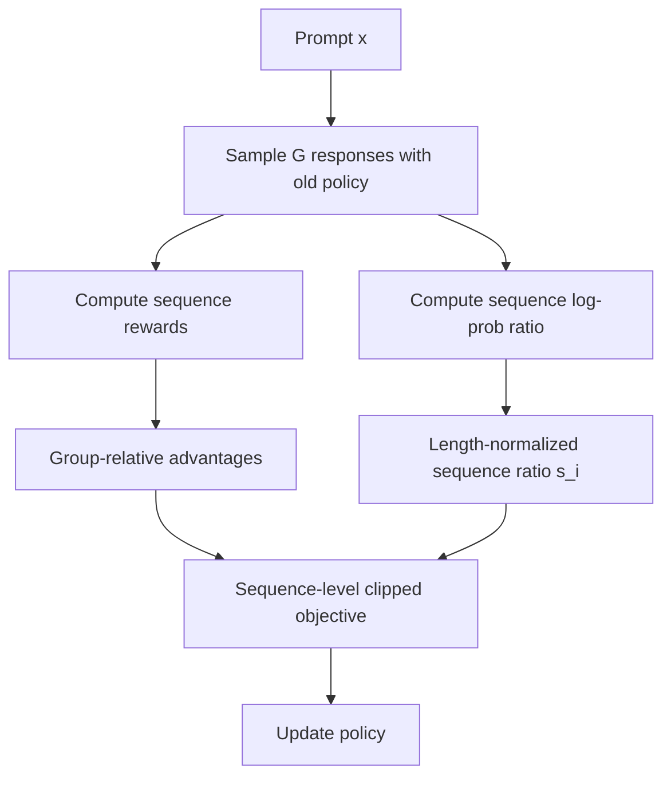
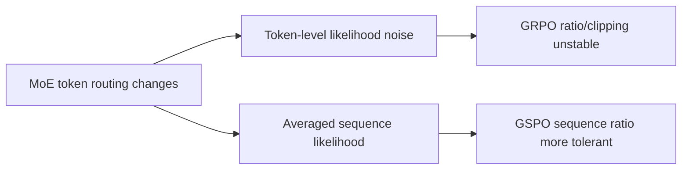

# GSPO 算法原理

## 面试定位

GSPO（Group Sequence Policy Optimization）是 Qwen 团队在 2025 年提出的 LLM 强化学习算法，重点解决 GRPO 在长训练和 MoE 模型 RL 中的 token-level importance ratio 不稳定问题。

面试重点：

- GSPO 相比 GRPO 改了什么？
- 为什么 sequence-level importance ratio 更稳定？
- length-normalized ratio 是什么？
- GSPO 为什么对 MoE 和训练/推理分离更友好？
- GSPO 和 DAPO 的差异是什么？

一句话概括：

> GSPO 把 GRPO/PPO 中 token-level 的概率比、裁剪和优化改到 sequence-level，使更新粒度与 sequence-level reward 对齐，从而提升长 CoT 和 MoE RL 的稳定性。

## 背景：GRPO 的粒度不匹配

LLM reasoning RL 中，reward 往往是整条回答级别的：

```text
这道数学题最终答案是否正确？
这段代码是否通过单元测试？
工具调用轨迹是否完成任务？
```

但 GRPO 的 importance ratio 和 clipping 是 token-level：

$$
\rho_{i,t}=
\frac{\pi_\theta(y_{i,t}|x,y_{i,<t})}
{\pi_{\theta_{\text{old}}}(y_{i,t}|x,y_{i,<t})}
$$

问题是：单个 token 的概率波动可能很大，尤其在长序列、MoE 路由变化、训练/推理引擎精度差异时，token-level ratio 噪声会污染整条 response 的学习信号。

GSPO 的核心判断：

> reward 是 sequence-level，优化也应该尽量按 sequence-level 对齐。

## GSPO 目标函数

对 prompt `x`，旧策略采样一组回答：

$$
\{y_i\}_{i=1}^{G}\sim\pi_{\theta_{\text{old}}}(\cdot\mid x)
$$

组内 advantage：

$$
\hat{A}_i=
\frac{r(x,y_i)-\text{mean}(\{r(x,y_j)\})}
{\text{std}(\{r(x,y_j)\})}
$$

GSPO objective：

$$
\mathcal{J}_{\text{GSPO}}(\theta)=
\mathbb{E}\left[
\frac{1}{G}\sum_{i=1}^{G}
\min\left(
s_i(\theta)\hat{A}_i,
\text{clip}(s_i(\theta),1-\epsilon,1+\epsilon)\hat{A}_i
\right)
\right]
$$

其中 $s_i(\theta)$ 是 length-normalized sequence-level importance ratio：

$$
s_i(\theta)=
\left(
\frac{\pi_\theta(y_i\mid x)}
{\pi_{\theta_{\text{old}}}(y_i\mid x)}
\right)^{\frac{1}{|y_i|}}
$$

等价写法：

$$
s_i(\theta)=
\exp\left(
\frac{1}{|y_i|}
\sum_{t=1}^{|y_i|}
\log
\frac{\pi_\theta(y_{i,t}\mid x,y_{i,<t})}
{\pi_{\theta_{\text{old}}}(y_{i,t}\mid x,y_{i,<t})}
\right)
$$

它本质上是 token ratio 的几何平均。

## 流程图



## 为什么要 length normalization

如果直接用整条序列概率比：

$$
\frac{\pi_\theta(y\mid x)}{\pi_{\theta_{\text{old}}}(y\mid x)}
=
\prod_{t=1}^{|y|}
\frac{\pi_\theta(y_t\mid x,y_{<t})}
{\pi_{\theta_{\text{old}}}(y_t\mid x,y_{<t})}
$$

长序列会导致乘积极大或极小，数值范围不稳定。取 $\frac{1}{|y|}$ 次方，相当于使用每 token 平均 log-ratio：

$$
\log s_i(\theta)=
\frac{1}{|y_i|}\sum_t \log \rho_{i,t}(\theta)
$$

这样：

- 不同长度回答的 ratio 更可比。
- 数值范围更稳定。
- 仍保留整条 sequence 的平均概率变化信息。

## GSPO vs GRPO

| 维度 | GRPO | GSPO |
|---|---|---|
| advantage | group-relative | group-relative |
| importance ratio | token-level | sequence-level length-normalized |
| clipping | token-level clipping | sequence-level clipping |
| reward 粒度 | sequence-level | sequence-level |
| 粒度匹配 | reward 与 update 不完全匹配 | reward 与 update 更一致 |
| MoE 稳定性 | 可能受 token 路由波动影响 | 更稳定 |
| 工程复杂度 | 需要处理 token ratio 噪声 | 更适合复用 inference likelihood |

一句话：

> GRPO 是“序列奖励 + token 级概率比”；GSPO 是“序列奖励 + 序列级概率比”。

## MoE 场景为什么更稳定

MoE 模型每个 token 会路由到不同 expert。训练时和 rollout 时的路由差异可能导致 token-level likelihood 波动。

在 GRPO 中，单个 token 的 ratio 异常可能影响 clipping 和梯度。Qwen 官方说明中提到，为了让 GRPO 在 MoE RL 中正常收敛，可能需要 Routing Replay：缓存旧策略激活的 expert 路由，并在新策略计算 ratio 时重放。

GSPO 的优势：

- 关注整条 sequence likelihood 的平均变化。
- 对单个 token likelihood 或路由波动不那么敏感。
- 可减少对 Routing Replay 这类基础设施技巧的依赖。



## 对训练/推理分离的意义

大规模 RL 系统常把 rollout/inference 和 training 分离：

- inference engine 负责高吞吐生成。
- training engine 负责反向传播更新。

如果算法强依赖 token-level 精确 likelihood，两个引擎的数值差异会更麻烦。GSPO 使用 sequence-level likelihood，对精度差异更容忍，因此官方认为它对 partial rollout、多轮 RL、训练-推理解耦更友好。

## GSPO 与 DAPO 的差异

| 维度 | DAPO | GSPO |
|---|---|---|
| 主要动机 | 改善 GRPO 在长 CoT 的采样、裁剪、长度问题 | 解决 token-level ratio 与 sequence reward 粒度不匹配 |
| 采样 | dynamic sampling 保证组内差异 | 仍是 group sampling，重点不在重采样 |
| clipping | decoupled clip，$\varepsilon_{\text{high}} > \varepsilon_{\text{low}}$ | sequence-level clip |
| loss 粒度 | token-level PG loss | sequence-level objective |
| 长度处理 | overlong reward shaping | ratio length normalization |
| 典型卖点 | 训练信号密度、探索、长度稳定 | MoE 稳定、基础设施友好、粒度一致 |

二者都来自对 GRPO 的改进，但解决的问题不同。

## 适用场景

GSPO 特别适合：

- 长 CoT 推理。
- MoE LLM 的 RL 后训练。
- sequence-level reward 明确的任务。
- 训练/推理引擎分离的大规模 RL 系统。
- token-level ratio 噪声导致训练不稳的场景。

不一定优先的场景：

- 很短 response。
- reward 是 dense token-level reward。
- 小模型、小数据、简单偏好任务，DPO/SFT 已足够。

## 训练监控指标

- sequence reward。
- group advantage 分布。
- sequence ratio $s_i$ 分布。
- clip fraction。
- response length。
- KL to reference。
- entropy。
- MoE expert load / routing stability。
- benchmark pass rate。

如果发现 sequence ratio 大量被 clip，说明更新过大或 old/new policy 偏移过快，需要调学习率、clip range、rollout 更新频率等。

## 面试高频问题

1. **GSPO 为什么叫 Sequence Policy Optimization？**  
   因为它把 importance ratio、clipping 和优化目标放在 sequence 粒度，而不是 token 粒度。

2. **GSPO 的 $s_i$ 是什么？**  
   它是新旧策略对整条回答概率比的长度归一化形式，也就是 token log-ratio 的平均后再取指数。

3. **为什么 GSPO 更适合 sequence-level reward？**  
   因为数学/代码等任务的奖励通常针对整条回答，sequence-level update 与奖励粒度一致，减少 token-level 噪声。

4. **GSPO 为什么能缓解 MoE RL 不稳定？**  
   MoE 的 token 路由波动会影响单 token likelihood；GSPO 聚合到 sequence likelihood，对单点波动更容忍。

5. **GSPO 是否完全替代 GRPO？**  
   不能这么说。GSPO 在论文和官方实验中展示了稳定性与效率优势，但具体任务仍要看奖励形式、模型结构和工程实现。

## 参考资料

- [Group Sequence Policy Optimization, Zheng et al., 2025](https://arxiv.org/abs/2507.18071)
- [Qwen Blog: GSPO Towards Scalable Reinforcement Learning for Language Models](https://qwenlm.github.io/blog/gspo/)
- [Qwen3 Technical Context and Models](https://qwen.ai/)
