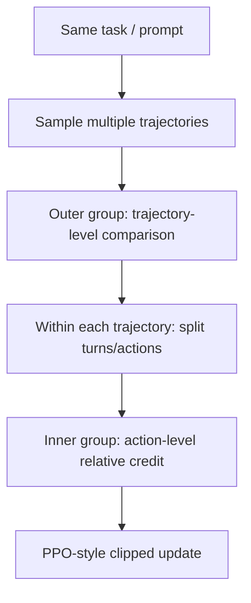
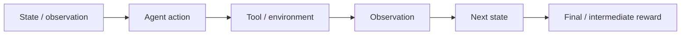

# GiGPO 算法原理

## 面试定位

GiGPO（Group-in-Group Policy Optimization）是面向 LLM Agent 训练的 group-based RL 算法。它的目标不是单轮数学题，而是多轮交互任务中的细粒度 credit assignment。

面试重点：

- 为什么 GRPO 不适合直接处理多轮 Agent 轨迹？
- GiGPO 的 group-in-group 是什么？
- 它如何在 critic-free 的前提下做步骤级/动作级信用分配？
- GiGPO 和 GRPO、PPO 的差异是什么？

一句话概括：

> GiGPO 在同一任务下采样多条 Agent 轨迹形成外层 group，再在轨迹内部按 action/turn 形成内层 group，从而用相对奖励做更细粒度的信用分配。

## 背景：Agent RL 的 credit assignment

单轮数学 RLVR 中，一条回答就是一个 completion：

```text
prompt -> reasoning -> final answer -> reward
```

但 Agent 任务是多轮轨迹：

```text
observe -> think -> act -> tool result -> think -> act -> ... -> final
```

最终 reward 只告诉你整条轨迹是否成功，难点是：

- 哪一步工具调用贡献最大？
- 哪一步观察理解错了？
- 哪个 action 导致任务失败？
- 同一任务不同轨迹中，哪些局部决策更好？

PPO 可以用 critic 估计每个状态价值，但 critic 成本高且不稳定。GRPO 去掉 critic，但通常只给整条 response 一个 group-relative advantage，不够细。

## GiGPO 的核心思路

GiGPO 保留 group-based、critic-free 的优点，同时增加内部粒度：



可以理解为两层比较：

1. **外层 group**：同一个任务的多条完整轨迹之间比较。
2. **内层 group**：同一轨迹或相似状态下的多个 action/turn 之间比较。

这就是 Group-in-Group。

## 与 GRPO 的关系

GRPO 对同一 prompt 采样 `G` 个回答：

$$
\{o_1,\ldots,o_G\}\sim\pi_{\theta_{\text{old}}}(\cdot|q)
$$

然后用组内 reward 标准化：

$$
\hat{A}_i=\frac{r_i-\mu_r}{\sigma_r}
$$

GiGPO 面对的是轨迹：

$$
\tau_i=(a_{i,1},a_{i,2},\ldots,a_{i,T_i})
$$

最终 reward：

$$
R_i=R(\tau_i)
$$

如果只把 $R_i$ 广播给所有 action，会出现问题：

- 成功轨迹中也可能有无效动作。
- 失败轨迹中也可能有正确局部动作。
- 长轨迹中早期关键动作和后期无关动作被同等对待。

GiGPO 的动机就是避免这种过粗的广播。

## Group-in-Group 信用分配

简化理解：

```text
外层：同一个任务下，多条轨迹比较整体成功程度
内层：轨迹内部或相似决策点之间，比较局部动作贡献
```

一个 Agent 轨迹例子：

```text
Task: 找到某论文的核心结论并总结

Trajectory A:
1. search paper title
2. open official arxiv page
3. read abstract
4. summarize with citation
Reward: high

Trajectory B:
1. search paper title
2. open random blog
3. copy unsupported claim
Reward: low
```

外层可以判断 A 比 B 好。内层进一步把“打开官方 arXiv 页面”“读取摘要”这类局部动作赋予更高 credit。

## 简化目标函数

对动作 $a_{i,t}$，仍使用 PPO-style ratio：

$$
\rho_{i,t}(\theta)=
\frac{\pi_\theta(a_{i,t}|s_{i,t})}
{\pi_{\theta_{\text{old}}}(a_{i,t}|s_{i,t})}
$$

GiGPO 的核心是构造更细粒度 advantage：

$$
\hat{A}_{i,t}^{\text{GiGPO}}
=
\text{OuterAdv}(\tau_i)
+
\lambda \text{InnerAdv}(a_{i,t})
$$

然后优化：

$$
\mathcal{J}(\theta)=
\mathbb{E}\left[
\sum_{i,t}
\min\left(
\rho_{i,t}(\theta)\hat{A}_{i,t},
\text{clip}(\rho_{i,t}(\theta),1-\epsilon,1+\epsilon)\hat{A}_{i,t}
\right)
\right]
$$

不同论文/实现会对 inner advantage 的构造有具体定义。面试中重点不是背公式，而是说清：

- 不训练 critic。
- advantage 仍来自相对比较。
- 相比 GRPO，它把 credit 从整条轨迹细化到局部动作/turn。

## GiGPO vs GRPO vs PPO

| 维度 | PPO | GRPO | GiGPO |
|---|---|---|---|
| critic | 需要 | 不需要 | 不需要 |
| 比较粒度 | token/state advantage | 同 prompt 多 completion | 同任务多轨迹 + 轨迹内动作 |
| 适合任务 | 通用 RLHF | 单轮推理 RLVR | 多轮 Agent / 工具调用 |
| 成本 | 高 | 较低 | 中等 |
| 主要问题 | critic 难训 | credit assignment 粗 | 轨迹分组和 inner credit 设计复杂 |

## 为什么适合 Agent

Agent 任务的 action 不是普通 token，而可能是：

- 搜索 query。
- 工具名称。
- API 参数。
- 浏览器点击。
- 代码执行。
- 文件读写。

这些动作具有明确语义和环境反馈，天然适合按 step/turn 做信用分配。



如果只用最终 reward 训练整条轨迹，学习信号太稀疏。GiGPO 通过 group-in-group 比较，让局部动作也获得相对 advantage。

## 奖励设计

Agent 任务常见奖励：

| 奖励 | 例子 |
|---|---|
| 任务成功 | 是否完成用户目标 |
| 工具正确性 | 是否选对工具、参数是否正确 |
| 过程效率 | 是否减少无用步骤 |
| 事实支撑 | 最终回答是否有 observation 支撑 |
| 安全约束 | 是否越权、是否执行危险操作 |

GiGPO 的 reward 可以同时来自最终任务成功和局部过程信号。

## 常见失败模式

| 问题 | 表现 | 处理 |
|---|---|---|
| 内层 credit 噪声大 | 奖励误分给无关动作 | 更清晰的步骤标注和规则奖励 |
| 轨迹过长 | 训练成本高，credit 稀释 | 限制 max turns，加入效率奖励 |
| 工具反馈不稳定 | 同动作结果不同 | 固定环境、记录 observation |
| reward hacking | 为了奖励重复调用工具 | 惩罚无效动作和重复步骤 |
| 分组不合理 | 不同难度任务混在一起比较 | 同任务/同难度内分组 |

## 面试高频问题

1. **GiGPO 为什么不直接用 GRPO？**  
   GRPO 通常把整条 completion 作为单位，Agent 多轮轨迹需要更细粒度的动作/turn credit。

2. **Group-in-Group 是什么意思？**  
   外层对同一任务的多条轨迹做组内比较，内层对轨迹中的局部动作或子步骤做相对信用分配。

3. **GiGPO 是否需要 critic？**  
   不需要，它仍然走 critic-free group-based RL 路线。

4. **GiGPO 适合什么任务？**  
   多轮 Agent、工具调用、Web 任务、交互式环境，而不是只有最终答案的简单单轮任务。

5. **它的主要工程难点是什么？**  
   轨迹采样成本、内层分组设计、局部奖励构造和环境可复现性。

## 参考资料

- [Group-in-Group Policy Optimization for LLM Agent Training](https://arxiv.org/abs/2505.10978)
- [ReAct: Synergizing Reasoning and Acting in Language Models](https://arxiv.org/abs/2210.03629)
