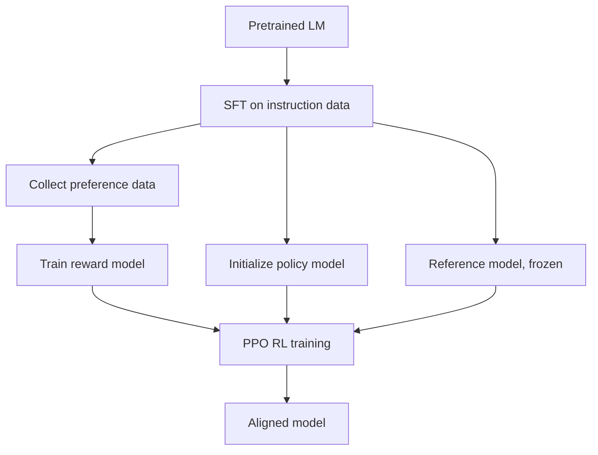
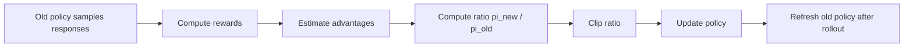

# PPO 算法原理

## 面试定位

PPO（Proximal Policy Optimization）是 RLHF 经典管线里的核心算法。大模型应用算法岗面试通常会问：

- PPO 为什么比普通 policy gradient 稳定？
- clipped objective 怎么理解？
- RLHF 中为什么需要 reward model、reference model、value model？
- PPO 和 DPO/GRPO 的差异是什么？
- LLM 场景下 PPO 的工程成本为什么高？

一句话概括：

> PPO 通过限制新旧策略的概率比，让策略更新不要离旧策略太远，从而在可多轮利用采样数据的同时保持训练稳定。

## PPO 在 RLHF 中的位置

经典 RLHF 流程：



训练时常见模型组件：

| 组件 | 是否训练 | 作用 |
|---|---|---|
| policy / actor | 训练 | 生成回答并被 PPO 更新 |
| reference model | 冻结 | 约束 policy 不要偏离 SFT 模型太远 |
| reward model | 冻结 | 给完整回答打偏好分 |
| value / critic | 训练 | 估计状态价值，降低 policy gradient 方差 |

## RL 视角下的 LLM

把 LLM 生成看作序列决策：

| RL 概念 | LLM 对应 |
|---|---|
| state `s_t` | prompt + 已生成 token 前缀 |
| action `a_t` | 下一个 token |
| policy `πθ(a_t|s_t)` | 语言模型输出概率 |
| trajectory | 一整段 response |
| reward | reward model 分数、规则奖励或人工反馈 |
| episode end | 生成 EOS 或达到最大长度 |

LLM 的奖励通常是 sequence-level：完整回答生成后才打分。但 PPO 的梯度是 token-level：每个 token 都要分配 advantage。

## Policy Gradient 基础

目标是最大化期望回报：

$$
J(\theta)=\mathbb{E}_{\tau\sim\pi_\theta}[R(\tau)]
$$

REINFORCE 梯度：

$$
\nabla_\theta J(\theta)=\mathbb{E}_{\tau\sim\pi_\theta}\left[\sum_t \nabla_\theta \log \pi_\theta(a_t|s_t) A_t\right]
$$

其中 `A_t` 是 advantage，表示当前动作比平均水平好多少：

$$
A_t = Q(s_t,a_t)-V(s_t)
$$

如果直接做 policy gradient，更新步子过大时新策略会远离采样数据对应的旧策略，训练容易崩。

## PPO 的核心：概率比与裁剪

PPO 使用旧策略采样，再用新策略多轮更新。关键是重要性采样比：

$$
r_t(\theta)=\frac{\pi_\theta(a_t|s_t)}{\pi_{\theta_{\text{old}}}(a_t|s_t)}
$$

clipped surrogate objective：

$$
L^{\text{CLIP}}(\theta)=
\mathbb{E}_t\left[
\min\left(
r_t(\theta)A_t,
\text{clip}(r_t(\theta),1-\epsilon,1+\epsilon)A_t
\right)
\right]
$$

直觉：

- 如果 advantage 为正，说明这个动作好，希望提高它的概率，但最多提高到 `1 + ε` 附近。
- 如果 advantage 为负，说明这个动作差，希望降低它的概率，但最多降低到 `1 - ε` 附近。
- 裁剪后的目标会阻止过激更新。



## Value Loss 和 Entropy Bonus

PPO 通常同时优化：

$$
L(\theta)=
L^{\text{CLIP}}(\theta)
- c_1 L^{\text{VF}}(\theta)
+ c_2 S[\pi_\theta](s)
$$

其中：

- `L^VF` 是 value function loss，用于训练 critic。
- `S` 是 entropy bonus，鼓励探索，避免策略过早塌缩。
- `c1/c2` 是权重。

value loss：

$$
L^{\text{VF}}=(V_\theta(s_t)-R_t)^2
$$

## GAE：优势估计

PPO 常用 GAE（Generalized Advantage Estimation）估计 advantage：

$$
\delta_t = r_t + \gamma V(s_{t+1}) - V(s_t)
$$

$$
A_t^{\text{GAE}}=\sum_{l=0}^{\infty}(\gamma\lambda)^l\delta_{t+l}
$$

参数含义：

- `γ`：未来奖励折扣。
- `λ`：bias-variance tradeoff。
- `λ` 越大，方差更高但偏差更低；越小，估计更平滑但偏差更高。

LLM RLHF 中，很多奖励来自完整回答末尾，因此 value model 对训练稳定性很关键，但也带来额外显存和训练复杂度。

## KL 约束

RLHF 中只最大化 reward model 很危险，模型可能学会 reward hacking，或者偏离原语言模型导致胡言乱语。因此常加入 reference model KL 惩罚：

$$
R_{\text{total}}(x,y)=r_{\text{RM}}(x,y)-\beta \text{KL}\left(\pi_\theta(y|x)\|\pi_{\text{ref}}(y|x)\right)
$$

直觉：

- reward model 负责“更符合偏好”。
- reference KL 负责“不要偏离原模型太远”。
- `β` 越大，模型越保守；越小，越容易追求高奖励但失控。

## LLM PPO 训练流程

```mermaid
sequenceDiagram
    participant P as Policy
    participant Ref as Reference
    participant RM as Reward Model
    participant V as Value Model
    participant Opt as PPO Optimizer

    P->>P: sample responses for prompts
    P->>RM: score full responses
    P->>Ref: compute KL to reference
    P->>V: estimate values
    V->>Opt: advantages via returns/GAE
    RM->>Opt: rewards
    Ref->>Opt: KL penalty
    Opt->>P: clipped policy update
    Opt->>V: value update
```

## 为什么 PPO 工程成本高

PPO-based RLHF 至少涉及多个模型副本：

- policy 生成。
- policy 训练。
- old policy 概率。
- reference model 概率。
- reward model 打分。
- value model 估值。

工程挑战：

- 显存大：多个模型或多个头。
- 吞吐低：需要在线生成 rollout。
- 超参敏感：KL 系数、clip range、reward scale、学习率都影响稳定性。
- 分布漂移：policy 更新后生成分布变化，reward model 可能被钻空子。
- 长回答 credit assignment 难：sequence-level reward 要分配给 token-level 动作。

## PPO vs DPO vs GRPO

| 算法 | 是否在线采样 | 是否需要 reward model | 是否需要 value model | 典型用途 |
|---|---|---|---|---|
| PPO | 是 | 是 | 是 | 经典 RLHF |
| DPO | 否 | 否，使用偏好对 | 否 | 离线偏好优化 |
| GRPO | 是 | 可用规则奖励/RM | 否 | 推理模型 RL，数学/代码 |

## 常见失败模式

| 问题               | 表现            | 原因          | 处理                            |
| ---------------- | ------------- | ----------- | ----------------------------- |
| KL 爆炸            | 输出风格突变，质量崩    | 更新过大或 KL 太低 | 增大 β，降学习率                     |
| reward hacking   | 奖励高但人看差       | RM 漏洞       | 改 RM/规则，加入人工评估                |
| entropy collapse | 输出单一、过短       | 过度优化        | entropy bonus、调 reward        |
| value loss 不稳    | advantage 噪声大 | critic 学不好  | 调 value lr/clip/normalization |
| 长度偏置             | 越长越容易高分或低分    | reward 未归一  | 长度归一或 shaping                 |

## 面试高频问题

1. **PPO 的 clip 到底 clip 什么？**  
   clip 新旧策略对同一动作的概率比 `π_new / π_old`，限制策略更新幅度。

2. **为什么不用普通 policy gradient？**  
   普通 PG 每批数据通常只能安全用一次，更新大时不稳定；PPO 用 clipped objective 允许多 epoch minibatch 更新。

3. **RLHF 为什么需要 reference model？**  
   防止 policy 为了 reward 偏离原语言模型太远，保持语言质量和安全边界。

4. **PPO 为什么需要 critic？**  
   critic 估计 value，用于计算 advantage，降低 policy gradient 方差。

5. **PPO 在 LLM 上最大的成本是什么？**  
   在线生成 rollout 和多模型前向/反向，尤其是长序列和大模型下显存、吞吐压力大。

## 参考资料

- [Proximal Policy Optimization Algorithms, Schulman et al., 2017](https://arxiv.org/abs/1707.06347)
- [OpenAI Baselines: Proximal Policy Optimization](https://openai.com/index/openai-baselines-ppo/)
- [Training language models to follow instructions with human feedback, Ouyang et al., 2022](https://arxiv.org/abs/2203.02155)
