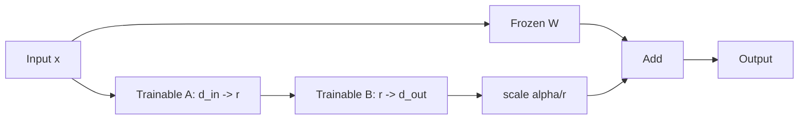
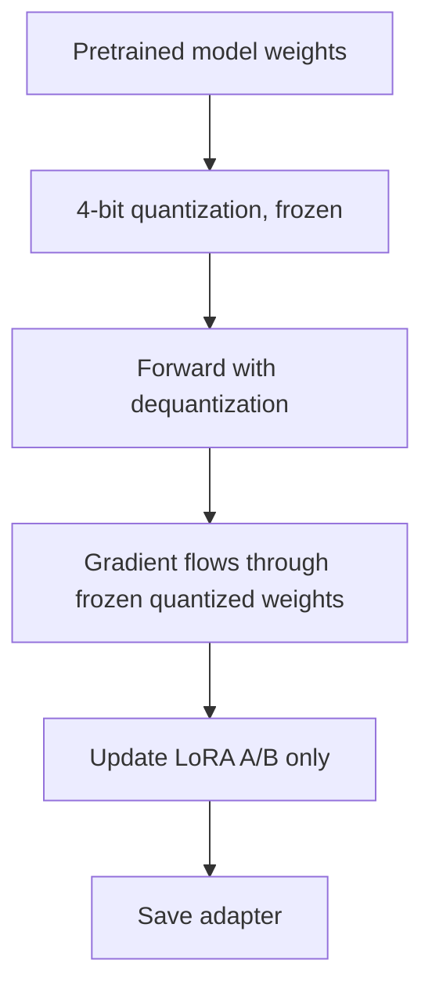
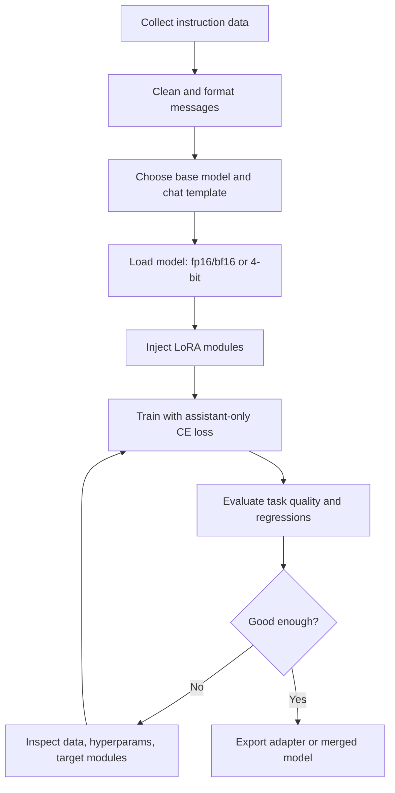

# LoRA 和 QLoRA

## 面试定位

LoRA 和 QLoRA 是大模型应用算法岗最常见的微调方案。面试一般会围绕四类问题展开：

- 为什么低秩更新能工作？
- LoRA 训练和全参微调在显存、效果、部署上有什么差异？
- QLoRA 为什么能在低显存下训练大模型？
- 实际项目中怎么选 rank、target modules、学习率、数据格式和评估指标？

一句话概括：

> LoRA 冻结原模型权重，只训练一个低秩增量矩阵；QLoRA 进一步把冻结的基座模型量化到 4-bit，只让梯度穿过量化权重并更新 LoRA 参数。

## 从 SFT 说起

SFT（Supervised Fine-Tuning）用高质量指令数据继续训练模型，让模型学习“输入指令 -> 输出答案”的行为模式。

常见数据格式：

```json
{
  "messages": [
    {"role": "system", "content": "你是一个严谨的助手。"},
    {"role": "user", "content": "解释一下 RAG 的召回和重排。"},
    {"role": "assistant", "content": "RAG 通常先用向量或混合检索召回候选文档..."}
  ]
}
```

SFT 的核心损失通常仍是 next-token cross entropy，但只对 assistant 部分计算 loss：

$$
\mathcal{L}_{\text{SFT}}=-\sum_{t\in \text{assistant tokens}}\log p_\theta(y_t\mid x,y_{<t})
$$

如果对 user/system token 也算 loss，模型会被训练去“复读用户输入”，通常不是我们想要的。

## 全参微调的问题

全参微调会更新模型所有参数：

$$
W \leftarrow W - \eta \nabla_W \mathcal{L}
$$

优点是容量最大，缺点很明显：

- 显存开销大：参数、梯度、优化器状态都要存。
- 多任务部署成本高：每个任务一份完整模型。
- 容易灾难性遗忘：小数据上过拟合后损伤通用能力。
- 工程迭代慢：训练、保存、分发都重。

LoRA 的目标是：在尽量保留效果的前提下，只训练很少的参数。

## LoRA 原理

对一个线性层：

$$
h = Wx
$$

LoRA 不直接更新 `W`，而是学习一个低秩增量：

$$
h = Wx + \Delta W x
$$

$$
\Delta W = \frac{\alpha}{r}BA
$$

其中：

- `W`：冻结的原始权重，形状通常是 `d_out x d_in`。
- `A`：可训练矩阵，形状 `r x d_in`。
- `B`：可训练矩阵，形状 `d_out x r`。
- `r`：rank，远小于 `d_in` 和 `d_out`。
- `alpha`：缩放系数，常用 `alpha / r` 控制更新强度。



LoRA 参数量：

原线性层参数量：

$$
d_{\text{out}}d_{\text{in}}
$$

LoRA 新增参数量：

$$
r(d_{\text{in}}+d_{\text{out}})
$$

当 `r << d` 时，训练参数会小很多。

## 为什么低秩更新可能有效

经验观察：模型适配下游任务时，并不一定需要在所有参数维度上独立调整。很多任务的有效更新可能集中在较低维子空间中。

可以这样回答：

- 预训练模型已经学到通用语言和知识表示。
- 下游 SFT 主要是改变行为风格、格式、领域偏好和少量能力边界。
- 这些变化不一定需要全秩矩阵更新。
- 低秩矩阵相当于限制更新空间，也有正则化效果。

注意：LoRA 不是保证所有任务都等价全参微调。数据量大、领域迁移强、模型能力缺口大时，全参或更高 rank 可能更好。

## LoRA 通常插在哪里

常见 target modules：

| 模块 | 作用 | 是否常用 |
|---|---|---|
| `q_proj`, `k_proj`, `v_proj`, `o_proj` | attention 投影 | 很常用 |
| `gate_proj`, `up_proj`, `down_proj` | MLP/SwiGLU | 常用，效果常更强 |
| `embed_tokens`, `lm_head` | 词嵌入和输出头 | 特殊任务可用，成本较高 |

实战建议：

- 资源紧张：先只训 `q_proj`, `v_proj` 或 attention 全部投影。
- 想要更好效果：attention + MLP。
- 新增大量领域词或特殊 token：考虑训练 embedding/lm_head，但要小心过拟合。

## LoRA 初始化与合并

常见初始化：

- `A` 随机初始化。
- `B` 初始化为 0。

这样训练开始时：

$$
\Delta W = BA = 0
$$

模型初始输出与基座模型一致，训练更稳定。

部署时可以选择：

1. **不合并**：加载 base model + adapter，灵活切换多个任务。
2. **合并**：把 `BA` 加回 `W`，得到普通权重，推理图更简单。

合并公式：

$$
W' = W + \frac{\alpha}{r}BA
$$

## QLoRA 原理

QLoRA 的关键是：基座模型权重量化到 4-bit 并冻结，LoRA 参数保持较高精度训练。



QLoRA 的三个重要技术点：

| 技术 | 作用 |
|---|---|
| NF4 | 针对近似正态分布权重的 4-bit 数据类型 |
| Double Quantization | 对量化常数再次量化，进一步省显存 |
| Paged Optimizers | 使用分页机制缓解长序列/大 batch 下的显存峰值 |

QLoRA 不是“用 4-bit 训练全部参数”，而是：

- base model：4-bit 存储，冻结。
- LoRA adapter：通常 fp16/bf16 训练。
- optimizer states：只为 LoRA 参数维护。

## LoRA vs QLoRA vs 全参微调

| 方案    |       训练参数 |  显存 | 效果上限           | 部署                     |
| ----- | ---------: | --: | -------------- | ---------------------- |
| 全参微调  |         全部 |  最高 | 最高             | 每个任务一份模型               |
| LoRA  | 少量 adapter |  中低 | 通常接近全参         | base + adapter 或 merge |
| QLoRA | 少量 adapter |  最低 | 接近 LoRA，依赖量化质量 | base 量化 + adapter      |

实践选择：

- 单卡/低预算：QLoRA。
- 多任务快速迭代：LoRA。
- 核心模型、大数据、强领域迁移：考虑全参微调或 LoRA 后继续全参。

## 常用超参数

| 参数 | 常见范围 | 影响 |
|---|---|---|
| `r` | 4, 8, 16, 32, 64 | rank 越大容量越强，也更耗显存 |
| `lora_alpha` | 16, 32, 64, 128 | 控制 LoRA 更新幅度 |
| `lora_dropout` | 0-0.1 | 小数据可防过拟合 |
| learning rate | `1e-5` 到 `2e-4` | LoRA 通常可比全参微调更大学习率 |
| batch size | 看显存 | 影响稳定性和吞吐 |
| max length | 按任务定 | 长上下文显存压力大 |

经验：

- `r=8/16` 是常见起点。
- 数据复杂、格式多、任务跨度大时可提高到 `32/64`。
- `alpha` 常设为 `2r` 或 `4r`，但不是定律。
- 小数据集更要关注 eval，而不是盲目增加 epoch。

## 数据质量比参数更重要

SFT 常见失败原因：

- 数据答案质量差，模型学到错误推理或啰嗦模板。
- prompt 模板和线上推理模板不一致。
- 多轮对话 role 标注错。
- assistant loss mask 错，把用户输入也训练成生成目标。
- 数据重复导致过拟合。
- 只看训练 loss，不做人类偏好或任务指标评估。

推荐数据检查：

```text
1. 随机抽样 50-100 条人工读
2. 检查 role、模板、特殊 token
3. 统计长度分布和截断比例
4. 去重或近重复过滤
5. 构造固定 eval set
6. 训练前后同一批 prompt 对比
```

## 训练流程



## 评估方法

按应用类型选择指标：

| 类型 | 指标 |
|---|---|
| 问答/RAG | exact match、F1、faithfulness、人工评审 |
| 代码 | pass@k、单测通过率、编译率 |
| 分类/抽取 | accuracy、F1、schema validity |
| 对话 | win rate、helpfulness、safety、格式遵循 |
| 工具调用 | tool selection accuracy、参数正确率、端到端成功率 |

必须做回归测试：

- 通用问答是否明显退化。
- 是否更容易幻觉。
- 是否破坏原模型安全边界。
- 输出格式是否稳定。

## 面试高频问题

1. **LoRA 为什么省显存？**  
   冻结 base model，不保存其梯度和优化器状态，只为低秩 adapter 训练参数维护优化器状态。

2. **LoRA 会增加推理延迟吗？**  
   未合并时会多一条低秩分支，有少量开销；合并到权重后基本没有额外延迟。

3. **QLoRA 的 4-bit 会不会影响梯度？**  
   base 权重冻结，只通过反量化参与前向和反向传播，最终更新的是 LoRA 参数；量化误差会影响训练信号，但显存收益很大。

4. **rank 越大越好吗？**  
   不一定。rank 大容量更强，但更容易过拟合，也更耗显存。需要用验证集和任务指标选择。

5. **为什么有时 LoRA 效果不好？**  
   可能是数据质量、模板、loss mask、target modules、rank、学习率或任务本身需要更大模型容量的问题。

6. **SFT 和 RLHF/DPO 的关系是什么？**  
   SFT 让模型学会基本任务格式和能力；偏好优化进一步让模型在多个可行回答中更偏向人类喜欢或奖励更高的回答。

## 实战排查清单

- 训练 loss 降了但效果差：检查 eval prompt 是否和训练模板一致。
- 输出总是很短：检查 max_new_tokens、eos token、训练数据长度偏短。
- 模型复读用户：检查 assistant-only loss mask。
- JSON 格式不稳：加入格式约束数据，评估 schema validity。
- 领域知识不够：SFT 不适合注入大量事实知识，优先 RAG 或继续预训练。
- QLoRA OOM：降低 max length、batch size、rank，开启 gradient checkpointing。

## 参考资料

- [LoRA: Low-Rank Adaptation of Large Language Models, Hu et al., 2021](https://arxiv.org/abs/2106.09685)
- [QLoRA: Efficient Finetuning of Quantized LLMs, Dettmers et al., 2023](https://arxiv.org/abs/2305.14314)
- [Hugging Face PEFT Documentation](https://huggingface.co/docs/peft/index)
