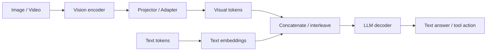

# Qwen2.5-VL 模态融合机制

## 面试定位

多模态 LLM 的核心问题是：图像/视频如何变成语言模型能处理的 token，并和文本 token 在同一个上下文中交互。Qwen2.5-VL 是一个典型案例。

一句话概括：

> VLM 通常先用视觉编码器把图像/视频转成 visual tokens，再通过投影层对齐到 LLM hidden space，最后和文本 token 一起送入 Transformer。

## 基本架构



## Visual Tokens

图像通常被切成 patch：

```text
image -> patches -> vision encoder -> visual embeddings
```

视频则需要同时处理：

- 空间维度。
- 时间维度。
- 帧采样。
- 长视频 token budget。

视觉 token 太多会占用上下文窗口，因此需要压缩、采样或动态分辨率策略。

## 模态对齐

Vision encoder 输出维度通常和 LLM hidden size 不同，需要 projector：

$$
h_{\text{vision-aligned}}=W_p h_{\text{vision}}
$$

对齐目标：

- 维度对齐。
- 语义空间对齐。
- 位置编码兼容。
- 让 LLM 能通过 attention 读取视觉信息。

## 多模态位置编码

文本只有一维位置，图像有二维空间位置，视频还有时间位置。

因此 VLM 需要处理：

| 模态 | 位置信息 |
|---|---|
| 文本 | token 顺序 |
| 图像 | height、width |
| 视频 | time、height、width |

Qwen2.5-VL 报告中使用了多模态位置编码思路，让模型同时感知文本顺序、图像空间和视频时间。

## 融合方式

常见融合路线：

| 方法 | 做法 |
|---|---|
| Early Fusion | visual tokens 和 text tokens 一起输入 LLM |
| Cross-Attention | LLM 通过 cross-attention 读取视觉 memory |
| Perceiver Resampler | 先把视觉 token 压缩成固定数量 |
| Dynamic Resolution | 根据图像尺寸动态分配 visual token |

Qwen2.5-VL 这类现代 VLM 通常强调动态分辨率、文档/图表理解、视频理解和定位能力。

## 应用算法关注点

多模态应用不只看模型结构，还要看输入管线：

- 图像 resize 策略。
- OCR 或直接视觉理解。
- 图表/表格 token budget。
- 视频抽帧。
- 多图顺序。
- prompt 中图片和文本的对应关系。

## 面试高频问题

1. **图像怎么进入 LLM？**  
   先由视觉编码器变成 visual tokens，再投影到 LLM hidden space，与文本 token 一起输入。

2. **为什么 VLM 上下文更贵？**  
   一张图可能产生大量 visual tokens，占用上下文窗口并增加 attention 成本。

3. **图像位置编码和文本位置编码有什么区别？**  
   文本是一维顺序，图像是二维空间，视频还需要时间维度。

4. **多模态模型的失败模式有哪些？**  
   OCR 错、图表读错、空间关系混淆、视频时间顺序错误、视觉 token 过度压缩。

## 参考资料

- [Qwen2.5-VL Technical Report](https://arxiv.org/abs/2502.13923)
- [LLaVA: Visual Instruction Tuning](https://arxiv.org/abs/2304.08485)
