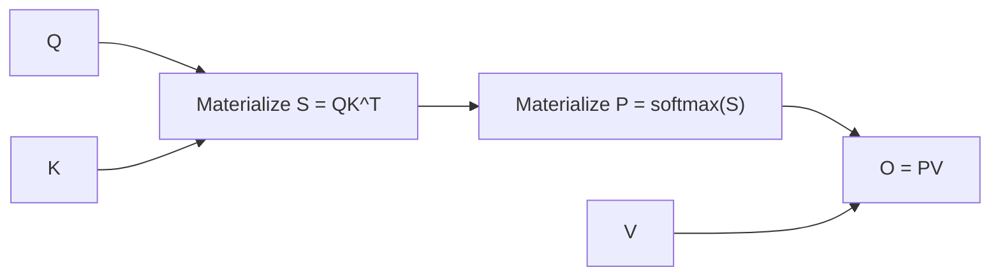
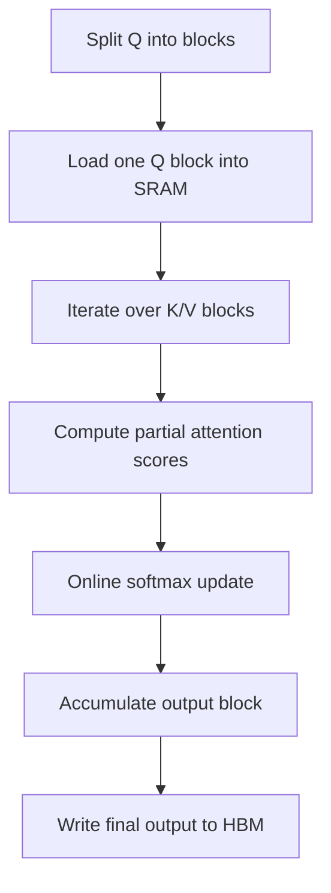

# Flash Attention

## 面试定位

FlashAttention 是大模型训练和推理中最重要的 attention kernel 优化之一。面试常问：

- FlashAttention 是否改变 attention 数学结果？
- 为什么标准 attention 显存占用高？
- FlashAttention 的 IO-aware 是什么意思？
- online softmax 如何避免存完整 attention matrix？
- FlashAttention 和 KV Cache 优化的是不是同一个瓶颈？

一句话概括：

> FlashAttention 不改变标准 attention 公式，而是通过分块计算和 online softmax 避免显式存储 `T x T` 注意力矩阵，大幅减少 HBM 读写和显存占用。

## 标准 Attention 的问题

标准 attention：

$$
O=\text{softmax}\left(\frac{QK^T}{\sqrt{d}}\right)V
$$

若序列长度为 `T`，attention score 是 `T x T`：

$$
S=QK^T
$$

训练时还需要保存中间激活用于反向传播，包括：

- attention logits。
- softmax probabilities。
- dropout mask。
- 输出中间值。

当 `T` 很大时，`T^2` 级别的中间矩阵会非常耗显存。



## GPU 内存层级

FlashAttention 的核心不是减少 FLOPs，而是减少内存读写。

| 存储 | 特点 |
|---|---|
| HBM | GPU 显存，大但相对慢 |
| SRAM / shared memory | 片上存储，小但很快 |
| Registers | 最快但容量最小 |

标准 attention 会反复在 HBM 中读写巨大的 `T x T` 矩阵。FlashAttention 把 Q/K/V 分块搬到片上 SRAM，在块内完成计算，避免把完整 attention matrix 写回 HBM。

## FlashAttention 的核心思路



关键点：

- 不一次性计算完整 `QK^T`。
- 每次只处理一个 Q block 和一个 K/V block。
- 用 online softmax 维护数值稳定的归一化结果。
- 最后只写输出 `O`，不写完整 softmax 矩阵。

## Online Softmax

softmax：

$$
\text{softmax}(x_i)=\frac{e^{x_i}}{\sum_j e^{x_j}}
$$

为了数值稳定，通常减最大值：

$$
\text{softmax}(x_i)=\frac{e^{x_i-m}}{\sum_j e^{x_j-m}},\quad m=\max_j x_j
$$

FlashAttention 分块时不能一次看到所有 logits，因此需要在线更新：

对已处理块维护：

- 当前最大值 `m`。
- 当前归一化分母 `l`。
- 当前输出累积 `o`。

当新块 logits 到来时，更新全局最大值：

$$
m_{\text{new}}=\max(m_{\text{old}},m_{\text{block}})
$$

旧分母和新分母要按最大值变化重新缩放：

$$
l_{\text{new}}=
e^{m_{\text{old}}-m_{\text{new}}}l_{\text{old}}
+
e^{m_{\text{block}}-m_{\text{new}}}l_{\text{block}}
$$

输出累积也做同样缩放。这样不用保存所有 logits，也能得到精确 softmax 结果。

## FlashAttention 是否近似

FlashAttention 是 exact attention：

- 数学上仍是标准 softmax attention。
- 不使用稀疏近似。
- 不丢 token。
- 主要差异来自浮点计算顺序变化导致的极小数值误差。

这点和 sparse attention、linear attention 不同。

## 复杂度对比

| 项 | 标准 Attention | FlashAttention |
|---|---|---|
| FLOPs | `O(T^2 d)` | `O(T^2 d)` |
| 显式 attention matrix | 需要 | 不需要 |
| HBM IO | 高 | 低 |
| 显存峰值 | 高 | 低 |
| 是否精确 | 是 | 是 |

FlashAttention 没有改变理论计算复杂度，但减少了 GPU 最慢环节之一：HBM 读写。

## FlashAttention 与 Mask

FlashAttention 支持 causal mask。分块计算时，只需要在 block 内对未来位置加 mask：

```text
Q block attends K/V blocks
if key_position > query_position:
    score = -inf
```

这保证输出与标准 causal attention 一致。

## 训练和推理中的作用

训练阶段：

- 降低 attention 激活显存。
- 支持更长 sequence 或更大 batch。
- 反向传播可重算部分中间值，减少存储。

Prefill 阶段：

- prompt 很长时，attention 仍是 `O(T^2)`，FlashAttention 能显著改善 kernel 效率。

Decode 阶段：

- 每步只有一个新 query attend 历史 K/V。
- 此时瓶颈更多是 KV Cache 读取和内存带宽。
- FlashAttention 仍有帮助，但不是唯一关键。

## FlashAttention vs KV Cache

| 技术 | 优化对象 | 主要阶段 |
|---|---|---|
| FlashAttention | attention kernel 的 IO 和显存 | 训练、prefill、部分 decode |
| KV Cache | 避免重复计算历史 K/V | 自回归 decode |
| PagedAttention | KV Cache 的内存管理 | 在线服务 |

面试回答：

> FlashAttention 优化的是 attention 计算方式；KV Cache 优化的是自回归生成中历史 K/V 的复用。二者经常同时使用，但解决的问题不同。

## 面试高频问题

1. **FlashAttention 改 attention 公式了吗？**  
   没有。它仍计算精确 softmax attention，只是分块计算并减少中间矩阵写回。

2. **为什么 FlashAttention 更快？**  
   不是因为 FLOPs 复杂度降低，而是因为减少了 HBM 读写，让计算更贴近 GPU 片上存储。

3. **为什么不保存 attention matrix？**  
   使用 online softmax 分块累积输出，不需要显式物化完整 `T x T` softmax 矩阵。

4. **FlashAttention 对长上下文有什么意义？**  
   长上下文下 attention matrix 更大，FlashAttention 的显存和 IO 优势更明显。

5. **FlashAttention 和 sparse attention 区别？**  
   FlashAttention 是精确 attention；sparse attention 改变注意力连接模式，是近似或结构化限制。

## 参考资料

- [FlashAttention: Fast and Memory-Efficient Exact Attention with IO-Awareness](https://arxiv.org/abs/2205.14135)
- [FlashAttention-2: Faster Attention with Better Parallelism and Work Partitioning](https://arxiv.org/abs/2307.08691)
