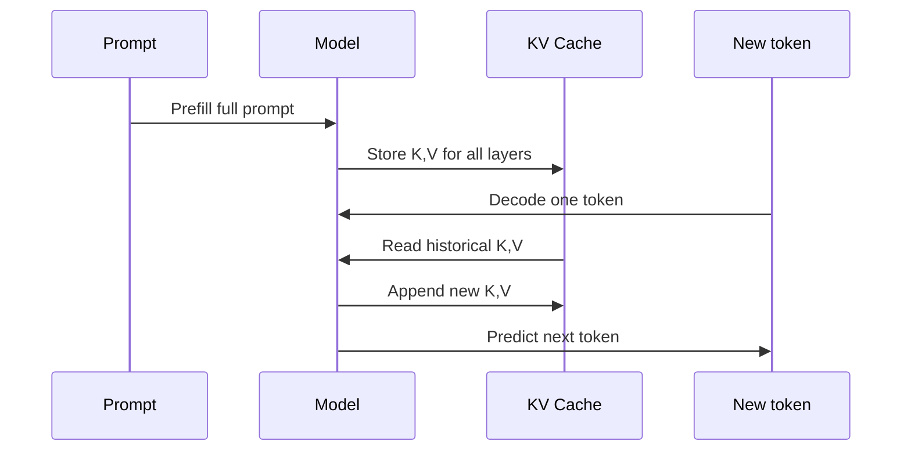

# KV Cache

## 面试定位

KV Cache 是自回归 LLM 推理加速的核心。面试常问：

- 为什么训练可以并行，推理不能完全并行？
- KV Cache 缓存的到底是什么？
- Prefill 和 Decode 有什么区别？
- KV Cache 显存怎么估算？
- MHA/MQA/GQA/MLA 对 KV Cache 有什么影响？

一句话概括：

> KV Cache 缓存历史 token 在每层 attention 中的 Key 和 Value，让 decode 阶段每生成一个新 token 时不用重复计算历史 K/V。

## 自回归生成

Decoder-only LLM 生成过程：

```text
prompt -> token_1 -> token_2 -> token_3 -> ...
```

第 `t+1` 个 token 依赖前面已经生成的 token：

$$
p(x_{t+1}|x_{\le t})
$$

所以推理必须逐步生成。每一步输入都会变长。

## 没有 KV Cache 会怎样

假设 prompt 长度为 `T`，已经生成 `n` 个 token。没有 KV Cache 时，每一步都要重新计算整个序列的 Q/K/V：

```text
step 1: compute K/V for T tokens
step 2: compute K/V for T+1 tokens
step 3: compute K/V for T+2 tokens
...
```

历史 token 的 K/V 实际不会变，因为模型参数不变、历史 token 不变。因此重复计算是浪费。

## KV Cache 缓存什么

每层 attention：

$$
Q=XW_Q,\quad K=XW_K,\quad V=XW_V
$$

decode 时，新 token 的 Q/K/V 需要新算；历史 token 的 K/V 可以复用。



注意：通常不缓存 Q，因为 Q 只用于当前查询，不需要被未来 token 复用。

## Prefill 与 Decode

| 阶段 | 输入 | Attention 形状 | 主要瓶颈 |
|---|---|---|---|
| Prefill | prompt 全部 token | `T x T` | 计算量、FlashAttention |
| Decode | 每步 1 个 token | `1 x T` | KV Cache 读取、内存带宽 |

Prefill 阶段可以并行处理 prompt 中所有 token；Decode 阶段必须逐 token 生成，但每步只算一个新 token 的 Q/K/V。

## KV Cache 形状

常见形状：

```text
[num_layers, batch_size, num_kv_heads, seq_len, head_dim]
```

K 和 V 各一份，所以显存近似：

$$
\text{Memory} =
2 \times L \times B \times T \times H_{kv} \times d_{head} \times \text{bytes}
$$

其中：

- `2`：K 和 V。
- `L`：层数。
- `B`：batch size。
- `T`：序列长度。
- `H_kv`：KV head 数。
- `d_head`：head 维度。
- `bytes`：每个元素字节数，例如 FP16/BF16 是 2。

## 显存估算例子

假设：

- `L = 32`
- `B = 1`
- `T = 32768`
- `H_kv = 8`
- `d_head = 128`
- BF16，`bytes = 2`

则：

$$
2 \times 32 \times 1 \times 32768 \times 8 \times 128 \times 2
\approx 4 \text{GB}
$$

这只是单个请求的 KV Cache，不包括模型权重、激活、临时 buffer 和调度碎片。

## MHA、MQA、GQA、MLA 的影响

KV Cache 与 `H_kv` 强相关：

| Attention | KV head 数 | KV Cache |
|---|---:|---:|
| MHA | 等于 Q head 数 | 最大 |
| GQA | 少于 Q head 数 | 中等 |
| MQA | 1 | 最小 |
| MLA | 缓存 latent 表示 | 进一步压缩 |

因此很多推理友好模型会使用 GQA、MQA 或 MLA。

## KV Cache 的常见问题

### 1. 显存碎片

不同请求的 prompt 和生成长度不同，KV Cache 分配和释放会产生碎片。vLLM 的 PagedAttention 就是为了解决这个问题。

### 2. 并发受限

长上下文请求占用大量 KV Cache，会降低同一 GPU 上能服务的并发数。

### 3. Batch 调度复杂

不同请求 decode 速度不同，有的结束，有的继续生成。推理服务要动态组织 batch。

### 4. Prefix 重复浪费

多轮对话、few-shot prompt、RAG 模板中常有相同前缀。如果不做 prefix cache，会重复 prefill。

## 常见优化

| 优化 | 作用 |
|---|---|
| GQA/MQA/MLA | 减少每 token KV Cache |
| PagedAttention | 块式管理 KV Cache，降低碎片 |
| Prefix Cache | 复用相同 prompt 前缀 |
| KV Quantization | 用低精度存储 K/V |
| Sliding Window | 只保留局部窗口 |
| Cache Eviction/Compression | 长上下文下丢弃或压缩历史 |

## KV Cache 与长上下文

长上下文的成本不只在 prefill。对在线服务来说，更大的问题常是：

```text
长上下文 -> KV Cache 更大 -> 并发降低 -> 吞吐下降 -> 成本上升
```

所以一个模型“支持 128K 上下文”并不等于生产服务可以低成本承载大量 128K 请求。

## 面试高频问题

1. **KV Cache 为什么能加速？**  
   历史 token 的 K/V 在 decode 中不变，缓存后每步只算新 token，避免重复计算历史。

2. **为什么不缓存 Q？**  
   Q 只用于当前 token 查询历史 K/V，未来 token 不会复用旧 Q。

3. **KV Cache 的主要代价是什么？**  
   显存和内存带宽，尤其是长上下文和高并发时。

4. **Prefill 和 Decode 的瓶颈有什么不同？**  
   Prefill 更偏计算密集；Decode 每步很小，更容易受 KV Cache 读取和调度影响。

5. **GQA 为什么能降低推理成本？**  
   GQA 减少 K/V head 数，从而减少 KV Cache 大小和读取带宽。

## 参考资料

- [Attention Is All You Need, Vaswani et al., 2017](https://arxiv.org/abs/1706.03762)
- [Fast Transformer Decoding: One Write-Head is All You Need](https://arxiv.org/abs/1911.02150)
- [Efficient Memory Management for Large Language Model Serving with PagedAttention](https://arxiv.org/abs/2309.06180)
