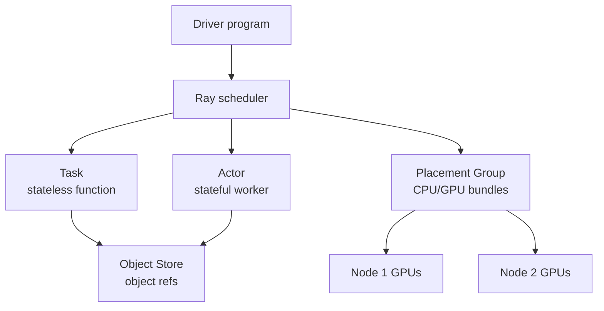
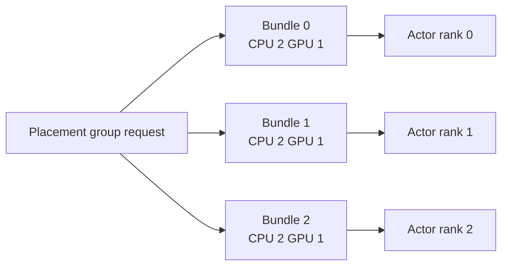
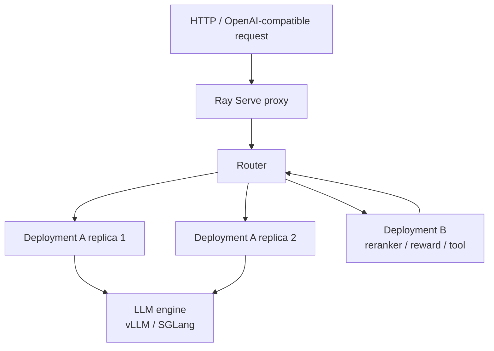
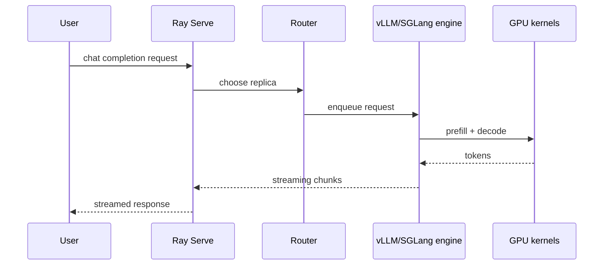
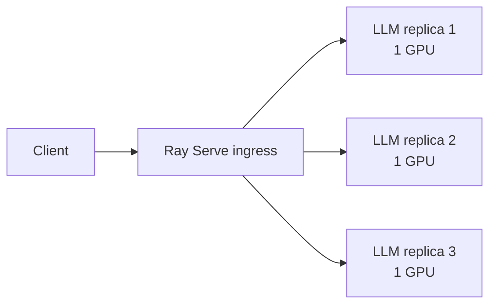
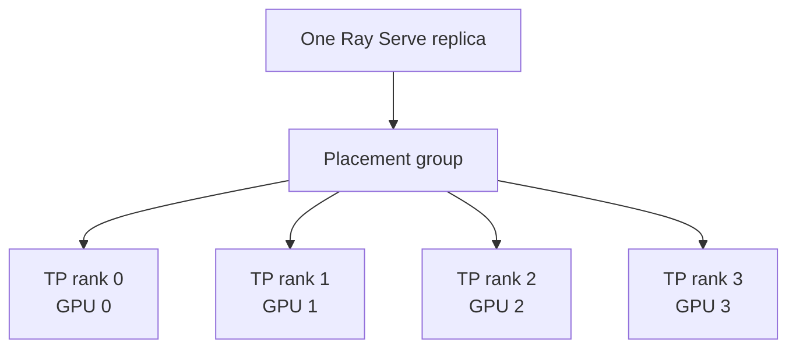
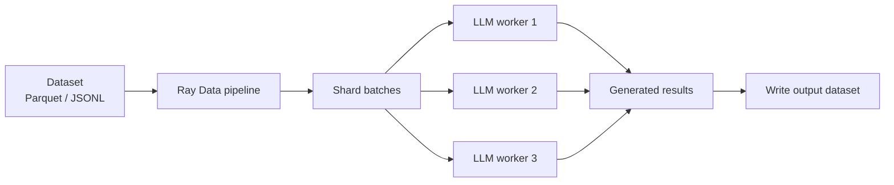
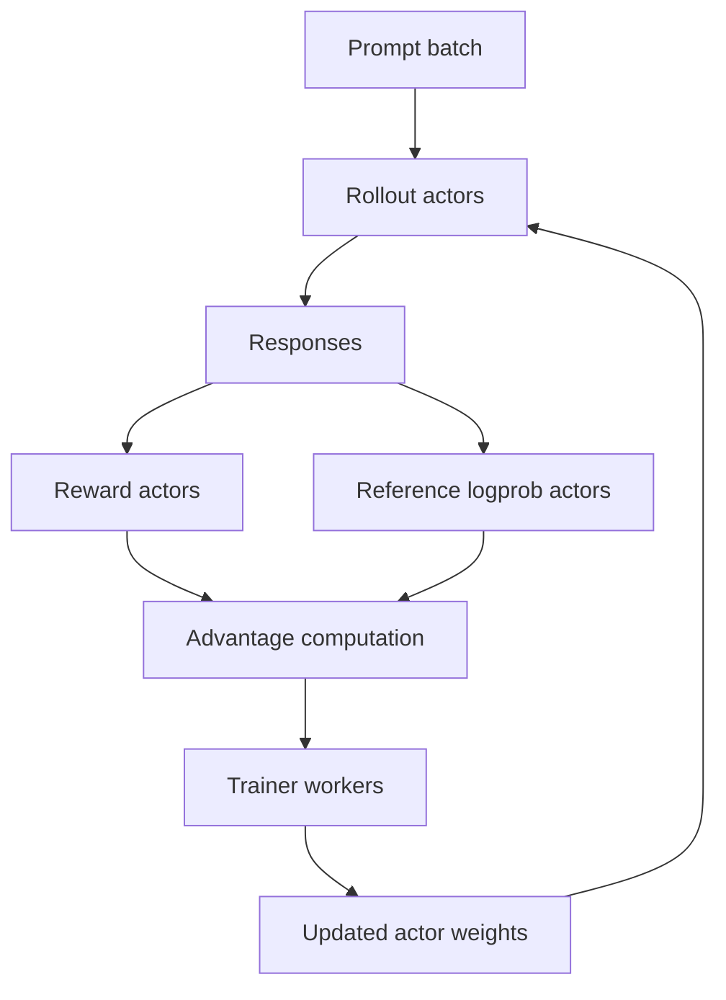

# Ray

## 面试定位

Ray 是分布式 Python 运行时，常用于大模型训练、后训练、批量推理和在线推理服务编排。它本身不是 LLM 推理引擎，而是把任务、actor、资源调度、对象传输、服务副本和 autoscaling 串起来。

面试常问：

- Ray Task 和 Ray Actor 有什么区别？
- Object Store 解决什么问题？
- Placement Group 为什么对多 GPU LLM 很重要？
- Ray Serve 和 vLLM/SGLang 的边界是什么？
- Ray 在 LLM 在线推理和 batch inference 中分别怎么用？

一句话概括：

> Ray 负责“分布式编排和资源调度”，vLLM/SGLang 负责“单个推理引擎的 token 调度和 KV Cache 管理”；生产 LLM serving 往往把二者组合起来。

## Ray Core 基础

Ray Core 提供四个最常用抽象：

| 概念 | 作用 | LLM 系统例子 |
|---|---|---|
| Task | 无状态远程函数 | 批量预处理、离线打分、reward 计算 |
| Actor | 有状态远程 worker | rollout worker、模型服务副本、参数同步 worker |
| Object Ref / Object Store | 分布式对象引用和共享内存对象存储 | batch 数据、生成结果、logprob、embedding |
| Placement Group | 原子预留一组 CPU/GPU 资源 | TP/PP rank、DP group、actor gang scheduling |



## Task vs Actor

Task 适合短生命周期、无状态计算：

```text
preprocess shard
score batch
compute reward
merge metrics
```

Actor 适合长生命周期、有状态计算：

```text
load model once
keep tokenizer / engine / cache
serve many requests
maintain rollout environment state
```

LLM 系统里，只要 worker 需要常驻模型权重，一般就应该用 Actor 或 Ray Serve replica，而不是每次 Task 重新加载模型。

## Object Store

Ray 的对象通过 `ObjectRef` 传递。对象可以放在集群任意节点的 object store 中，调用方用引用拿结果。

这对 LLM 工作流有两个意义：

- worker 之间传大 batch 时，不必把数据塞进普通函数返回值里手工管理。
- 调度系统能追踪对象依赖，决定任务什么时候可以运行。

但它不是无限缓存。大模型系统里要注意：

- 不要把超大模型权重频繁放进 object store。
- 大量长文本、logits、KV Cache 不适合随意跨节点传。
- 对象生命周期要及时释放，否则容易造成 object store pressure。

## Placement Group

LLM 多 GPU 推理经常要求一组 rank 同时存在：

- TP ranks。
- PP stages。
- data parallel attention ranks。
- rollout worker + colocated engine。

Placement Group 可以把一组资源 bundle 原子地预留出来，避免只启动了一半 rank。



常见策略：

- `PACK`：尽量放在少数节点，减少跨节点通信。
- `SPREAD`：分散放置，提高故障隔离。
- `STRICT_PACK`：强制放在同一节点，常用于需要强局部性的 rank group。

大模型推理中，TP 通常希望优先放在 NVLink/NVSwitch 内；跨节点 TP/PP 要考虑网络带宽和延迟。

## Ray Serve

Ray Serve 是基于 Ray 的在线服务层。它提供：

- HTTP ingress。
- deployment。
- replica。
- request routing。
- autoscaling。
- resource 配置。
- model composition。
- streaming 和多模型 pipeline。



Ray Serve 的 deployment 是逻辑服务；replica 是实际运行的 Python 进程。一个 deployment 可以配置多个 replica，Serve router 负责分发请求。

## Ray Serve 和 vLLM/SGLang 的边界

| 层 | 负责什么 |
|---|---|
| Ray Core | 分布式任务、actor、object store、资源调度 |
| Ray Serve | HTTP/API、deployment、replica、routing、autoscaling |
| Ray Serve LLM | LLM serving 模式封装，例如 OpenAI API、PD disaggregation、data parallel attention |
| vLLM/SGLang | 推理 engine、continuous batching、KV Cache、prefix cache、kernel 调度 |
| NCCL/torch.distributed | 多 GPU collective communication |

所以一个典型请求路径是：



## 在线 LLM Serving 技术路线

### 1. 单机单副本

先用 vLLM/SGLang 启一个模型 endpoint：

- 确认模型能加载。
- 测 TTFT、TPOT、tokens/s。
- 设置 `max_model_len`、`max_num_seqs`、batch 参数。
- 确认 streaming、stop tokens、chat template 正确。

Ray 此时不是必须的。

### 2. Ray Serve 包一层服务

当需要生产服务能力时，用 Ray Serve 管理入口和副本：

- HTTP proxy。
- replica 生命周期。
- `num_replicas`。
- `ray_actor_options` 分配 CPU/GPU。
- `max_ongoing_requests` 控制单 replica 背压。
- `autoscaling_config` 按队列/请求量扩缩容。



### 3. 多副本水平扩展

当单副本 QPS 不够：

- 增加 replica 数。
- 每个 replica 绑定固定 GPU。
- router 做负载均衡。
- 结合 prefix-aware 或 session-aware routing 提升 cache 命中。

这对应推理数据并行：复制模型，分发请求。

### 4. 单副本多 GPU

当模型放不下单卡：

- tensor parallel：切矩阵权重。
- pipeline parallel：切层。
- placement group：保证 rank 资源一起启动。
- 优先同节点高速互联，再考虑跨节点。



### 5. Ray Serve LLM 高级模式

Ray Serve LLM 针对 LLM serving 封装了更复杂的模式：

- OpenAI-compatible API。
- multi-node multi-GPU deployment。
- data parallel attention。
- prefill/decode disaggregation。
- custom routing。
- multi-model serving。

典型组合：

```text
普通 dense model:
Ray Serve replicas + vLLM TP/PP

高吞吐 MoE:
Ray Serve LLM + data parallel attention + expert parallel

长 prompt / decode 干扰明显:
Ray Serve LLM + prefill/decode disaggregation

RAG/Agent 服务:
Ray Serve model composition + embedding/rerank/LLM deployments
```

## Batch Inference 技术路线

在线服务关注 tail latency；批量推理更关注总吞吐和成本。

Ray Data 常用于：

- 读取大规模数据集。
- map/filter/partition。
- 调用 vLLM/SGLang 或已部署 endpoint。
- 写回 Parquet/JSONL。



批量推理常见优化：

- 增大 batch，提高 GPU 利用。
- 按 prompt length 分桶，减少 padding 和调度浪费。
- 对失败样本做 retry。
- 把输入输出 schema 固定，方便断点续跑。
- 避免把所有生成结果一次性拉回 driver。

## Ray 在后训练中的位置

后训练系统会同时包含推理负载和训练负载：

- actor rollout：推理生成。
- reference logprob：前向打分。
- reward：规则、模型或环境。
- trainer：反向传播更新。

Ray 适合把这些 worker 组织起来：



这也是 veRL、RLlib 或自研 RLHF 系统常用 Ray 的原因：不是因为 Ray 替代了训练框架，而是因为它能把异构 worker 和资源调度统一管理。

## 生产关注点

| 问题 | 说明 | 处理 |
|---|---|---|
| 冷启动慢 | 模型权重大，replica 启动慢 | 预热、最小副本数、镜像缓存 |
| 资源碎片 | GPU/CPU bundle 无法凑齐 | placement group、节点规格统一 |
| object store 压力 | 大对象堆积 | 控制对象生命周期，避免传 KV/logits 大对象 |
| tail latency 高 | 长请求拖慢队列 | 分桶、限流、prefix routing、独立长上下文池 |
| rank 失败 | TP/PP/DP group 中一个 rank 挂掉 | 整组重启，健康检查 |
| autoscaling 抖动 | 负载突增突降 | min replicas、冷却时间、队列阈值 |
| 版本不一致 | 多节点环境不同 | runtime env、镜像、依赖锁定 |

## 面试高频问题

1. **Ray 和 vLLM 是什么关系？**  
   vLLM 是推理引擎，负责 token 调度和 KV Cache；Ray 是分布式运行时和服务编排层，负责 replica、资源、路由和扩缩容。

2. **什么时候必须用 Ray？**  
   单机单模型不一定需要。多机、多副本、复杂 pipeline、后训练 worker 编排、batch inference 大规模调度时更有价值。

3. **Ray Actor 为什么适合 LLM worker？**  
   Actor 可以长期持有模型权重、tokenizer、engine 和状态，避免每次请求重复初始化。

4. **Placement Group 为什么重要？**  
   多 GPU 模型需要一组 rank 同时启动并放在合适拓扑上，否则只启动部分 rank 会造成资源浪费或 collective hang。

5. **Ray Serve 的 replica 和推理 DP 有什么关系？**  
   多个 replica 各自处理不同请求，就是在线推理最常见的数据并行形态。

6. **Ray Object Store 能不能放 KV Cache？**  
   通常不应该。KV Cache 是高频 GPU 内存状态，应由推理 engine 管理；跨节点放 object store 会引入巨大传输和生命周期问题。

## 参考资料

- [Ray Core Key Concepts](https://docs.ray.io/en/latest/ray-core/key-concepts.html)
- [Ray Core Objects](https://docs.ray.io/en/latest/ray-core/objects.html)
- [Ray Serve: Scalable and Programmable Serving](https://docs.ray.io/en/latest/serve/index.html)
- [Ray Serve Deployment Configuration](https://docs.ray.io/en/latest/serve/configure-serve-deployment.html)
- [Ray Serve LLM Overview](https://docs.ray.io/en/latest/serve/llm/index.html)
- [Ray Serve LLM Architecture Overview](https://docs.ray.io/en/latest/serve/llm/architecture/overview.html)
- [Ray Serve LLM vLLM Compatibility](https://docs.ray.io/en/latest/serve/llm/user-guides/vllm-compatibility.html)
- [Ray Serve LLM Data Parallel Attention](https://docs.ray.io/en/latest/serve/llm/user-guides/data-parallel-attention.html)
- [Ray Serve LLM Cross-node Parallelism](https://docs.ray.io/en/latest/serve/llm/user-guides/cross-node-parallelism.html)
- [Ray Data: Working with LLMs](https://docs.ray.io/en/latest/data/working-with-llms.html)
