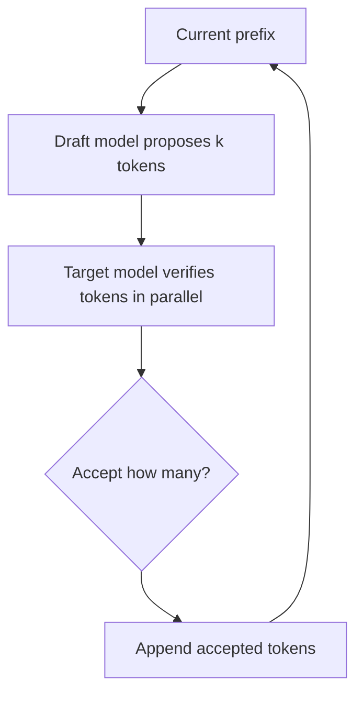

# Speculative Decoding 和 EAGLE

## 面试定位

Speculative Decoding 是大模型推理加速方法。它不改变目标模型输出分布，而是用小模型或 draft head 先提出多个候选 token，再由大模型并行验证。

一句话概括：

> 投机解码用便宜的 draft 模型先猜多个 token，用昂贵的 target 模型一次性验证，从而减少 target 模型自回归调用次数。

## 标准自回归 decode

```text
target model -> token 1
target model -> token 2
target model -> token 3
...
```

每个 token 都要跑一次大模型 decode。

## Speculative Decoding 流程



关键：

- draft 模型便宜。
- target 模型验证多个 token。
- 如果接受率高，target 调用次数减少。
- 可以保持与 target sampling 一致的分布。

## 接受率

加速效果取决于：

| 因素 | 影响 |
|---|---|
| draft 准确率 | 越接近 target，接受率越高 |
| draft 成本 | 太贵会抵消收益 |
| 任务分布 | 简单/模板化任务更容易猜中 |
| batch 和系统实现 | 并行验证和调度影响真实速度 |

## EAGLE 系列

EAGLE 的思路不是用一个完整小模型生成 draft，而是利用目标模型的中间特征训练轻量 draft module，预测后续 token 或特征。

简化流程：


EAGLE-3 进一步改进 draft 能力，目标是提高接受率和扩展性。

## 与 KV Cache 的关系

Speculative Decoding 不是减少模型参数，也不是减少单次 target forward 的 FLOPs；它减少的是 target 模型自回归 decode 次数。

需要注意：

- draft 也需要计算。
- target 验证需要处理候选 token。
- KV Cache 接受/回滚逻辑更复杂。
- serving 框架要支持 speculative scheduler。

## 与其他加速方法对比

| 方法 | 优化点 |
|---|---|
| FlashAttention | attention kernel IO |
| KV Cache | 避免历史 K/V 重算 |
| PagedAttention | KV Cache 管理 |
| Quantization | 权重/激活精度 |
| Speculative Decoding | 减少 target decode 调用次数 |

## 面试高频问题

1. **Speculative Decoding 会改变模型输出吗？**  
   严格算法可以保持 target 模型采样分布不变；工程变体可能做近似。

2. **加速效果由什么决定？**  
   draft 接受率、draft 成本、target 验证效率和系统调度。

3. **EAGLE 和普通小 draft 模型区别？**  
   EAGLE 使用目标模型特征训练轻量 draft 模块，而不是完全独立的小语言模型。

4. **为什么线上不一定总能加速？**  
   接受率低、batch 调度复杂、draft 成本高或 KV Cache 管理复杂都可能抵消收益。

## 参考资料

- [Fast Inference from Transformers via Speculative Decoding](https://arxiv.org/abs/2211.17192)
- [EAGLE: Speculative Sampling Requires Rethinking Feature Uncertainty](https://arxiv.org/abs/2401.15077)
- [EAGLE-3: Scaling up Inference Acceleration of Large Language Models via Training-Time Test](https://arxiv.org/abs/2503.01840)
