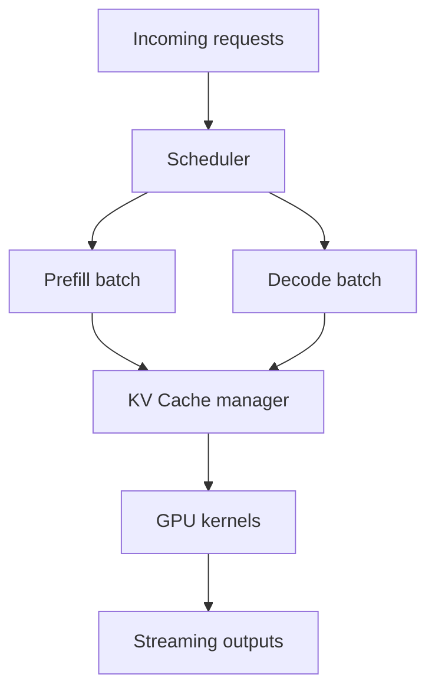
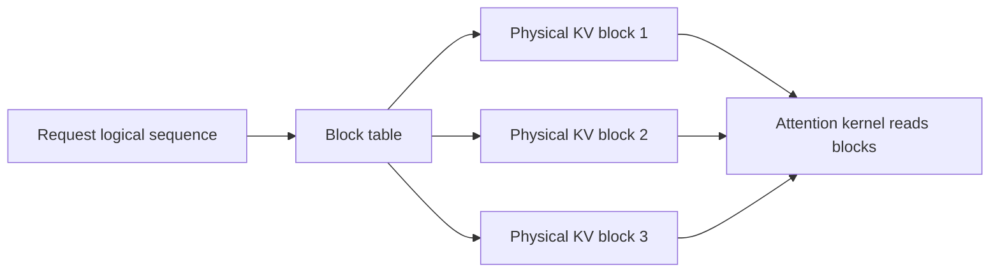
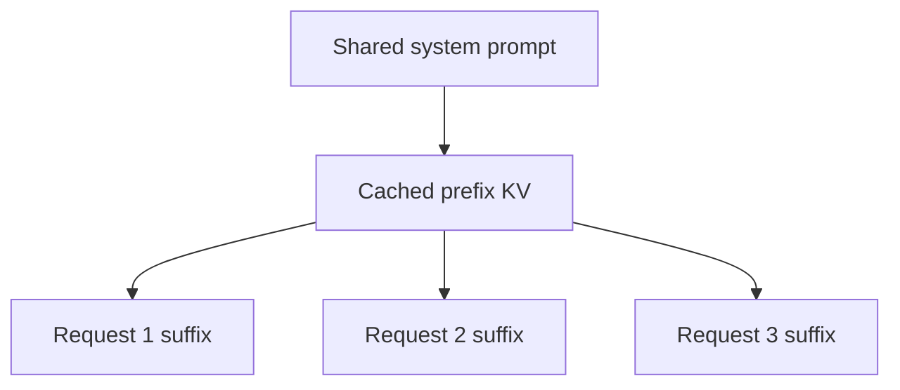
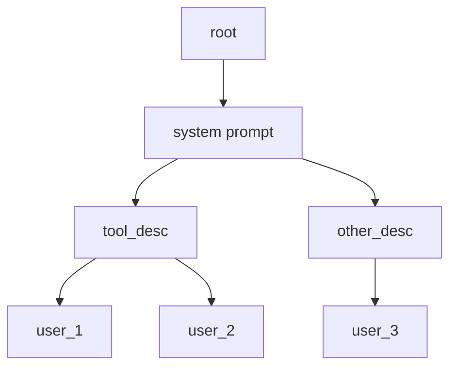

# vLLM SGLang

## 面试定位

vLLM 和 SGLang 都是大模型推理服务框架，但关注点不完全相同。面试常问：

- vLLM 的 PagedAttention 解决什么问题？
- continuous batching 为什么能提高吞吐？
- SGLang 的 RadixAttention 是什么？
- 结构化输出为什么会影响推理速度？
- 在线服务里吞吐、延迟、显存之间如何权衡？

一句话概括：

> vLLM 重点解决高吞吐 LLM serving 中的 KV Cache 管理和调度；SGLang 重点解决多调用、结构化、Agent/RAG 程序的高效执行和缓存复用。

## 推理服务的核心瓶颈

单次 LLM 推理可以分成：

```text
Prefill: 处理 prompt
Decode : 逐 token 生成
```

在线服务比单机 demo 难很多：

- 请求长度不同。
- 输出长度不同。
- 请求动态到达。
- KV Cache 占用大且生命周期不同。
- 用户关心首 token 延迟和总吞吐。
- 需要 OpenAI-compatible API、流式输出、限流和监控。



## vLLM 核心：PagedAttention

传统 KV Cache 通常为每个请求预留连续显存。问题：

- 每个请求生成长度未知。
- 预留太多会浪费。
- 预留太少会扩容困难。
- 不同请求结束后产生碎片。

PagedAttention 借鉴操作系统虚拟内存，把 KV Cache 分成固定大小 block：

```text
Logical token positions:
[0..15] [16..31] [32..47]

Physical KV blocks:
block 7, block 2, block 9
```

请求看到的是连续逻辑序列，底层物理 KV block 可以不连续。

## PagedAttention 流程



优势：

- 减少 KV Cache 内部碎片。
- 支持动态增长。
- 方便共享 prefix blocks。
- 提高同一 GPU 上的并发容量。

## Continuous Batching

静态 batching 会等一批请求全部完成后再处理下一批。问题是：生成长度不同，短请求会等待长请求。

continuous batching 每个 decode step 都可以：

- 加入新请求。
- 移除已完成请求。
- 重组 batch。

```text
step 1: A B C
step 2: A B C D
step 3: A C D   (B finished)
step 4: A C D E
```

好处：

- GPU 利用率更高。
- 吞吐更高。
- 队列等待时间更低。

代价：

- 调度更复杂。
- KV Cache 管理更复杂。
- 不同请求的 latency 可能需要策略平衡。

## Prefix Cache

很多请求有相同前缀：

- 系统 prompt。
- few-shot examples。
- 多轮对话历史。
- RAG 模板。
- Agent 工具说明。

Prefix cache 可以复用前缀的 KV Cache，避免重复 prefill。



## SGLang 核心：结构化 LLM 程序

SGLang 的定位不只是“跑一个模型”，而是高效执行复杂 LLM program：

- 多次 generation。
- 分支和循环。
- 并行调用。
- few-shot / multi-turn / RAG。
- JSON、正则、grammar constrained decoding。
- 多模态输入。

它包括：

- frontend：Python-embedded language，描述 LLM program。
- runtime：高性能推理运行时。

## RadixAttention

SGLang 的 RadixAttention 用 radix tree 管理可共享的 KV Cache prefix。

直觉：

```text
Prompt A: system + tool_desc + user_1
Prompt B: system + tool_desc + user_2
Prompt C: system + other_desc + user_3
```

`system + tool_desc` 可以共享。Radix tree 让运行时自动发现和复用这些公共前缀。



## 结构化输出加速

JSON/grammar constrained decoding 常见于 Agent 和业务系统。朴素做法每步检查合法 token，可能增加开销。

SGLang 论文中提到使用 compressed finite state machines 等方式加速结构化输出解码。

核心思想：

- 把输出约束编译成状态机。
- 每步根据当前状态限制可选 token。
- 尽量减少约束检查开销。

## vLLM vs SGLang

| 维度 | vLLM | SGLang |
|---|---|---|
| 核心卖点 | PagedAttention、serving throughput | 结构化 LLM program 高效执行 |
| KV Cache | block-based paging | RadixAttention / prefix reuse |
| 调度 | continuous batching | runtime-level scheduling |
| 适合场景 | 通用 API serving | Agent、RAG、多调用、结构化输出 |
| API | OpenAI-compatible 常用 | runtime + frontend program |

实际生产中，二者的功能边界会不断扩展。面试不要把它们说成非此即彼，更准确是：

> vLLM 更像高吞吐推理服务底座；SGLang 更强调复杂 LLM 应用程序的执行效率。

## 推理服务关键指标

| 指标 | 含义 |
|---|---|
| TTFT | Time To First Token，首 token 延迟 |
| TPOT | Time Per Output Token，单 token 延迟 |
| Throughput | 每秒处理 token/request 数 |
| Concurrency | 同时服务请求数 |
| GPU utilization | GPU 利用率 |
| KV Cache hit rate | prefix/cache 复用效果 |
| Queueing latency | 排队等待时间 |

优化时经常要权衡：

- 更大 batch 提高吞吐，但可能增加单请求延迟。
- 更长上下文提升能力，但降低并发。
- prefix cache 提升重复 prompt 效率，但需要额外缓存管理。

## 面试高频问题

1. **PagedAttention 解决什么？**  
   把 KV Cache 分块管理，减少显存碎片，支持动态增长和更高并发。

2. **continuous batching 为什么有效？**  
   在线请求长度不同，continuous batching 每步动态加入/移除请求，让 GPU 持续有活干。

3. **SGLang 的 RadixAttention 和 vLLM PagedAttention 有什么区别？**  
   PagedAttention 关注 KV Cache 的块式内存管理；RadixAttention 关注前缀结构复用。

4. **为什么结构化输出会影响性能？**  
   约束解码需要限制合法 token，朴素实现会增加每步检查开销。

5. **服务优化只看 tokens/s 吗？**  
   不够。还要看 TTFT、TPOT、并发、稳定性、cache 命中率和成本。

## 参考资料

- [Efficient Memory Management for Large Language Model Serving with PagedAttention](https://arxiv.org/abs/2309.06180)
- [vLLM Documentation](https://docs.vllm.ai/)
- [SGLang: Efficient Execution of Structured Language Model Programs](https://arxiv.org/abs/2312.07104)
- [SGLang Documentation](https://docs.sglang.ai/)
