# 数据并行（DP、DDP、FSDP）

## 面试定位

数据并行在大模型系统里有两层含义：

- 训练里：多张 GPU 处理不同 mini-batch，通过梯度同步保持模型一致。
- 推理里：多份模型副本处理不同请求，通过路由和负载均衡提高并发吞吐。

面试常问：

- DP、DDP、FSDP 分别切分了什么？
- 推理服务里的 data parallel 和训练 DDP 是不是一回事？
- 模型放不下单卡时，应该先用 DP 还是 TP/PP？
- 为什么 FSDP 适合训练，但通常不是在线推理首选？
- Ray Serve/vLLM 里的 data parallel attention 解决什么问题？

一句话概括：

> 推理里的数据并行主要是“复制模型、分发请求、提高吞吐”；训练里的 DDP/FSDP 主要是“复制或分片模型、同步梯度、降低训练成本”。二者都叫 data parallel，但通信模式和目标不同。

## 先区分训练和推理

训练时有反向传播：

```text
different data batch -> forward -> backward -> sync gradients -> optimizer step
```

推理时没有梯度同步：

```text
different requests -> independent model replica -> generate response
```

所以不要把 DDP 的 `all-reduce gradients` 直接套到在线推理。在线推理更关心：

- 请求路由。
- batch 调度。
- KV Cache 容量。
- 首 token 延迟。
- 总吞吐。
- 副本扩缩容。

## 三个概念

| 概念 | 主要场景 | 模型权重 | 通信 | 解决问题 |
|---|---|---|---|---|
| DP | 训练/推理 | 每个 worker 一份完整权重 | 训练同步梯度；推理通常无同步 | 扩大 batch 或请求并发 |
| DDP | 训练 | 每个 rank 一份完整权重 | 反向后梯度 all-reduce | 多 GPU/多机训练加速 |
| FSDP | 训练为主 | 参数、梯度、优化器状态分片 | 参数 all-gather、梯度 reduce-scatter | 模型/优化器状态放不下单卡 |

更准确地说，DP、DDP、FSDP 的区别不在于“数据怎么切”，因为它们都会把 batch 切给不同 GPU。真正区别在于：

- 模型副本怎么放。
- 梯度怎么同步。
- 参数、梯度、优化器状态怎么占显存。
- 通信发生在什么时候。

## 训练时显存里有什么

训练一个模型时，GPU 里不只是模型参数。常见显存对象包括：

| 显存对象 | 含义 |
|---|---|
| Parameters | 模型权重，例如 linear/attention/embedding 参数 |
| Gradients | 反向传播得到的参数梯度 |
| Optimizer states | Adam 的 momentum、variance、master weight 等 |
| Activations | 前向传播中间激活，反向传播要用 |
| Temporary buffers | 通信、矩阵乘、attention、kernel workspace 等临时内存 |

所以大模型训练显存爆炸通常不是：

```text
模型参数太大
```

而是：

```text
参数 + 梯度 + 优化器状态 + 激活 + 临时 buffer
一起太大
```

ZeRO/FSDP 主要优化的是模型状态：

```text
parameters + gradients + optimizer states
```

它们不自动解决所有激活显存问题。长上下文训练里，仍然经常需要 activation checkpointing、FlashAttention、sequence parallel 或降低 micro batch。

## 数据并行的训练语义

假设全局 batch 有 1024 条样本，4 张 GPU 做数据并行：

```text
GPU0: 256 samples
GPU1: 256 samples
GPU2: 256 samples
GPU3: 256 samples
```

每张 GPU 都做：

```text
forward -> loss -> backward -> local gradient
```

然后把多张 GPU 的梯度平均：

```text
global_grad = (grad0 + grad1 + grad2 + grad3) / 4
```

最后所有 GPU 使用相同的全局平均梯度更新参数。直觉上等价于：

```text
单卡一次看 1024 条样本算梯度
多卡每张看 256 条样本，各算梯度，再平均
```

这里同步的是梯度，不是简单平均 loss。

## DP：单进程多卡

PyTorch 传统 `nn.DataParallel` 是单进程多 GPU。它的路线很直观：

```text
Step 1: 主进程拿到一个 batch
Step 2: scatter，把 batch 切到多张 GPU
Step 3: 每张 GPU 放一份完整模型副本
Step 4: 每张 GPU forward/backward
Step 5: gather/reduce，把梯度汇总到主 GPU
Step 6: 主 GPU optimizer.step()
Step 7: 参数再同步到其他 GPU
```

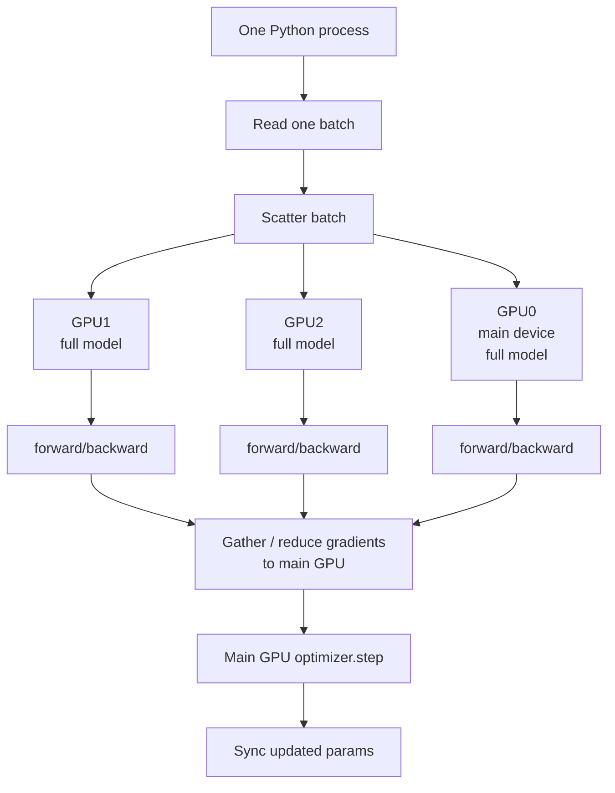

DP 的问题是中心化：

- GPU0 既要计算，又要收集和更新。
- 通信集中到主 GPU。
- 一个 Python 进程调度多张 GPU，容易受调度开销影响。
- GPU 数越多，主卡越容易成为瓶颈。

所以现在训练里通常不推荐 DP。即使是单机多卡，也更常用 DDP。

推理服务里说 DP，通常指多个独立 serving replica：

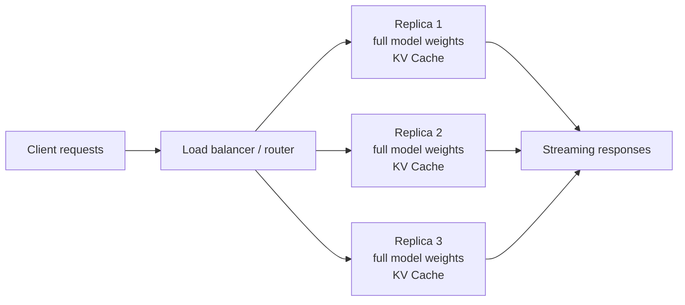

## 推理数据并行的技术路线

第一步，先确认模型是否能放进单 GPU。

- 能放下：优先单 GPU serving，把 vLLM/SGLang 的 batch、KV Cache、prefix cache 调好。
- 放不下：先用 tensor parallel 或 pipeline parallel 把单个模型副本切到多 GPU。
- 单副本吞吐不够：再横向复制多个副本，也就是推理 DP。
- MoE 模型吞吐不够：考虑 DP + expert parallel，或 Ray Serve/vLLM 的 data parallel attention。

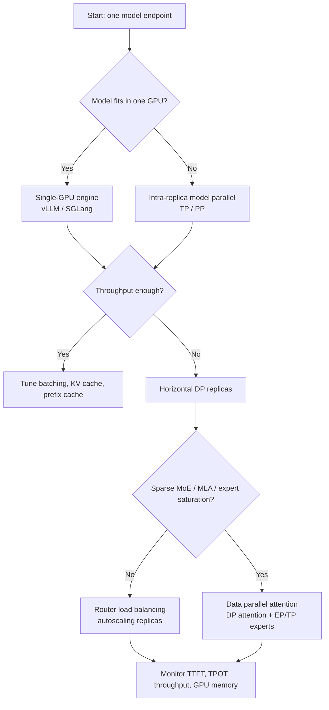

## 普通推理 DP

普通推理 DP 的每个 replica 是独立的：

- 每个 replica 加载完整模型或一个完整 TP/PP 模型组。
- 每个 replica 维护自己的 KV Cache。
- router 把请求分发到不同 replica。
- replica 之间通常不需要 token 级同步。

这种路线适合：

- dense model。
- 单个模型副本已经能运行。
- 请求多、并发高。
- 希望通过增加副本线性提高 QPS。

它不适合解决：

- 单请求延迟过高。
- 模型权重单卡放不下。
- 单个超长上下文请求 KV Cache 不够。

如果模型太大，应该先在一个 replica 内使用 TP/PP，而不是直接 DP。因为 DP 复制完整模型，不能降低单副本显存。

## DP + TP/PP

生产里常见的是二维并行：

```text
data_parallel_size = 4
tensor_parallel_size = 2

total GPUs = 4 x 2 = 8
```

含义：

- 4 个 serving replica 负责不同请求。
- 每个 replica 内部用 2 张 GPU 做 tensor parallel。
- router 看到的是 4 个可调度副本。

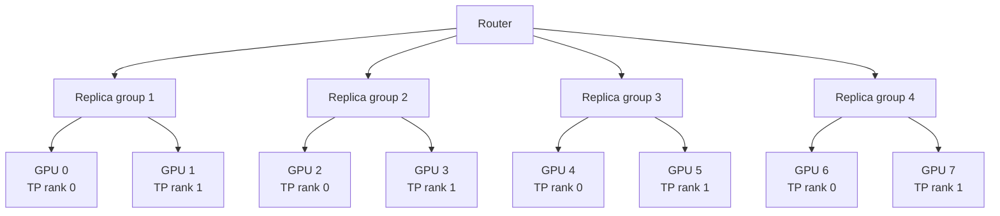

这个结构的判断顺序：

1. 用 TP/PP 解决“单副本能不能跑”。
2. 用 DP 解决“并发和吞吐够不够”。
3. 用调度策略解决“不同请求长度导致的负载不均”。

## Data Parallel Attention

普通 DP 中，各副本完全独立。Ray Serve LLM 和 vLLM 文档里还提到一种更专门的 data parallel attention，主要面向稀疏 MoE 推理。

核心思想：

- attention/QKV 层在 DP rank 上复制。
- MoE expert 可以结合 expert parallel 或 tensor parallel 分布。
- 多个 DP rank 不是完全独立副本，forward 需要对齐。
- expert 层可能需要跨 rank 做 token dispatch/combine 或 all-to-all。

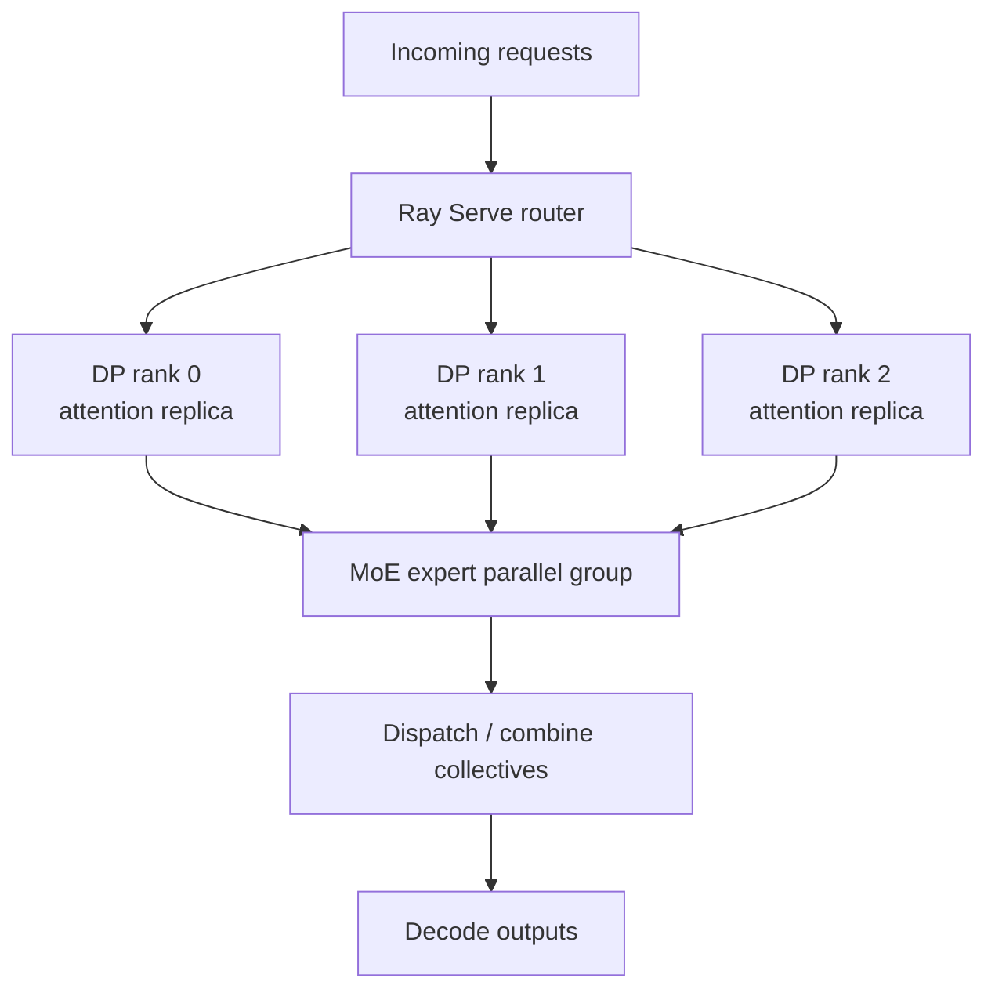

它适合：

- 稀疏 MoE 模型。
- 高吞吐场景。
- decode 阶段需要更大有效 batch 去喂饱 experts。
- KV Cache 容量成为并发瓶颈。

它不适合：

- 低并发服务。
- 普通 dense model。
- 已经能用 TP 充分切分 KV Cache 的 GQA 模型。
- 运维团队还没有能力处理 rank 级故障、集体通信和严格放置。

## DDP：训练数据并行

DDP 是 PyTorch 训练里最常见的数据并行实现。

DDP 和 DP 一样，每张 GPU 都有完整模型副本，但它通常是：

```text
one process per GPU
```

例如 4 张 GPU：

```text
rank0 -> GPU0
rank1 -> GPU1
rank2 -> GPU2
rank3 -> GPU3
```

整体流程：

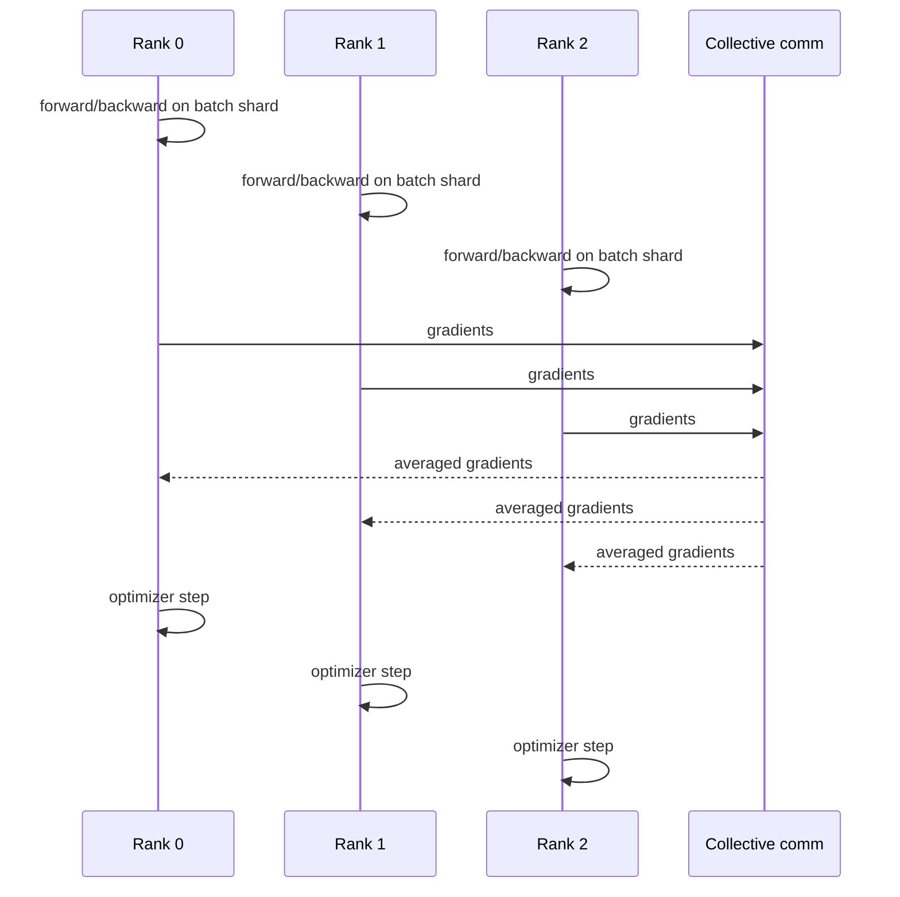

关键点：

- 每个 rank 持有完整模型副本。
- 每个 rank 处理不同数据 shard。
- 反向传播后同步梯度。
- 模型参数在 optimizer step 后保持一致。
- 一般推荐一张 GPU 对应一个进程。

DDP 不是把所有梯度交给某一张主卡更新。每个 rank 都会拿到相同的平均梯度，然后每个 rank 在本地执行 `optimizer.step()`。因为初始参数相同、每步平均梯度相同、optimizer 逻辑相同，所以各 rank 的参数会保持一致。

## DDP 的 All-Reduce

假设 4 张 GPU 得到 4 份本地梯度：

```text
GPU0: grad0
GPU1: grad1
GPU2: grad2
GPU3: grad3
```

All-reduce 后，每张 GPU 都拿到同一个平均梯度：

```text
GPU0: (grad0 + grad1 + grad2 + grad3) / 4
GPU1: (grad0 + grad1 + grad2 + grad3) / 4
GPU2: (grad0 + grad1 + grad2 + grad3) / 4
GPU3: (grad0 + grad1 + grad2 + grad3) / 4
```

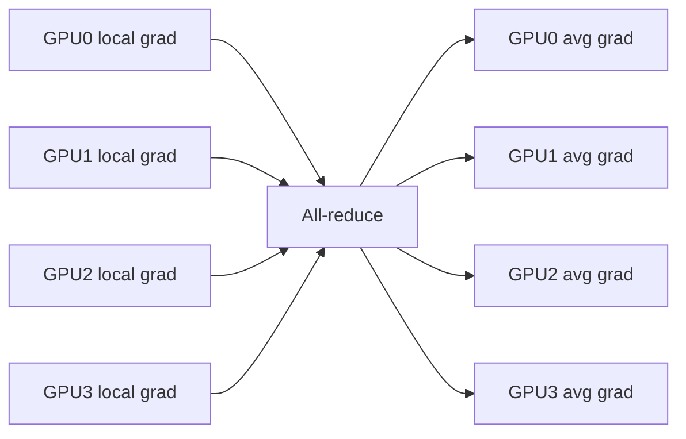

DDP 的高效之处在于，它通常不是等整个 backward 完全结束后才通信。PyTorch DDP 会给参数注册 autograd hook，并把梯度组织成 bucket：

```text
bucket 0: 一组参数梯度
bucket 1: 一组参数梯度
bucket 2: 一组参数梯度
```

当一个 bucket 里的梯度都 ready，就可以异步发起 all-reduce。这样 backward 还在继续算前面层梯度时，后面层已经算好的梯度可以在后台通信。

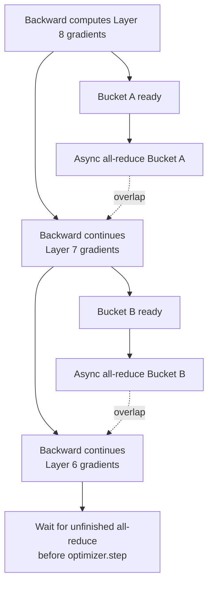

DDP 一轮训练可以拆成：

```text
Step 0: torchrun 启动多个进程
Step 1: init_process_group() 建立通信组
Step 2: 每个 rank 构建同样的模型
Step 3: DDP 包装模型，注册 gradient hooks
Step 4: DistributedSampler 切分数据
Step 5: 每个 rank forward，得到 local loss
Step 6: backward 计算 local gradients
Step 7: bucket ready 后自动 all-reduce
Step 8: 每个 rank 的 param.grad 变成平均梯度
Step 9: 每个 rank 本地 optimizer.step()
```

DDP 适合模型能放进单 GPU、但要扩大训练吞吐的场景。它不能解决模型权重本身放不下的问题。

DDP 的显存瓶颈是每张 GPU 都保存完整模型状态：

```text
每张 GPU 显存 ≈ P + G + O + activations + buffers
```

其中：

- `P`：parameters。
- `G`：gradients。
- `O`：optimizer states。

如果模型状态需要 80GB，8 张 GPU 做 DDP 不是每张存 10GB，而是每张仍然要存接近 80GB 的模型状态。这就是 FSDP/ZeRO 要解决的问题。

## FSDP：分片数据并行

FSDP 仍然属于数据并行，但每个 rank 不再常驻完整模型状态。

它分片：

- parameters。
- gradients。
- optimizer states。

计算某一层时临时 all-gather 参数，反向后 reduce-scatter 梯度。

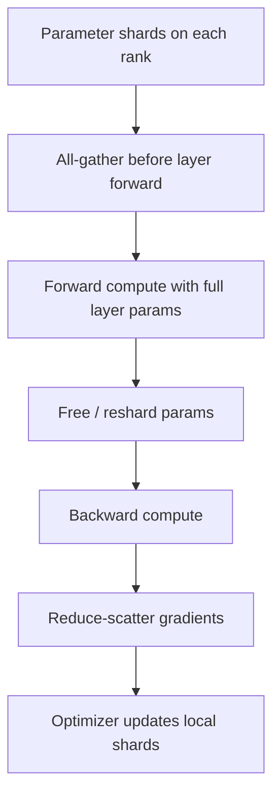

FSDP 的训练语义仍然是数据并行：每张 GPU 处理不同数据切片。但存储上，它把模型状态切开，所以看起来又像“模型状态分片”。

## FSDP 的 All-Gather 和 Reduce-Scatter

FSDP 的参数常态是分片存储。假设参数 `W` 被切成 4 片：

```text
GPU0: W_part0
GPU1: W_part1
GPU2: W_part2
GPU3: W_part3
```

计算某个模块前，需要 all-gather 当前模块参数：

```text
GPU0: full W
GPU1: full W
GPU2: full W
GPU3: full W
```

但这个 full parameter 通常只是临时 materialize，用完会释放或 reshard。

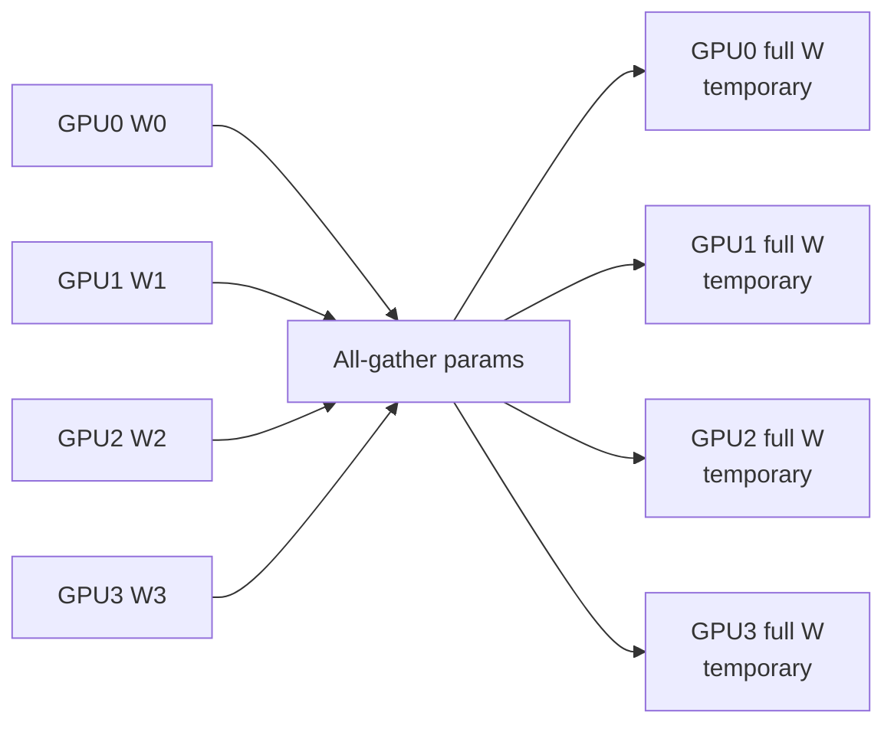

反向传播后，FSDP 不想让每张 GPU 都保存完整梯度，所以做 reduce-scatter：

```text
先 reduce：把多张 GPU 的梯度求和/平均
再 scatter：每张 GPU 只保留自己负责的 gradient shard
```

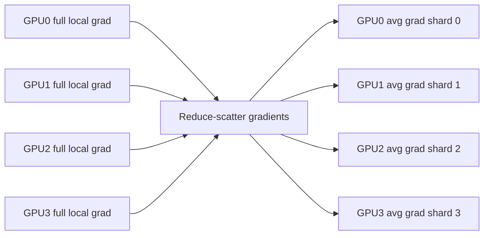

FSDP 一轮训练的时间线：

```text
Forward:
  all-gather current module params
  compute current module
  reshard/free full params
  repeat for next module

Backward:
  all-gather current module params
  compute gradients
  reduce-scatter gradients
  reshard/free full params
  repeat in reverse order

Optimizer:
  each rank updates local parameter shard
```

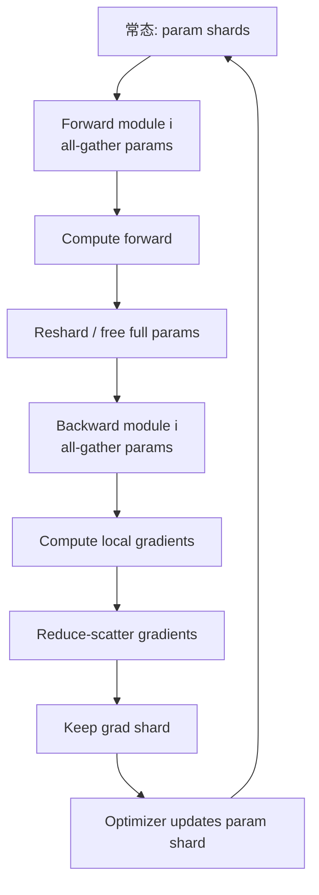

FSDP 适合：

- 训练时参数、梯度、优化器状态太大。
- 希望用数据并行语义训练更大模型。
- 可接受更多通信和更复杂 checkpoint。

在线推理通常不优先用 FSDP：

- 推理没有 optimizer states 和 gradients，FSDP 最省的部分不存在。
- 每层 all-gather 会增加延迟和通信复杂度。
- serving 更常用 TP/PP、quantization、PagedAttention、prefix cache。

但 FSDP 仍和推理有关：

- 训练/微调 checkpoint 可能是 sharded，需要合并或转换成 serving 格式。
- 离线 batch inference 有时会复用训练栈，但生产在线 serving 通常会换成 vLLM/SGLang/TensorRT-LLM 等推理引擎。

## 显存公式理解 DDP 和 FSDP

假设：

```text
P = 参数显存
G = 梯度显存
O = 优化器状态显存
N = 数据并行 GPU 数
```

DDP 每张 GPU 都有完整模型状态：

```text
DDP 每卡显存 ≈ P + G + O + activations + buffers
```

FSDP 把模型状态分到 `N` 张 GPU 上：

```text
FSDP 每卡显存 ≈ P/N + G/N + O/N + activations + all-gather buffers
```

所以 FSDP 的核心收益是模型状态显存随数据并行度下降。代价是通信更多：

- forward 前 all-gather 参数。
- backward 中 all-gather 参数。
- backward 后 reduce-scatter 梯度。
- 更复杂的 prefetch、reshard、checkpoint 和 state dict 管理。

一句话：

```text
DDP 优先解决训练加速问题；
FSDP 优先解决模型状态显存问题。
```

如果模型单卡能放下，DDP 往往更简单、更稳定，也可能更快。如果 DDP 单卡显存放不下，才需要 FSDP/ZeRO 这类分片方案。

## FSDP 和 ZeRO

ZeRO 可以理解成一类模型状态分片思路：

| 阶段 | 分片内容 |
|---|---|
| ZeRO-1 | optimizer states |
| ZeRO-2 | optimizer states + gradients |
| ZeRO-3 | optimizer states + gradients + parameters |

FSDP 的 FULL_SHARD 思路和 ZeRO-3 很接近：都把参数、梯度、优化器状态切到数据并行 ranks 上。区别是具体系统、API、调度和 checkpoint 格式不同。

## 常见配置概念

| 概念 | 作用 | 代价 |
|---|---|---|
| Auto Wrap Policy | 决定哪些模块作为 FSDP 单元 | 包太大峰值显存高，包太碎通信频繁 |
| Reshard After Forward | forward 后释放 full params，只保留 shard | 更省显存，但 backward 可能重新 all-gather |
| Backward Prefetch | backward 当前层时提前 all-gather 后续层参数 | 通信计算重叠，但峰值显存可能升高 |
| CPU Offload | 参数或 optimizer states 放到 CPU | 省 GPU 显存，但 PCIe/CPU-GPU 传输慢 |
| Activation Checkpointing | 不保存部分激活，backward 时重算 | 用计算换激活显存 |

实践里，Transformer 通常不会只把整个模型作为一个巨大的 FSDP 单元。更常见的是按 Transformer Block 包裹，让每次 all-gather 的参数规模可控。

## DP、DDP、FSDP 对比

| 维度 | DP | DDP | FSDP |
|---|---|---|---|
| 进程模型 | 单进程多卡 | 多进程，通常每卡一进程 | 多进程，通常每卡一进程 |
| 每卡参数 | 完整副本 | 完整副本 | 常态下只有 shard |
| 每卡梯度 | 汇总机制低效 | 完整梯度 | 梯度 shard |
| 每卡优化器状态 | 不适合大规模 | 完整 optimizer states | optimizer states shard |
| 主要通信 | scatter/gather/reduce 到主卡 | gradient all-reduce | parameter all-gather + gradient reduce-scatter |
| 是否中心化 | 是 | 否 | 否 |
| 主要优势 | 代码简单 | 训练吞吐和扩展性好 | 显存效率高，可训更大模型 |
| 主要问题 | 主卡瓶颈 | 每卡必须放完整模型状态 | 通信和配置复杂 |
| 典型场景 | 小 demo | 模型单卡能放下的多卡训练 | 大模型训练/微调 |

## 梯度累积的关系

大模型训练经常用 gradient accumulation 扩大全局 batch：

```text
global batch size =
micro_batch_size x gradient_accumulation_steps x data_parallel_size
```

DDP 默认每次 backward 都会同步梯度。做梯度累积时，常用 `no_sync()` 避免每个 micro step 都 all-reduce，只在最后一个 accumulation step 同步一次。

FSDP 也可以配合梯度累积，但因为涉及参数 all-gather、reshard、reduce-scatter 和 offload，配置比 DDP 更敏感。

## 常见误区

1. **DDP 是不是平均 loss？**  
   不是重点。DDP 同步的是参数梯度 gradients，不是简单把 loss 平均。

2. **DDP 每一步都广播参数吗？**  
   一般不需要。初始化参数一致，之后每步梯度同步且 optimizer 更新一致，参数自然保持一致。

3. **FSDP 是不是模型并行？**  
   训练语义上仍是数据并行，因为每个 rank 处理不同数据；存储上是模型状态分片。

4. **FSDP 是不是不需要通信？**  
   不是。FSDP 通信更多，只是把 DDP 的梯度 all-reduce 换成参数 all-gather 和梯度 reduce-scatter 等操作。

5. **FSDP 会自动省激活显存吗？**  
   不完全。FSDP 主要省参数、梯度、优化器状态；激活仍和 batch size、sequence length、hidden size、checkpointing 有关。

## 生产落地路线

### 1. 单副本基准

先测一个 replica：

- 最大 `max_model_len`。
- 最大并发序列数。
- TTFT。
- TPOT。
- tokens/s。
- GPU memory。
- KV Cache block 使用率。

### 2. 判断瓶颈

| 现象 | 可能瓶颈 | 优先路线 |
|---|---|---|
| 模型权重放不下 | 权重显存 | TP/PP、量化 |
| 长上下文并发低 | KV Cache | GQA/MLA、PagedAttention、增加副本 |
| 单副本 GPU 利用低 | batch 不够 | continuous batching、提高并发 |
| QPS 不够 | 副本数不够 | DP replicas、autoscaling |
| MoE expert 利用低 | expert batch 小 | DP attention + EP |
| 首 token 慢 | prefill 慢 | prefix cache、PD disaggregation |

### 3. 横向扩容

推理 DP 的扩容单位一般是 replica group：

```text
replica group = 1 full model instance
             or 1 TP/PP model-parallel group
```

扩容时要同时关注：

- 每个 replica 的显存。
- 总 GPU 数。
- router 是否 prefix-aware。
- 副本冷启动时间。
- 模型权重加载时间。
- streaming 响应是否稳定。

### 4. 故障和扩缩容

普通 DP 中，一个 replica 挂了，router 可以绕过它。

data parallel attention 或 TP/PP group 中，一个 rank 挂了，整个 group 往往不可用，因为集体通信需要所有 rank 参与。生产系统要能：

- 原子创建 replica group。
- 检测 unhealthy rank。
- 整组重启。
- 保留其他健康 group 对外服务。

## 和 Ray 的关系

Ray 本身不是推理 kernel，也不是 KV Cache 管理算法。它在这里主要负责：

- 启动和管理 serving replicas。
- 给每个 replica 分配 CPU/GPU 资源。
- placement group 保证 TP/PP/DP rank 放置。
- Ray Serve 做请求入口、路由、autoscaling。
- Ray Serve LLM 把 vLLM/SGLang 这类 engine 接到生产 serving 编排里。

因此常见架构是：

```text
Ray Serve / Kubernetes 负责服务编排
vLLM / SGLang 负责单副本推理调度和 KV Cache
NCCL / torch.distributed 负责多 GPU collectives
```

## 面试高频问题

1. **推理 DP 和训练 DDP 的区别？**  
   推理 DP 是多个模型副本处理不同请求，通常无梯度同步；训练 DDP 是多个模型副本处理不同 batch，反向后同步梯度。

2. **DP 能不能让一个放不下单卡的模型跑起来？**  
   不能。普通 DP 复制完整模型。模型放不下时先用 TP/PP、量化或更大的 GPU。

3. **为什么 FSDP 不常作为在线推理首选？**  
   FSDP 主要省训练中的参数、梯度和优化器状态；在线推理没有梯度和优化器状态，而且频繁 all-gather 会影响延迟。

4. **什么时候用 DP + TP？**  
   TP 让单个模型副本放进多 GPU；DP 复制多个 TP group 来提高并发吞吐。

5. **Data parallel attention 和普通 DP 有什么区别？**  
   普通 DP 副本独立；data parallel attention 的多个 DP rank 需要作为一个 group 协同 forward，常和 MoE expert parallel、collectives 结合。

6. **扩容推理 DP 时最容易忽略什么？**  
   KV Cache 容量、请求长度分布、prefix cache 命中率、冷启动加载时间和 tail latency。

## 参考资料

- [PyTorch: What is Distributed Data Parallel](https://docs.pytorch.org/tutorials/beginner/ddp_series_theory.html)
- [PyTorch: DistributedDataParallel API](https://docs.pytorch.org/docs/stable/generated/torch.nn.parallel.DistributedDataParallel.html)
- [PyTorch: DDP Design Note](https://github.com/pytorch/pytorch/blob/master/docs/source/notes/ddp.rst)
- [PyTorch: Getting Started with FSDP2](https://docs.pytorch.org/tutorials/intermediate/FSDP_tutorial.html)
- [PyTorch: FullyShardedDataParallel API](https://docs.pytorch.org/docs/stable/fsdp.html)
- [PyTorch Distributed Overview](https://docs.pytorch.org/tutorials/beginner/dist_overview.html)
- [DeepSpeed: ZeRO Tutorial](https://www.deepspeed.ai/tutorials/zero/)
- [vLLM: Distributed Inference and Serving](https://docs.vllm.ai/en/v0.9.1/serving/distributed_serving.html)
- [vLLM: Data Parallel Deployment](https://docs.vllm.ai/en/latest/serving/data_parallel_deployment/)
- [Ray Serve LLM: Data Parallel Attention](https://docs.ray.io/en/latest/serve/llm/user-guides/data-parallel-attention.html)
- [Ray Serve LLM: Cross-node Parallelism](https://docs.ray.io/en/latest/serve/llm/user-guides/cross-node-parallelism.html)
