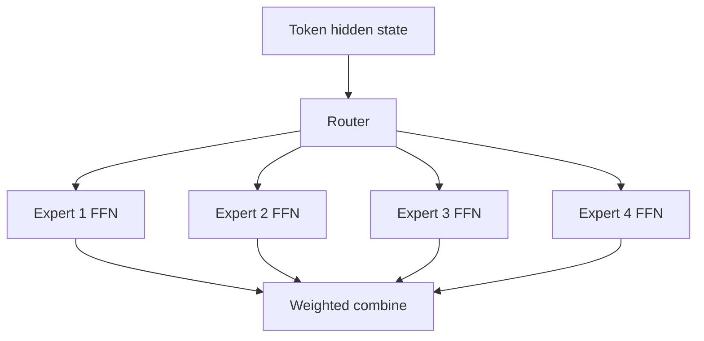
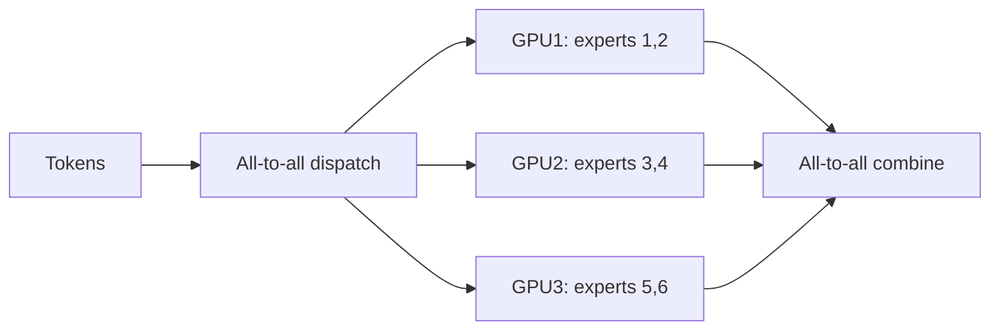

# MoE 和 Expert Parallelism

## 面试定位

MoE（Mixture of Experts）是扩展模型参数量但控制每 token 计算量的重要路线。面试常问：

- MoE 和 dense FFN 的区别是什么？
- Router 怎么选 expert？
- 为什么 MoE 需要 load balancing？
- Expert Parallelism 解决什么工程问题？

一句话概括：

> MoE 通常把 Transformer 中的 dense FFN 替换为多个 expert FFN，每个 token 只激活少数 expert，从而增加总参数量但控制单 token FLOPs。

## Dense FFN vs MoE FFN

Dense FFN：

```text
每个 token 都经过同一套 FFN 参数
```

MoE FFN：

```text
每个 token 先经过 router
router 选择 top-k experts
token 只经过被选中的 expert
```



## Router

Router 输出每个 token 到各 expert 的分数：

$$
p(e|x)=\text{softmax}(W_rx)
$$

然后选择 top-k experts：

```text
top-1: 每个 token 进 1 个 expert
top-2: 每个 token 进 2 个 experts
```

输出通常是 expert 输出的加权和：

$$
y=\sum_{e\in \text{TopK}(x)}p(e|x)\text{Expert}_e(x)
$$

## 为什么需要 Load Balancing

如果 router 总是把 token 分给少数 expert：

- 热门 expert 过载。
- 其他 expert 学不到东西。
- 设备间负载不均。
- 训练和推理吞吐下降。

常见做法：

- auxiliary load balancing loss。
- expert capacity limit。
- token dropping 或 rerouting。
- router z-loss。

## Expert Parallelism

当 expert 数很多时，一张 GPU 放不下所有 expert。Expert Parallelism 把不同 expert 放到不同 GPU 上：



核心代价是 all-to-all 通信。MoE 不是免费扩容：计算更稀疏，但通信和负载均衡更复杂。

## MoE 的优势与代价

| 维度 | 优势 | 代价 |
|---|---|---|
| 参数量 | 可显著增加 | 权重存储更大 |
| 计算量 | 每 token 只激活 top-k | router 和通信开销 |
| 能力 | experts 可学习不同模式 | expert collapse 风险 |
| 系统 | 可跨设备放 expert | all-to-all 难优化 |

## MoE 与推理

推理时 MoE 的挑战：

- 不同 token 路由不同，batch 内计算不规则。
- expert 负载不均会拖慢延迟。
- 权重加载和 expert placement 影响吞吐。
- RL 后训练中 token 路由变化还会影响 likelihood 稳定性，GSPO 这类方法就关注过 MoE RL 的稳定性。

## 面试高频问题

1. **MoE 为什么能扩大模型容量？**  
   总 expert 参数很多，但每个 token 只激活少数 expert，因此单 token 计算量受控。

2. **MoE 主要替换 Transformer 哪一部分？**  
   通常替换 FFN/MLP 层，而不是 attention 层。

3. **为什么需要 load balancing loss？**  
   防止 router 把大部分 token 分到少数 expert，造成过载和专家坍缩。

4. **Expert Parallelism 的代价是什么？**  
   token dispatch/combine 需要 all-to-all 通信，系统复杂度高。

## 参考资料

- [Outrageously Large Neural Networks: The Sparsely-Gated Mixture-of-Experts Layer](https://arxiv.org/abs/1701.06538)
- [Switch Transformers](https://arxiv.org/abs/2101.03961)
- [DeepSeek-V2](https://arxiv.org/abs/2405.04434)
