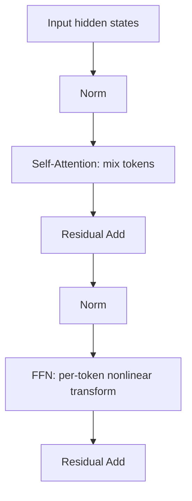
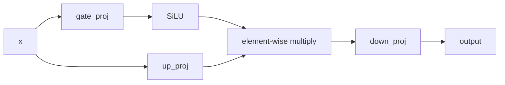
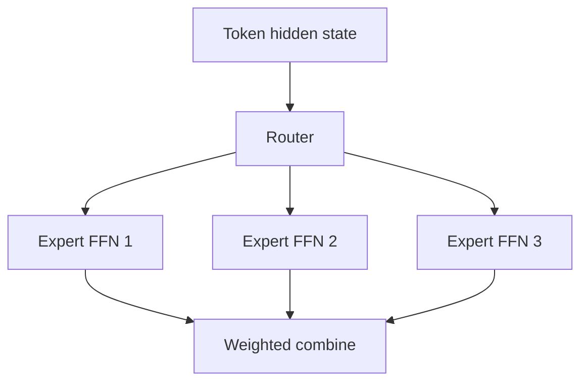

# FFN

## 面试定位

FFN（Feed-Forward Network）是 Transformer block 中最容易被低估的模块。很多人只记住 attention，但现代 LLM 中大量参数和计算都在 FFN/MLP。面试常问：

- FFN 在 Transformer 里负责什么？
- 为什么 FFN 是逐 token 独立计算？
- GELU、SwiGLU、ReLU 有什么区别？
- 为什么 FFN hidden size 通常比 model dimension 大？
- MoE 和 FFN 是什么关系？

一句话概括：

> Attention 负责 token 间通信，FFN 负责每个 token 自身的非线性特征变换和容量扩展；现代 LLM 常用 SwiGLU 形式的 MLP。

## FFN 在 block 中的位置

以 Pre-Norm Decoder block 为例：

```text
x = x + Attention(Norm(x))
x = x + FFN(Norm(x))
```



Attention 的输出已经混合了上下文信息，FFN 再对每个位置的 hidden vector 做非线性变换。

## 原始 FFN 公式

原始 Transformer 的 FFN：

$$
\text{FFN}(x)=W_2 \sigma(W_1x+b_1)+b_2
$$

其中：

- `W1`: `d_model -> d_ff`
- `W2`: `d_ff -> d_model`
- `d_ff` 通常远大于 `d_model`
- `σ` 是激活函数，如 ReLU、GELU、SwiGLU

逐 token 独立计算：

$$
y_t = \text{FFN}(x_t)
$$

不同 token 之间不会在 FFN 内直接交互。跨 token 信息已经由 attention 混合到 `x_t` 里。

## 为什么 hidden size 要扩张

常见设置：

$$
d_{\text{ff}} \approx 4d_{\text{model}}
$$

扩张的直觉：

- 先把 token 表示投影到更高维空间。
- 通过非线性激活选择/组合特征。
- 再压回原 hidden size。

这类似“升维后做非线性加工，再投回残差流”。

参数量近似：

$$
\text{Params}_{\text{FFN}} \approx 2d_{\text{model}}d_{\text{ff}}
$$

如果 `d_ff = 4d_model`：

$$
\text{Params}_{\text{FFN}} \approx 8d_{\text{model}}^2
$$

这通常比 attention 投影参数更多。

## 激活函数

### ReLU

$$
\text{ReLU}(x)=\max(0,x)
$$

优点是简单，缺点是负半轴直接截断，表达相对粗糙。

### GELU

$$
\text{GELU}(x)=x\Phi(x)
$$

`Φ(x)` 是标准正态分布 CDF。GELU 可以理解为带概率门控的平滑 ReLU，BERT/GPT 早期模型常用。

### Swish / SiLU

$$
\text{SiLU}(x)=x\sigma(x)
$$

平滑、非单调，是 SwiGLU 的组成部分。

## GLU 与 SwiGLU

GLU（Gated Linear Unit）引入门控：

$$
\text{GLU}(x)=(xW_u)\odot \sigma(xW_g)
$$

SwiGLU 把 sigmoid 门换成 Swish/SiLU：

$$
\text{SwiGLU}(x)=
\left(\text{SiLU}(xW_g)\odot xW_u\right)W_d
$$

其中：

- `W_g`：gate projection
- `W_u`：up projection
- `W_d`：down projection



SwiGLU 的优势：

- 门控机制让模型动态选择激活哪些特征。
- 实践中比普通 GELU MLP 效果更好。
- LLaMA、Qwen、DeepSeek 等现代 LLM 中常见。

## FFN 与参数记忆

一种常见直觉：FFN 层像“键值记忆库”：

- 第一层投影和激活负责匹配某些特征模式。
- 第二层把匹配到的模式写回 hidden representation。

不要把这理解成严格数据库，但它解释了为什么很多事实性、风格性、模式性知识可能存储在 MLP 参数中。

## MoE 与 FFN

MoE（Mixture of Experts）通常把密集 FFN 替换成多个 expert FFN：



MoE 的核心是：

- 总参数量可以很大。
- 每个 token 只激活少数 expert。
- 计算量不随总 expert 数线性增长。

面试表达：

> MoE 主要扩展的是 FFN 容量，而不是 attention 容量；它用稀疏激活在参数规模和计算成本之间折中。

## FFN 的计算特点

| 模块 | 是否跨 token | 主要瓶颈 | 推理阶段特点 |
|---|---|---|---|
| Attention | 是 | attention score、KV cache、内存带宽 | decode 受 KV cache 影响大 |
| FFN | 否 | 大矩阵乘 | 对每个 token 独立，吞吐依赖 GEMM |

FFN 在训练和 prefill 中通常占大量 FLOPs；decode 阶段每步只处理新 token，但仍要过所有层的 FFN。

## 面试高频问题

1. **FFN 为什么逐 token 独立？**  
   因为跨 token 交互由 attention 完成，FFN 只对每个位置的上下文融合后表示做非线性加工。

2. **为什么 FFN 参数量大？**  
   FFN 通常先升维到 `3-4x d_model`，再降维回 `d_model`，两个大矩阵带来大量参数。

3. **SwiGLU 比 GELU MLP 多了什么？**  
   多了门控分支，能动态控制哪些特征通过。

4. **MoE 和 FFN 的关系？**  
   MoE 通常把一个 dense FFN 换成多个 expert FFN，并通过 router 为每个 token 选择少数 expert。

5. **Attention 和 FFN 哪个更重要？**  
   分工不同。Attention 负责通信，FFN 负责变换和容量；现代 LLM 两者都不可或缺。

## 参考资料

- [Attention Is All You Need, Vaswani et al., 2017](https://arxiv.org/abs/1706.03762)
- [GLU Variants Improve Transformer, Shazeer, 2020](https://arxiv.org/abs/2002.05202)
- [Outrageously Large Neural Networks: The Sparsely-Gated Mixture-of-Experts Layer](https://arxiv.org/abs/1701.06538)
