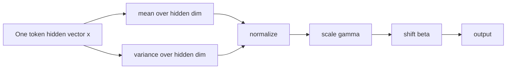
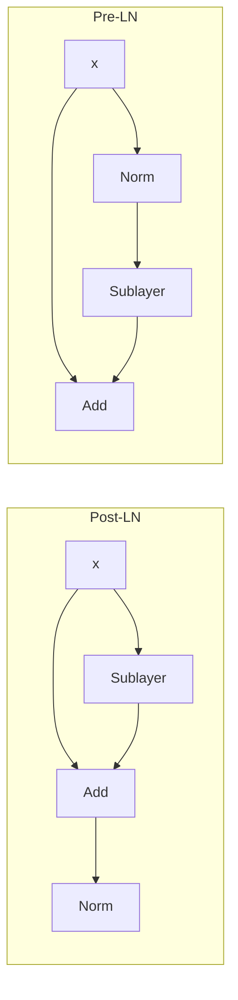

# Layer Norm 和 RMS Norm

## 面试定位

归一化层看起来只是一个小模块，但它决定了深层 Transformer 能不能稳定训练。面试常问：

- LayerNorm 和 BatchNorm 有什么区别？
- Pre-LN 为什么比 Post-LN 更适合深层 LLM？
- RMSNorm 相比 LayerNorm 少了什么，为什么还能工作？
- Norm 放在 attention/FFN 前后会影响什么？

一句话概括：

> LayerNorm/RMSNorm 的作用是稳定每个 token 隐状态的尺度，避免深层网络中激活和梯度不断漂移；现代 LLM 常用 Pre-Norm + RMSNorm。

## 为什么 Transformer 需要 Norm

Transformer block 中有多层矩阵乘、attention softmax、非线性激活和残差相加。如果不控制尺度：

- 激活值可能随层数变大或变小。
- softmax logits 可能过大导致梯度饱和。
- 残差路径和子层输出尺度不匹配。
- 深层模型训练容易不稳定。

Norm 的目标不是让表达能力更强，而是让优化更容易。

## LayerNorm 公式

对单个 token 的 hidden vector `x ∈ R^d`：

$$
\mu = \frac{1}{d}\sum_{i=1}^{d}x_i
$$

$$
\sigma^2 = \frac{1}{d}\sum_{i=1}^{d}(x_i-\mu)^2
$$

$$
\text{LayerNorm}(x)_i =
\gamma_i \frac{x_i-\mu}{\sqrt{\sigma^2+\epsilon}}+\beta_i
$$

其中：

- `μ`：当前 token 在 hidden 维度上的均值。
- `σ`：当前 token 在 hidden 维度上的标准差。
- `γ`：可学习缩放参数。
- `β`：可学习平移参数。
- `ε`：防止除零的小常数。

LayerNorm 是按 token 独立归一化，不依赖 batch 里的其他样本。



## LayerNorm vs BatchNorm

| 维度 | BatchNorm | LayerNorm |
|---|---|---|
| 统计范围 | batch 维度 | hidden 维度 |
| 是否依赖 batch size | 是 | 否 |
| 适合场景 | CNN、大 batch 训练 | NLP、变长序列、LLM |
| 推理统计 | 需要 running mean/var | 不需要 running stats |
| 对自回归生成 | 不方便 | 方便 |

LLM 不常用 BatchNorm 的原因：

- 文本序列长度可变。
- 自回归推理 batch 动态变化。
- 分布随 token 位置和上下文变化。
- 小 batch 或分布式训练下 BatchNorm 统计不稳定。

## Post-LN 与 Pre-LN

原始 Transformer 使用 Post-LN：

```text
x = LayerNorm(x + Sublayer(x))
```

现代深层 LLM 更常用 Pre-LN：

```text
x = x + Sublayer(LayerNorm(x))
```

对比：



为什么 Pre-LN 更稳定：

- 残差主路径更接近恒等映射，梯度可以直接从深层回传到浅层。
- 每个子层看到的输入先被归一化，输入尺度更稳定。
- 深层网络更容易训练，减少 warmup 和初始化敏感性。

Post-LN 的问题：

- 梯度必须穿过每层末尾的 Norm。
- 层数变深后更容易出现梯度不稳定。
- 训练深层大模型通常更难。

## RMSNorm 公式

RMSNorm 去掉均值中心化，只使用均方根缩放：

$$
\text{RMS}(x)=\sqrt{\frac{1}{d}\sum_{i=1}^{d}x_i^2+\epsilon}
$$

$$
\text{RMSNorm}(x)_i=\gamma_i\frac{x_i}{\text{RMS}(x)}
$$

它相比 LayerNorm 少了两步：

- 不减均值 `μ`。
- 通常没有 bias `β`。

## RMSNorm 为什么能工作

直觉：

- 在深层 Transformer 中，最关键的是控制向量尺度，而不是强制均值为 0。
- 残差连接、权重初始化和后续线性层可以吸收一部分均值偏移。
- RMSNorm 计算更少，训练和推理都更便宜。

RMSNorm 在 LLaMA、Qwen、DeepSeek 等模型中很常见。

| 方法 | 减均值 | 除标准差/RMS | 可学习 scale | 计算量 |
|---|---|---|---|---|
| LayerNorm | 是 | 标准差 | 是 | 较高 |
| RMSNorm | 否 | RMS | 是 | 较低 |

## Norm 与残差尺度

一个 Pre-Norm block：

$$
x_{l+1}=x_l+F(\text{Norm}(x_l))
$$

好处：

- 即使 `F` 一开始学得不好，模型也可以近似保留 `x_l`。
- 残差路径不被 Norm 破坏。
- 子层输入稳定，输出作为增量加回。

但 Pre-LN 也有潜在问题：

- 最终输出可能需要额外 final norm。
- 深层 residual stream 的尺度仍可能增长。
- 有些架构会引入 residual scaling 或初始化技巧控制尺度。

## 面试高频问题

1. **LayerNorm 是对哪个维度归一化？**  
   对每个 token 的 hidden dimension 做归一化，不跨 batch，也不跨 sequence token。

2. **为什么 LLM 不常用 BatchNorm？**  
   BatchNorm 依赖 batch 统计，文本变长和自回归推理下统计不稳定；LayerNorm/RMSNorm 更适合序列模型。

3. **Pre-LN 为什么更适合深层 Transformer？**  
   它保留残差主路径的梯度通道，并让每个子层输入尺度稳定。

4. **RMSNorm 比 LayerNorm 少了什么？**  
   少了均值中心化，通常也少了 bias，只用 RMS 控制尺度。

5. **Norm 的核心作用是提高表达能力吗？**  
   主要是优化稳定性和训练效率，不是单纯增加表达能力。

## 工程注意点

- 训练 loss 爆炸或梯度异常时，Norm 位置、epsilon、初始化都值得检查。
- 混合精度训练下 Norm 常需要注意数值稳定性。
- RMSNorm 更省计算，但不是所有旧模型都能直接替换。
- LoRA/SFT 时一般不训练 Norm 参数，除非做更强的 domain adaptation。

## 参考资料

- [Layer Normalization, Ba et al., 2016](https://arxiv.org/abs/1607.06450)
- [Root Mean Square Layer Normalization, Zhang and Sennrich, 2019](https://arxiv.org/abs/1910.07467)
- [Attention Is All You Need, Vaswani et al., 2017](https://arxiv.org/abs/1706.03762)
