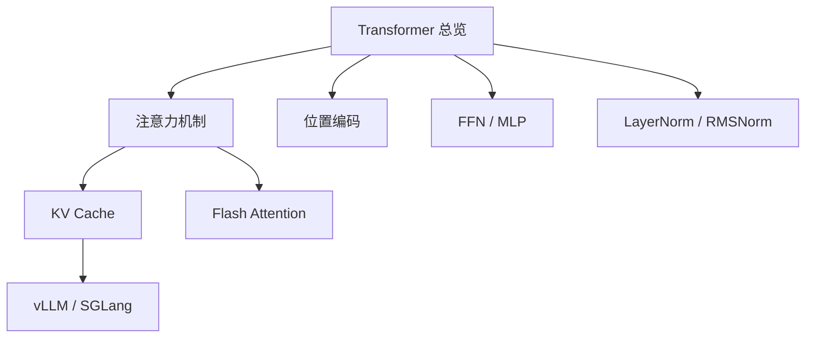
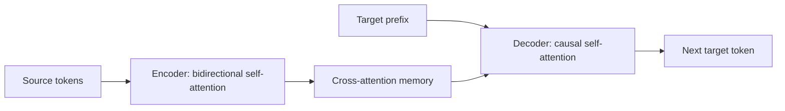
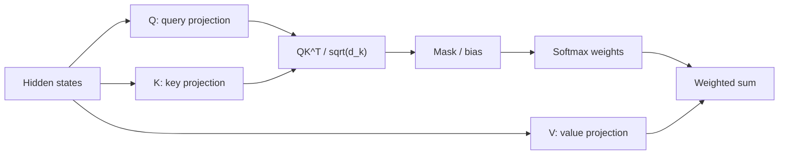
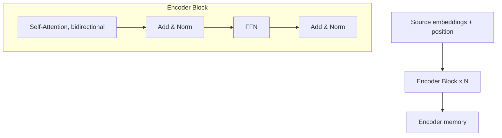
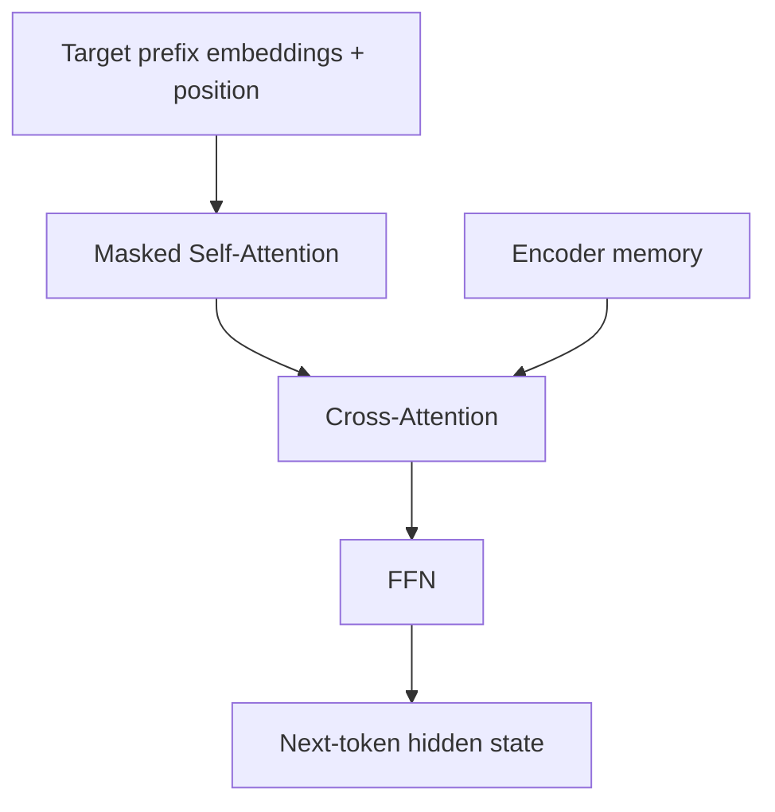
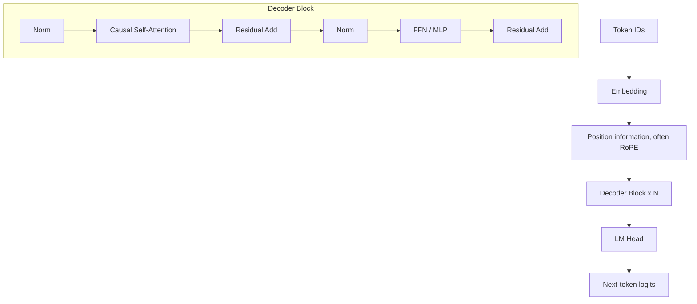

# Transformer 算法概述

## 面试定位

Transformer 是现代大语言模型的基础架构。面试里通常不会只问“Attention 公式是什么”，而是会沿着模块继续追问：

- 为什么 self-attention 能并行建模长距离依赖？
- Decoder-only 和 Encoder-Decoder 的区别是什么？
- MHA、MQA、GQA、MLA 分别解决什么问题？
- RoPE 为什么比绝对位置编码更适合 LLM？
- LayerNorm、RMSNorm、Pre-Norm 为什么能稳定深层训练？
- KV Cache、FlashAttention、PagedAttention 分别优化了哪一类瓶颈？

一句话概括：

> Transformer 用注意力完成跨 token 信息交互，用 FFN 做逐 token 非线性变换，用位置编码注入顺序信息，再通过残差和归一化稳定深层训练。

## 学习地图

当前目录已经把 Transformer 拆成几个模块。建议按下面顺序学习：



对应文件：

| 文件                               | 重点                                                |
| -------------------------------- | ------------------------------------------------- |
| `注意力机制（MHA、MQA、GQA、MLA）.md`      | Q/K/V、mask、多头、KV cache 压缩路线                       |
| `位置编码.md`                        | sinusoidal、learned、RoPE、ALiBi、长上下文外推              |
| `FFN.md`                         | MLP、GELU、SwiGLU、参数量和计算量                           |
| `Layer Norm 和 RMS Norm.md`       | Pre-LN、Post-LN、RMSNorm、训练稳定性                      |
| `../../大模型推理/KV Cache.md`        | prefill/decode、cache 形状、显存估算                      |
| `../../大模型推理/Flash Attention.md` | IO-aware attention、online softmax、显存优化            |
| `../../大模型推理/vLLM SGLang.md`     | PagedAttention、continuous batching、RadixAttention |

## 原始 Transformer 与现代 LLM

原始 Transformer 是 Encoder-Decoder 架构，最初用于机器翻译：



## QKV 机制总览

Q/K/V 是 attention 的三组线性投影。给定 hidden states `X`：

$$
Q=XW_Q,\quad K=XW_K,\quad V=XW_V
$$

attention 用 Q 和 K 算相关性，再用相关性加权聚合 V：

$$
\text{Attention}(Q,K,V)=
\text{softmax}\left(\frac{QK^T}{\sqrt{d_k}}+M\right)V
$$

直觉：

- **Query**：当前位置想找什么信息。
- **Key**：每个位置提供什么可匹配的索引。
- **Value**：真正被取走、被加权汇总的内容。



QKV 在不同 attention 里的来源不同：

| Attention 类型 | Q 来自哪里 | K/V 来自哪里 | 作用 |
|---|---|---|---|
| Encoder self-attention | Encoder 当前层输入 | Encoder 当前层输入 | 源序列内部双向交互 |
| Decoder masked self-attention | Decoder 当前层输入 | Decoder 当前层输入 | 目标前缀内部因果交互 |
| Encoder-Decoder cross-attention | Decoder hidden states | Encoder 输出 memory | Decoder 读取源序列信息 |
| Decoder-only causal self-attention | 当前 prompt/response 前缀 | 当前 prompt/response 前缀 | 统一建模上下文并预测下一个 token |

一个常见误区是把 Q/K/V 理解成三份输入。更准确地说，它们通常来自同一份 hidden states 的不同投影；只有 cross-attention 中，Q 来自 Decoder，K/V 来自 Encoder memory。

## Encoder / Decoder 的结构、位置和差别

原始 Transformer 的数据流是：

```text
source tokens -> Encoder stack -> encoder memory
target prefix -> Decoder stack -> LM/softmax head -> next target token
```

### Encoder 在哪里

Encoder 位于源序列输入侧，负责把 source tokens 编码成一组上下文表示，也就是 encoder memory。

Encoder block 的典型结构：



Encoder self-attention 是双向的：每个 source token 可以看到同一句子里的所有 source tokens。它适合理解、分类、抽取、embedding、rerank 等任务。

### Decoder 在哪里

Decoder 位于目标序列生成侧，负责根据已经生成的 target prefix 和 encoder memory 预测下一个 target token。

原始 Encoder-Decoder 里的 Decoder block：



Decoder 有三层核心子模块：

1. **Masked self-attention**：只能看目标序列的历史 token，不能看未来 token。
2. **Cross-attention**：用 Decoder hidden states 做 Q，用 Encoder memory 做 K/V，从源序列读取信息。
3. **FFN**：逐 token 做非线性特征变换。

### Encoder 和 Decoder 的核心差别

| 维度 | Encoder | Decoder |
|---|---|---|
| 所在位置 | 输入侧/source side | 输出侧/target side |
| 主要作用 | 理解和编码输入 | 自回归生成输出 |
| self-attention 可见性 | 双向可见 | 因果可见，只能看历史 |
| 是否有 cross-attention | 通常没有 | Encoder-Decoder 中有 |
| 训练目标 | 表征学习、mask prediction 或 seq2seq 编码 | next-token prediction |
| 典型模型 | BERT、Embedding/Rerank 模型 | GPT、LLaMA、Qwen、DeepSeek |

一句话记忆：

> Encoder 擅长“看完整输入并理解”，Decoder 擅长“看历史前缀并生成后续”。

现代通用大语言模型多数采用 Decoder-only 架构：



三类架构对比：

| 架构 | Attention 可见性 | 典型模型 | 典型任务 |
|---|---|---|---|
| Encoder-only | 双向可见 | BERT | 分类、抽取、rerank、embedding |
| Encoder-Decoder | Encoder 双向，Decoder 因果 | T5、原始 Transformer | 翻译、摘要、条件生成 |
| Decoder-only | 只能看历史 token | GPT、LLaMA、Qwen、DeepSeek | 对话、代码、Agent、通用生成 |

## Decoder-only Block 的数据流

现代 LLM 常用 Pre-Norm：

```text
x = x + Attention(Norm(x))
x = x + FFN(Norm(x))
```

它的核心直觉：

- `Norm` 控制输入尺度，让深层训练更稳。
- `Attention` 负责 token 之间的信息混合。
- `FFN` 负责每个 token 内部的非线性特征变换。
- `Residual` 让每层只需要学习增量，梯度也更容易穿过深层网络。

## 为什么 Decoder-only 成为当前主流

Decoder-only 并不是在所有任务上都绝对优于 Encoder 或 Encoder-Decoder，但它最适合“大规模通用生成模型”这条路线。

### 1. 训练目标极其统一

Decoder-only 只需要 next-token prediction：

$$
p(x)=\prod_{t=1}^{T}p(x_t|x_{<t})
$$

互联网上的文本、代码、对话、网页、论文都可以直接转成“预测下一个 token”的训练样本。相比需要构造 source-target 对的 seq2seq 训练，数据规模化更直接。

### 2. 任务都能转成 prompt continuation

很多任务可以统一写成：

```text
Prompt: 指令 + 上下文 + 示例 + 问题
Model: 继续生成答案
```

分类、抽取、问答、代码生成、工具调用、Agent 轨迹都可以变成“给定前缀，生成后续”。这让模型、训练目标和推理接口都保持统一。

### 3. 推理路径简单，适配 KV Cache

Decoder-only 只有 causal self-attention，没有 Encoder-Decoder 的 cross-attention 分支。在线推理时：

- prefill prompt。
- 缓存每层历史 K/V。
- decode 阶段逐 token 追加 K/V。

这条路径非常适合 vLLM、SGLang、TensorRT-LLM 等 serving 系统做高吞吐优化。

### 4. In-context learning 自然

Decoder-only 把 instruction、示例、检索内容、工具观察、历史对话都放进同一个上下文前缀中。模型通过 causal attention 在同一个序列里做条件生成，因此 few-shot、CoT、RAG、Agent 都能以 prompt 形式接入。

### 5. 规模化经验最成熟

当前最大规模的开源/闭源通用 LLM 多数沿 Decoder-only 路线发展，带来了成熟的：

- tokenizer/chat template。
- SFT 和偏好优化流程。
- KV Cache 和 serving 框架。
- LoRA/QLoRA 微调生态。
- Agent/RAG 应用接口。

也要注意边界：

- Encoder-only 仍然很适合 embedding、rerank、分类和抽取。
- Encoder-Decoder 仍然适合一些强条件生成或输入输出结构差异很大的任务。
- Decoder-only 主流，主要是因为通用生成和规模化训练/部署的综合收益最大。

## 自回归训练目标

Decoder-only LLM 通常使用 next-token prediction：

$$
\mathcal{L}_{\text{CE}}=
-\sum_{t=1}^{T}\log p_\theta(x_t \mid x_{<t})
$$

训练时可以并行计算所有位置的 logits，因为 causal mask 已经阻止第 `t` 个位置看到未来 token。推理时必须逐 token 生成，因为第 `t+1` 个 token 取决于第 `t` 个 token 的实际采样结果。

## 训练与推理的核心差异

| 阶段 | 输入 | 计算特点 | 关键瓶颈 |
|---|---|---|---|
| 训练 | 完整序列 | teacher forcing，可并行 | 激活显存、attention `O(T^2)` |
| Prefill | prompt 全量 token | 一次处理上下文 | attention 计算、长上下文 |
| Decode | 每次 1 个新 token | 依赖 KV Cache | KV Cache 显存、内存带宽、调度 |

因此推理优化通常分成两类：

- **算子优化**：FlashAttention、融合算子、量化 kernel。
- **系统优化**：KV Cache 管理、continuous batching、PagedAttention、prefix cache。

## 常见模块变体

| 模块           | 早期 Transformer                | 现代 LLM 常见选择                          |
| ------------ | ----------------------------- | ------------------------------------ |
| Norm         | Post-LayerNorm                | Pre-LN、RMSNorm                       |
| Activation   | ReLU                          | GELU、SwiGLU                          |
| Position     | sinusoidal / learned absolute | RoPE、ALiBi、RoPE scaling              |
| Attention    | MHA                           | MHA、MQA、GQA、MLA                      |
| Architecture | Encoder-Decoder               | Decoder-only                         |
| Inference    | 逐步重算                          | KV Cache、PagedAttention、prefix cache |

## 面试高频问题

1. **为什么 Transformer 比 RNN 更适合大规模训练？**  
   Self-attention 可并行处理所有 token，长距离依赖路径短；RNN 必须按时间步递推，并行性差。

2. **Q/K/V 分别是什么？**  
   Q 是当前位置的查询，K 是可匹配索引，V 是被聚合的内容；self-attention 中三者通常来自同一 hidden states 的不同投影，cross-attention 中 Q 来自 Decoder，K/V 来自 Encoder。

3. **Encoder 和 Decoder 最大差别是什么？**  
   Encoder 双向理解输入，Decoder 因果生成输出；Encoder-Decoder 里的 Decoder 还通过 cross-attention 读取 Encoder memory。

4. **为什么 Decoder-only 能统一很多任务？**  
   分类、抽取、问答、代码、工具调用都可以转成“给定前缀，预测后续文本”。

5. **为什么当前通用 LLM 多用 Decoder-only？**  
   next-token prediction 数据规模化最直接，任务可统一成 prompt continuation，推理路径简单且适配 KV Cache 和 serving 系统。

6. **Transformer block 里 attention 和 FFN 分工是什么？**  
   Attention 做跨 token 混合，FFN 做逐 token 非线性变换和容量存储。

7. **为什么推理要 KV Cache？**  
   自回归生成中历史 token 的 K/V 不变，缓存后每步只需计算新 token 并 attend 历史 K/V。

8. **FlashAttention 和 KV Cache 优化的是同一件事吗？**  
   不是。FlashAttention 优化 attention 算子的显存读写；KV Cache 避免 decode 阶段重复计算历史 K/V。

## 参考资料

- [Attention Is All You Need, Vaswani et al., 2017](https://arxiv.org/abs/1706.03762)
- [RoFormer: Enhanced Transformer with Rotary Position Embedding](https://arxiv.org/abs/2104.09864)
- [FlashAttention: Fast and Memory-Efficient Exact Attention with IO-Awareness](https://arxiv.org/abs/2205.14135)
