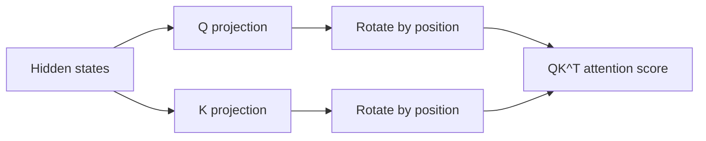

# 位置编码

## 面试定位

Self-attention 本身对 token 顺序不敏感。位置编码的作用是把“第几个 token、相距多远、相对顺序如何”注入模型。面试常问：

- 为什么 Transformer 必须加位置编码？
- 绝对位置编码、相对位置编码、RoPE、ALiBi 有什么区别？
- RoPE 为什么能表示相对位置？
- 长上下文扩展为什么经常围绕 RoPE 做文章？

一句话概括：

> 位置编码解决 self-attention 的顺序感知问题；现代 Decoder-only LLM 最常见的是 RoPE，因为它把位置信息注入 Q/K 点积，天然适合相对位置和自回归注意力。

## 为什么需要位置编码

Self-attention 的核心项是：

$$
\text{softmax}(QK^T)V
$$

如果没有位置编码，输入 token 的集合顺序不会被显式建模。比如：

```text
我 爱 你
你 爱 我
```

两句话的 token 集合相同，但语义完全不同。Transformer 必须通过某种方式知道 token 的位置。

## 绝对位置编码

最直接方式是：

$$
X = E_{\text{token}} + E_{\text{pos}}
$$

其中 `E_pos` 可以是可学习参数，也可以是固定函数。

### Sinusoidal Position Encoding

原始 Transformer 使用固定正余弦编码：

$$
PE_{(pos,2i)}=\sin\left(\frac{pos}{10000^{2i/d}}\right)
$$

$$
PE_{(pos,2i+1)}=\cos\left(\frac{pos}{10000^{2i/d}}\right)
$$

优点：

- 不增加可学习参数。
- 不同频率覆盖不同距离。
- 理论上可外推到比训练更长的位置。

缺点：

- 位置直接加到 embedding 上，和语义混合较早。
- 对现代超长上下文和自回归生成不是最优选择。

### Learned Absolute Position Embedding

可学习绝对位置编码：

$$
X_t = E[x_t] + P_t
$$

优点：

- 简单。
- 训练长度内效果好。

缺点：

- 对训练长度之外的位置外推弱。
- 位置表长度固定，扩展上下文需要额外处理。

## 相对位置编码

相对位置编码不只告诉模型“这是第几个 token”，而是告诉模型“两个 token 相距多远”。

注意力 logit 可以写成：

$$
\text{score}_{ij}=q_i^T k_j + b(i-j)
$$

其中 `b(i-j)` 是相对距离 bias。

相对位置更适合语言，因为很多语法和依赖关系与相对距离相关，而不是绝对下标。

## RoPE：Rotary Position Embedding

RoPE 不把位置向量加到 embedding 上，而是在计算 attention 前，对 Q/K 做位置相关旋转。

对二维向量，可以写成：

$$
R_\theta
\begin{bmatrix}
x_1 \\
x_2
\end{bmatrix}
=
\begin{bmatrix}
\cos\theta & -\sin\theta \\
\sin\theta & \cos\theta
\end{bmatrix}
\begin{bmatrix}
x_1 \\
x_2
\end{bmatrix}
$$

第 `pos` 个 token 的旋转角度与位置相关：

$$
\theta_{pos,i}=pos \cdot \omega_i
$$

其中不同维度对使用不同频率 `ω_i`。



## RoPE 为什么能表示相对位置

RoPE 的关键性质是：

$$
(R_m q)^T(R_n k)=q^T R_{n-m}k
$$

也就是说，位置 `m` 的 Q 和位置 `n` 的 K 做点积，结果只依赖相对位置 `n-m`。这让 attention score 自然包含相对距离信息。

面试表达：

> RoPE 把绝对位置编码成 Q/K 的旋转角，但 Q/K 点积时绝对角度会相互抵消，留下相对位置差。

## ALiBi

ALiBi（Attention with Linear Biases）直接在 attention score 上加一个与距离相关的线性偏置：

$$
\text{score}_{ij}=q_i^T k_j + m_h(i-j)
$$

其中 `m_h` 是每个 head 的斜率。

优点：

- 不需要显式位置 embedding。
- 外推到长上下文较自然。
- 实现简单。

缺点：

- 表达能力不如 RoPE 灵活。
- 现代主流开源 LLM 中 RoPE 更常见。

## RoPE 长上下文扩展

RoPE 在超出训练长度后会遇到频率外推问题。常见扩展方法：

| 方法 | 思路 |
|---|---|
| Position Interpolation | 把更长位置压缩映射到训练范围附近 |
| NTK-aware scaling | 调整 RoPE base，让低频维度支持更长距离 |
| YaRN | 结合插值、外推和温度缩放 |
| LongRoPE | 对不同频率维度做更细粒度缩放 |

工程上要区分：

- **可运行上下文长度**：模型和推理框架允许输入这么长。
- **有效上下文能力**：模型真的能在这么长距离内检索、推理、遵循指令。

## 位置编码对比

| 方法 | 注入位置 | 是否相对 | 长度外推 | 常见程度 |
|---|---|---|---|---|
| Sinusoidal | embedding 相加 | 弱相对性 | 一般 | 原始 Transformer |
| Learned absolute | embedding 相加 | 否 | 弱 | 早期 GPT/BERT |
| Relative bias | attention score | 是 | 较好 | T5 等 |
| RoPE | Q/K 旋转 | 是 | 可通过 scaling 扩展 | 现代 LLM 主流 |
| ALiBi | attention score bias | 是 | 较好 | 部分长上下文模型 |

## 面试高频问题

1. **为什么 attention 本身不懂顺序？**  
   如果不加入位置，self-attention 只看到 token 内容，交换 token 顺序不会显式改变位置关系。

2. **RoPE 和绝对位置编码最大区别是什么？**  
   绝对位置编码加在 embedding 上；RoPE 作用在 Q/K 上，让 attention score 直接带相对位置信息。

3. **RoPE 为什么适合 Decoder-only？**  
   自回归注意力主要比较当前 token 与历史 token 的相对距离，RoPE 的相对位置性质正好匹配。

4. **长上下文 scaling 是不是一定提升长文本能力？**  
   不一定。它让模型能处理更长位置，但有效检索和推理还依赖训练数据、架构和推理系统。

## 参考资料

- [Attention Is All You Need, Vaswani et al., 2017](https://arxiv.org/abs/1706.03762)
- [RoFormer: Enhanced Transformer with Rotary Position Embedding](https://arxiv.org/abs/2104.09864)
- [Train Short, Test Long: Attention with Linear Biases Enables Input Length Extrapolation](https://arxiv.org/abs/2108.12409)
