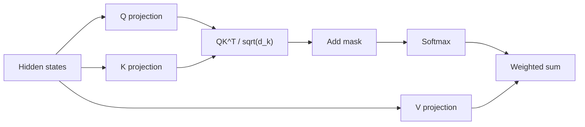
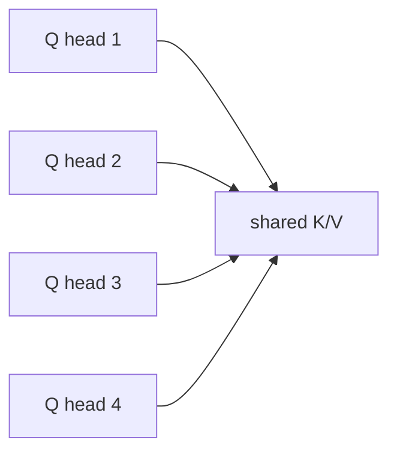
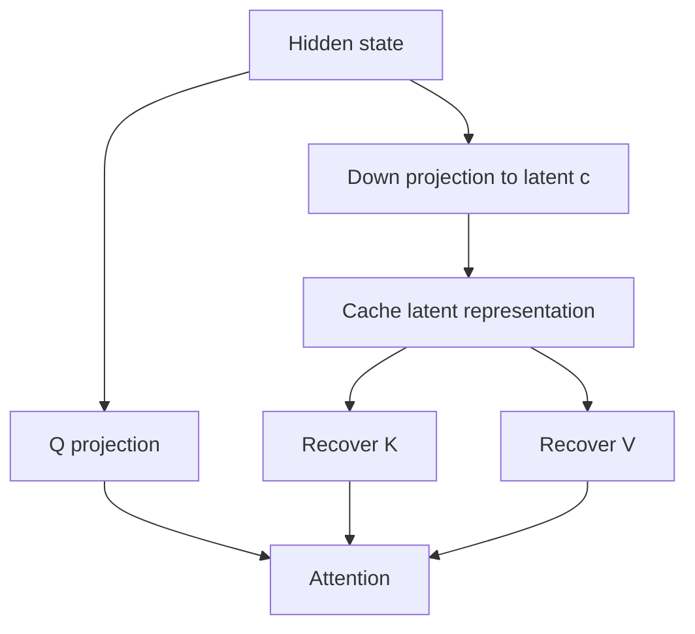

# 注意力机制（MHA、MQA、GQA、MLA）

## 面试定位

注意力机制是 Transformer 的核心，也是大模型推理优化的入口。面试常问：

- Q/K/V 分别是什么？
- 为什么要除以 `sqrt(d_k)`？
- causal mask 怎么保证自回归？
- MHA、MQA、GQA 如何影响 KV Cache？
- MLA 为什么能进一步压缩 KV Cache？

一句话概括：

> Attention 用 Q 和 K 计算 token 间相关性，再用相关性加权聚合 V；MHA/MQA/GQA/MLA 的主要差异在于 K/V 如何组织和缓存。

## Scaled Dot-Product Attention

给定输入 hidden states `X`：

$$
Q=XW_Q,\quad K=XW_K,\quad V=XW_V
$$

注意力计算：

$$
\text{Attention}(Q,K,V)=
\text{softmax}\left(\frac{QK^T}{\sqrt{d_k}}+M\right)V
$$

其中：

- `Q`：Query，当前位置想查询什么。
- `K`：Key，每个位置提供什么索引。
- `V`：Value，被聚合的内容。
- `M`：mask，例如 causal mask。



## 为什么除以 `sqrt(d_k)`

如果 `q` 和 `k` 的元素近似独立、均值为 0、方差为 1：

$$
\text{Var}(q^Tk)=d_k
$$

维度越大，点积 logit 的方差越大，softmax 越容易饱和。除以 `sqrt(d_k)` 后：

$$
\text{Var}\left(\frac{q^Tk}{\sqrt{d_k}}\right)\approx 1
$$

这样梯度更稳定。

## Mask 机制

Decoder-only LLM 使用 causal mask：

```text
token 1 can attend: 1
token 2 can attend: 1,2
token 3 can attend: 1,2,3
token 4 can attend: 1,2,3,4
```

矩阵形式：

```text
      K1 K2 K3 K4
Q1    ✓  x  x  x
Q2    ✓  ✓  x  x
Q3    ✓  ✓  ✓  x
Q4    ✓  ✓  ✓  ✓
```

这保证训练时第 `t` 个位置不能看到未来 token。

## Multi-Head Attention

MHA 把 hidden dimension 拆成多个 head：

$$
\text{head}_h=\text{Attention}(XW_h^Q,XW_h^K,XW_h^V)
$$

$$
\text{MHA}(X)=\text{Concat}(\text{head}_1,\ldots,\text{head}_H)W_O
$$

多头的价值：

- 不同 head 可以关注不同语义关系。
- 子空间维度更小，注意力分布更灵活。
- 输出拼接后再融合。

## MHA 的 KV Cache 成本

自回归 decode 时，每层要缓存历史 token 的 K/V。

MHA 中每个 attention head 都有自己的 K/V：

$$
\text{KV cache size} \propto
L \times T \times H_{kv} \times d_{head} \times 2
$$

其中：

- `L`：层数。
- `T`：序列长度。
- `H_kv`：K/V head 数。
- `d_head`：每个 head 维度。
- `2`：K 和 V 两份缓存。

当上下文很长或并发很多时，KV Cache 会成为推理显存瓶颈。

## MQA：Multi-Query Attention

MQA 让所有 Query heads 共享同一组 K/V：

| 项 | MHA | MQA |
|---|---:|---:|
| Q heads | 多个 | 多个 |
| K/V heads | 多个 | 1 |
| KV Cache | 大 | 小 |
| 质量 | 高 | 可能下降 |



优点：

- KV Cache 显著减少。
- decode 阶段内存带宽压力降低。

缺点：

- 所有 Q heads 共享同一组 K/V，表达能力可能受限。

## GQA：Grouped-Query Attention

GQA 是 MHA 和 MQA 的折中：多个 Q heads 共享一组 K/V heads。

例如 32 个 Q heads，8 个 KV heads，则每 4 个 Q heads 共享一个 K/V head。

| 项 | MHA | GQA | MQA |
|---|---:|---:|---:|
| Q heads | 32 | 32 | 32 |
| K/V heads | 32 | 8 | 1 |
| KV Cache | 最大 | 中等 | 最小 |
| 表达能力 | 强 | 折中 | 较弱 |

GQA 是现代 LLM 的常见选择，因为它在质量和推理成本之间比较平衡。

## MLA：Multi-Head Latent Attention

MLA 是 DeepSeek-V2 系列引入的注意力结构，目标是进一步压缩 KV Cache。

核心思路：

> 不直接缓存每个 head 的完整 K/V，而是把 K/V 压缩到低维 latent 表示，decode 时再通过投影恢复需要的 K/V 信息。

简化流程：



直觉：

- MQA/GQA 是减少 K/V head 数。
- MLA 是把 K/V 内容本身压缩到低维 latent。
- 目标都是减少 decode 阶段 KV Cache 显存和内存带宽。

## MHA、MQA、GQA、MLA 对比

| 方法  | 核心做法                  | KV Cache | 质量风险    | 典型场景           |
| --- | --------------------- | -------: | ------- | -------------- |
| MHA | 每个 Q head 独立 K/V      |       最大 | 最低      | 小模型、训练简单       |
| MQA | 所有 Q heads 共享 1 组 K/V |       最小 | 较高      | 极致推理效率         |
| GQA | 多个 Q heads 共享一组 K/V   |       中等 | 较低      | 现代 LLM 常见      |
| MLA | K/V 低秩 latent 压缩      |       更低 | 依赖设计和训练 | DeepSeek 类高效推理 |

## 与 KV Cache 的关系

这些 attention 变体的共同目标之一是降低 decode 阶段成本：

```text
MHA: cache all K/V heads
GQA: cache fewer K/V heads
MQA: cache one K/V head
MLA: cache compressed latent K/V
```

但它们不是无代价优化：

- KV Cache 越小，可能表达能力越受约束。
- 架构越复杂，训练和 kernel 实现越复杂。
- 是否划算取决于模型大小、上下文长度、并发和硬件。

## 面试高频问题

1. **Q/K/V 怎么理解？**  
   Q 是查询向量，K 是匹配索引，V 是被聚合的信息。

2. **MHA 为什么要多个 head？**  
   多个 head 可以在不同子空间学习不同注意力模式，避免单一 attention 分布表达不足。

3. **MQA/GQA 主要优化什么？**  
   主要减少 K/V head 数，从而减少 KV Cache 和 decode 内存带宽。

4. **MLA 和 GQA 的区别？**  
   GQA 减少 K/V head 数；MLA 把 K/V 压缩成 latent cache，路线更激进。

5. **Attention 的训练复杂度是多少？**  
   标准 full attention 对序列长度是 `O(T^2)`，因为要计算 `T x T` 的 attention score。

## 参考资料

- [Attention Is All You Need, Vaswani et al., 2017](https://arxiv.org/abs/1706.03762)
- [Fast Transformer Decoding: One Write-Head is All You Need](https://arxiv.org/abs/1911.02150)
- [GQA: Training Generalized Multi-Query Transformer Models from Multi-Head Checkpoints](https://arxiv.org/abs/2305.13245)
- [DeepSeek-V2: A Strong, Economical, and Efficient Mixture-of-Experts Language Model](https://arxiv.org/abs/2405.04434)
