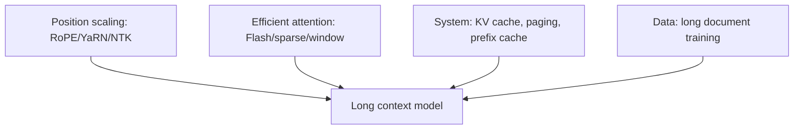

# 稀疏注意力和长上下文

## 面试定位

标准 full attention 对序列长度是 `O(T^2)`。长上下文模型要解决的问题是：如何在有限算力和显存下处理更长序列，并保持有效检索和推理能力。

一句话概括：

> 稀疏注意力通过限制 token 间连接减少计算；长上下文能力还依赖位置编码扩展、训练数据、KV Cache 管理和评估。

## Full Attention 的瓶颈

标准 attention score：

$$
S=QK^T
$$

若序列长度为 `T`，矩阵大小为：

$$
T \times T
$$

复杂度：

$$
O(T^2d)
$$

当 `T` 从 8K 增加到 128K，attention 计算和中间状态压力会急剧增加。

## 稀疏注意力模式

| 模式 | 思路 | 适合 |
|---|---|---|
| Sliding Window | 只看附近窗口 | 局部依赖 |
| Global Tokens | 少数全局 token 连接所有位置 | 文档摘要、分类 |
| Block Sparse | 按块保留部分连接 | 长文档 |
| Dilated Attention | 间隔采样远距离 token | 长距离稀疏依赖 |
| Retrieval Attention | 只 attend 检索出的关键块 | 超长上下文 |

示意：

```text
Full:    每个 token 看所有 token
Window:  每个 token 只看左右窗口
Global:  局部窗口 + 少数全局节点
```

## 稀疏注意力的代价

稀疏不是纯收益：

- 可能漏掉关键远距离信息。
- kernel 实现更复杂。
- 不同任务最优稀疏模式不同。
- 难以像 full attention 一样通用。

因此很多主流 LLM 仍使用 full attention + FlashAttention + RoPE scaling + KV Cache 优化，而不是完全稀疏化。

## 长上下文不等于有效上下文

要区分：

| 概念 | 含义 |
|---|---|
| 支持上下文长度 | 模型和系统能接受这么多 token |
| 有效上下文能力 | 模型能准确利用远距离信息 |
| 长上下文推理能力 | 模型能在长材料上多步推理 |

常见评估：

- needle-in-a-haystack。
- long document QA。
- multi-hop QA。
- repo-level code understanding。
- long conversation consistency。

## 长上下文技术栈



单独扩 RoPE 只能让模型“能跑更长位置”，不保证真的会用长上下文。

## 面试高频问题

1. **稀疏注意力主要省什么？**  
   省 attention 的 `T^2` 连接计算和中间存储。

2. **FlashAttention 是稀疏注意力吗？**  
   不是。FlashAttention 是精确 full attention 的 IO 优化。

3. **为什么长上下文能力不能只看 context window？**  
   模型可能能输入 128K，但远距离检索、推理和抗干扰能力未必足够。

4. **RoPE scaling 解决什么？**  
   解决位置编码外推问题，但还需要长文本训练和系统优化配合。

## 参考资料

- [Longformer](https://arxiv.org/abs/2004.05150)
- [Big Bird](https://arxiv.org/abs/2007.14062)
- [FlashAttention](https://arxiv.org/abs/2205.14135)
