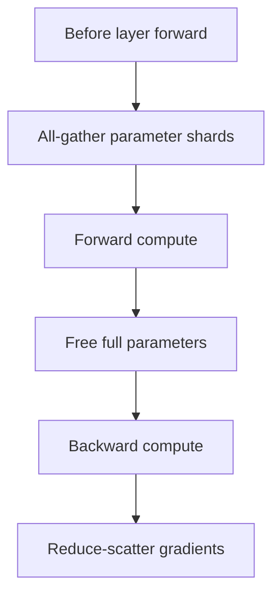

# FSDP ZeRO 和并行训练

## 面试定位

FSDP 和 ZeRO 是大模型训练中最常见的显存优化方案。面试不一定要求你实现，但要能说清它们分片了什么、解决了什么问题、代价是什么。

一句话概括：

> ZeRO/FSDP 通过把参数、梯度和优化器状态切分到多张 GPU 上，降低单卡显存占用；代价是更多通信和更复杂的 checkpoint/调度。

## 数据并行的瓶颈

普通 DDP：

- 每张卡都有完整模型参数。
- 每张卡处理不同 batch。
- 反向后 all-reduce 梯度。

问题：每张卡都存完整参数、梯度、优化器状态，模型大时显存撑不住。

## ZeRO 三阶段

| 阶段 | 分片内容 | 省显存 |
|---|---|---|
| ZeRO-1 | optimizer states | 中 |
| ZeRO-2 | optimizer states + gradients | 更高 |
| ZeRO-3 | optimizer states + gradients + parameters | 最高 |

ZeRO-3 中，每张 GPU 只持有一部分参数。需要计算某层时，再 all-gather 该层参数，计算后释放。

## FSDP

FSDP（Fully Sharded Data Parallel）与 ZeRO-3 思路接近：



核心：

- 参数分片。
- 前向前 all-gather。
- 反向后 reduce-scatter。
- 可结合 mixed precision、activation checkpointing、CPU offload。

## 其他并行方式

| 并行 | 切分对象 | 典型用途 |
|---|---|---|
| Data Parallel | batch | 最基础 |
| Tensor Parallel | 单层矩阵 | 大模型单层太大 |
| Pipeline Parallel | layer | 层数很多 |
| Sequence Parallel | sequence 维 | 长上下文 |
| Expert Parallel | MoE experts | MoE 模型 |
| Context Parallel | attention context | 超长上下文 |

真实训练常组合使用：

```text
DP + TP + PP + FSDP/ZeRO + activation checkpointing
```

## 通信与计算权衡

分片节省显存，但会增加通信：

- all-gather 参数。
- reduce-scatter 梯度。
- tensor parallel all-reduce。
- pipeline bubble。

优化目标不是“显存最小”，而是在显存、吞吐、稳定性之间平衡。

## Checkpoint 难点

FSDP/ZeRO 下参数是分片的，保存 checkpoint 有两种：

- sharded checkpoint：每张卡保存自己的 shard，恢复快但迁移复杂。
- full checkpoint：聚合成完整权重，方便部署但保存时显存/内存压力大。

训练系统必须处理：

- 自动保存。
- 断点恢复。
- rank 数变化。
- optimizer state 恢复。
- adapter/LoRA 权重导出。

## 面试高频问题

1. **DDP 和 FSDP 最大区别？**  
   DDP 每卡完整模型，只同步梯度；FSDP 把参数、梯度、优化器状态都分片。

2. **ZeRO-3 省显存的代价是什么？**  
   需要频繁 all-gather 参数和 reduce-scatter 梯度，通信开销更高。

3. **TP 和 FSDP 的区别？**  
   TP 切单层矩阵计算，FSDP 切参数存储；二者可组合。

4. **为什么 activation checkpointing 能省显存？**  
   不保存部分中间激活，反向时重算，用计算换显存。

## 参考资料

- [ZeRO: Memory Optimizations Toward Training Trillion Parameter Models](https://arxiv.org/abs/1910.02054)
- [PyTorch FSDP Documentation](https://pytorch.org/docs/stable/fsdp.html)
