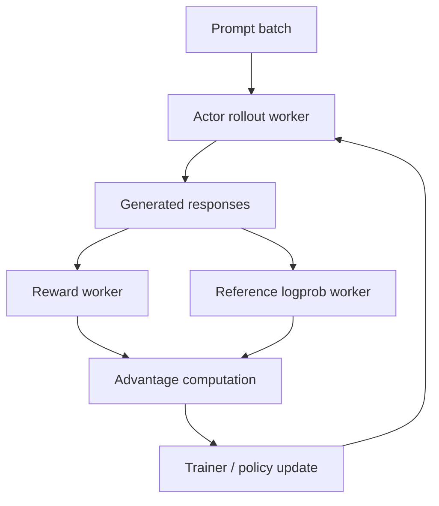

# veRL Ray 后训练系统

## 面试定位

veRL 是面向 LLM 后训练的 RL 框架，Ray 常用于调度分布式 worker。理解它们有助于把 PPO/GRPO/DAPO 从公式连接到真实训练系统。

一句话概括：

> LLM RL 后训练系统要把 actor rollout、reference logprob、reward、advantage、policy update 等步骤拆成分布式 worker，并在 GPU 集群中高效调度。

## 后训练系统数据流



PPO 还可能包含 critic worker；GRPO/DAPO 通常不需要 critic。

## 为什么需要专门框架

LLM RL 比普通 SFT 复杂：

- 训练中要不断生成新样本。
- rollout 是推理负载，update 是训练负载。
- actor/ref/reward/critic 资源需求不同。
- 需要在不同并行策略之间切换。
- reward 可能来自规则、模型、外部环境或工具。

## Ray 的角色

Ray 提供分布式任务和 actor 抽象：

| 概念 | 作用 |
|---|---|
| Ray Actor | 长生命周期 worker，例如 rollout worker |
| Object Store | 分布式对象存储 |
| Placement Group | 控制 GPU/CPU 资源放置 |
| Task | 一次性远程函数 |

在 LLM RL 中，Ray 常用于组织：

- rollout workers。
- reward workers。
- trainer workers。
- evaluation workers。

## veRL 关注点

veRL/HybridFlow 强调把 RL 数据流拆成可组合模块：

```text
generate_sequences
compute_log_probs
compute_rewards
compute_advantages
update_actor
update_critic
```

这样可以支持：

- PPO。
- GRPO。
- DPO 类训练。
- DAPO 等 reasoning RL。
- 多种模型并行后端。

## Rollout Engine 与 Trainer

常见组合：

| 模块 | 常见后端 |
|---|---|
| rollout | vLLM / SGLang / HF generate |
| training | FSDP / Megatron / DeepSpeed |
| reward | rule-based / reward model / external env |
| orchestration | Ray |

难点是权重同步：

```text
trainer 更新 actor 权重
-> rollout engine 需要加载或同步新权重
-> 下一轮 rollout 使用最新 policy
```

## DataProto / batch 数据

RL 后训练 batch 通常不只是 `input_ids`，还包含：

- prompts。
- responses。
- attention_mask。
- position_ids。
- old_log_probs。
- ref_log_probs。
- rewards。
- advantages。
- loss masks。
- metadata。

一个可靠的数据协议能减少 worker 间字段混乱。

## 系统失败模式

| 问题          | 表现          | 处理                                 |
| ----------- | ----------- | ---------------------------------- |
| rollout 慢   | trainer 等数据 | 增加 rollout 并行、vLLM/SGLang          |
| reward 慢    | 队列堆积        | reward 并行、规则优化、缓存                  |
| 权重同步慢       | GPU 空转      | 增量同步、合理更新频率                        |
| logprob 不一致 | ratio 异常    | 保证 tokenizer/template/precision 一致 |
| worker OOM  | 某类 worker 崩 | 单独调资源和 batch                       |

## 面试高频问题

1. **为什么 RL 后训练需要 rollout worker？**  
   因为训练数据由当前策略在线生成，不像 SFT 只读静态数据集。

2. **Ray 在这里解决什么问题？**  
   管理分布式 worker、资源放置、对象传输和任务调度。

3. **为什么 rollout 和 training 常用不同后端？**  
   rollout 追求推理吞吐，training 追求反向传播和参数分片效率。

4. **权重同步为什么重要？**  
   rollout 必须使用接近当前 policy 的权重，否则 on-policy 假设被破坏，importance ratio 变不稳定。

## 参考资料

- [veRL GitHub](https://github.com/verl-project/verl)
- [Ray Documentation](https://docs.ray.io/)
- [Proximal Policy Optimization Algorithms](https://arxiv.org/abs/1707.06347)
