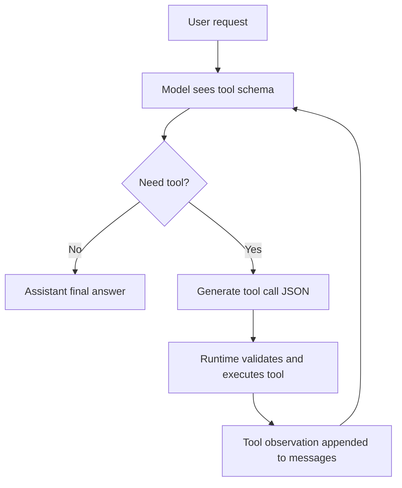

# Chat Template 和 Tool Calling

## 面试定位

Chat template 是大模型应用算法中很容易被忽略的工程细节。SFT、DPO、工具调用、Agent 训练如果模板不一致，模型效果会明显变差。

一句话概括：

> Chat template 把 system/user/assistant/tool 等结构化消息序列化成模型能训练和生成的 token 序列；Tool Calling 则是在这个序列里加入可解析的函数调用协议。

## 为什么需要 Chat Template

原始 LLM 只会做 next-token prediction。对话模型需要把多轮消息转成一段文本：

```json
[
  {"role": "system", "content": "你是一个严谨的助手。"},
  {"role": "user", "content": "解释一下 KV Cache。"},
  {"role": "assistant", "content": "KV Cache 是..."}
]
```

序列化后可能变成：

```text
<|system|>
你是一个严谨的助手。
<|user|>
解释一下 KV Cache。
<|assistant|>
KV Cache 是...
```

模型真正看到的是 token 序列，而不是 JSON 对象。

## Template 不一致的风险

| 问题 | 表现 |
|---|---|
| role token 错 | 模型复读用户、角色混乱 |
| EOS 错 | 输出不停或过早停止 |
| 训练/推理模板不一致 | 线下 loss 降，线上效果差 |
| tool schema 混乱 | 函数名/参数生成不稳定 |
| assistant loss mask 错 | 模型学习生成 user/system 内容 |

SFT 时通常只对 assistant 部分计算 loss：

$$
\mathcal{L}=-\sum_{t\in \text{assistant tokens}}\log p_\theta(y_t|x,y_{<t})
$$

## Tool Calling 协议

Tool calling 的核心是让模型输出结构化动作：

```json
{
  "name": "search_docs",
  "arguments": {
    "query": "KV Cache 显存估算",
    "top_k": 5
  }
}
```

执行流程：



## Tool Schema 设计原则

好的工具 schema：

- 工具名清晰。
- 参数结构化。
- description 写清适用边界。
- 返回值包含状态、结果、错误信息。
- 高风险工具需要权限控制和人工确认。

反例：

```json
{"name": "do_anything", "parameters": {"input": "string"}}
```

更好的例子：

```json
{
  "name": "search_docs",
  "description": "在内部知识库中检索相关文档片段",
  "parameters": {
    "query": "string",
    "top_k": "integer",
    "filters": {"source": "string"}
  }
}
```

## 与 Agent 的关系

Agent 可以看成循环版 tool calling：

```text
model -> tool call -> observation -> model -> tool call -> ... -> final
```

因此 Agent 质量很大程度取决于：

- 工具描述是否清晰。
- observation 是否可靠。
- 模型是否能区分推理文本和动作 JSON。
- 运行时是否验证参数和权限。

## 面试高频问题

1. **Chat template 是训练时还是推理时用？**  
   两者都用，而且必须一致。

2. **为什么 SFT 只算 assistant loss？**  
   因为我们希望模型学习生成助手回答，而不是学习复读 system/user。

3. **Tool calling 和普通文本生成有什么区别？**  
   Tool calling 要生成可解析、可校验的结构化动作，运行时会执行并把观察结果放回上下文。

4. **工具调用不稳定怎么排查？**  
   检查 schema、模板、训练数据、JSON 约束、参数校验和工具 observation。

## 参考资料

- [Hugging Face Chat Templates](https://huggingface.co/docs/transformers/chat_templating)
- [OpenAI Function Calling Guide](https://platform.openai.com/docs/guides/function-calling)
