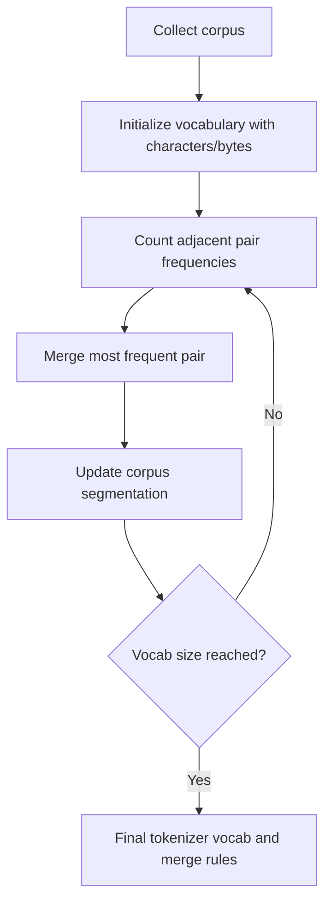

# Tokenizer 和 BPE

## 面试定位

Tokenizer 是文本进入大模型的第一关。很多模型效果问题、上下文长度问题、中文/代码表现问题，都和 tokenization 有关。

一句话概括：

> Tokenizer 把原始文本切成 token id；BPE 通过从字符/字节开始逐步合并高频片段，在词表大小和表达效率之间折中。

## 为什么不能直接按字切或按词切

按字符切：

- 词表小。
- 序列很长，训练和推理成本高。
- 英文词、代码标识符会被拆得很碎。

按词切：

- 词表巨大。
- 未登录词严重。
- 多语言和代码场景很难维护。

Subword tokenization 折中：

- 常见词可以作为整体 token。
- 罕见词可以拆成子词。
- OOV 问题较少。

## BPE 基本流程

BPE（Byte Pair Encoding）训练流程：



例子：

```text
low lower lowest
初始: l o w   l o w e r   l o w e s t
高频合并: l+o -> lo
继续合并: lo+w -> low
最终可能得到: low, er, est 等 token
```

## Byte-level BPE

很多 GPT 类 tokenizer 使用 byte-level BPE：

- 初始单位是 byte，而不是 Unicode 字符。
- 任意文本都能表示，不容易 OOV。
- 多语言、emoji、特殊符号、代码更稳。

代价：

- 某些语言可能 token 效率较低。
- 同一字符在不同编码/空格上下文下可能切法不同。

## Tokenization 对模型的影响

| 影响 | 解释 |
|---|---|
| 上下文长度 | 同一段文本切出的 token 越多，可用上下文越少 |
| 成本 | API 和推理通常按 token 计费或受 token 限制 |
| 多语言能力 | 中文、日文、代码切分效率影响训练信号 |
| 格式稳定性 | JSON、代码缩进、特殊符号切分影响输出 |
| 对齐数据 | chat template 和 special tokens 会影响训练/推理一致性 |

## Special Tokens

常见 special tokens：

| token | 作用 |
|---|---|
| BOS | 序列开始 |
| EOS | 序列结束 |
| PAD | batch 对齐 |
| UNK | 未知 token，现代 byte-level tokenizer 较少依赖 |
| role tokens | system/user/assistant/tool 分隔 |
| tool tokens | 函数调用、工具结果边界 |

特殊 token 必须和模型训练时的 chat template 一致，否则模型可能：

- 不知道何时停止。
- 混淆 user 和 assistant。
- 工具调用格式不稳定。
- 多轮对话角色错乱。

## Tokenizer 与上下文窗口

模型标称支持 `N` tokens，不等于支持 `N` 字。不同语言 token/字符比差异很大：

```text
English: token 通常接近词或子词
中文: 可能 1 个汉字 1 个 token，也可能多字合并
代码: 标识符、空格、符号切分影响很大
```

应用中要做 token 预算：

```text
system prompt
+ user question
+ retrieved documents
+ tool descriptions
+ conversation history
+ reserved output tokens
<= context window
```

## 面试高频问题

1. **BPE 解决什么问题？**  
   在字符级和词级之间折中，减少 OOV，同时控制词表大小和序列长度。

2. **为什么 tokenizer 会影响中文或代码效果？**  
   切分效率影响同样上下文窗口能容纳的信息量，也影响训练时模型看到的模式粒度。

3. **为什么 chat 模型不能随便换 tokenizer？**  
   embedding、lm head、special tokens 和训练模板都与 tokenizer 绑定。

4. **Tokenizer 和成本有什么关系？**  
   训练、推理、API 计费和上下文窗口通常都以 token 为单位。

## 参考资料

- [Neural Machine Translation of Rare Words with Subword Units](https://arxiv.org/abs/1508.07909)
- [Language Models are Unsupervised Multitask Learners, GPT-2](https://cdn.openai.com/better-language-models/language_models_are_unsupervised_multitask_learners.pdf)
