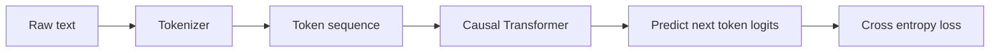

# Causal LM Objective 和数据工程

## 面试定位

预训练回答的是：基座模型能力从哪里来。应用算法岗不一定要训练千亿模型，但需要理解 next-token objective、数据质量、token budget 和训练稳定性。

一句话概括：

> Causal LM 通过预测下一个 token 从大规模文本中学习语言、知识、推理和代码模式；预训练效果由数据、模型、算力、优化稳定性共同决定。

## Causal LM Objective

Decoder-only LLM 的训练目标：

$$
p_\theta(x)=\prod_{t=1}^{T}p_\theta(x_t|x_{<t})
$$

损失函数：

$$
\mathcal{L}_{\text{CE}}=
-\sum_{t=1}^{T}\log p_\theta(x_t|x_{<t})
$$

训练时使用 causal mask，保证第 `t` 个位置不能看到未来 token。



## 为什么 next-token prediction 能学到很多能力

预测下一个 token 看似简单，但大规模数据中包含：

- 事实知识。
- 语法和语义。
- 代码结构。
- 数学推导。
- 对话模式。
- 文档格式。
- 隐式任务示例。

为了降低 next-token loss，模型需要学习这些统计规律和抽象结构。

## 数据工程

预训练数据常见来源：

| 来源 | 价值 | 风险 |
|---|---|---|
| Web 文本 | 覆盖广 | 噪声、重复、低质 |
| 书籍/论文 | 长文本、高质量 | 版权、领域偏 |
| 代码 | 推理和工具能力 | license、重复模板 |
| 数学/题库 | 推理能力 | 格式单一 |
| 多语言数据 | 多语言能力 | 语种比例难调 |
| 合成数据 | 可控补足 | 模型自举偏差 |

核心处理：

```text
爬取/收集 -> 语言识别 -> 质量过滤 -> 去重 -> 安全过滤
-> 数据混合 -> tokenization -> packing -> 训练
```

## 去重为什么重要

重复数据会导致：

- 训练 token 浪费。
- benchmark 泄漏。
- 记忆化增强。
- loss 看似下降但泛化差。

去重粒度：

- exact duplicate。
- near duplicate。
- document-level。
- span-level。
- benchmark contamination check。

## Data Mixture

不同数据比例会塑造不同能力：

```text
更多代码 -> 代码和结构化推理更强
更多数学 -> 推理任务更强
更多高质量指令/对话 -> 后训练前的可用性更好
更多多语言 -> 多语言能力更好
```

Data mixture 不是越多越好，而是资源预算下的取舍。

## Token Budget

预训练常按 token 数规划：

$$
\text{training tokens} = \text{batch tokens} \times \text{training steps}
$$

需要平衡：

- 模型参数量。
- 数据 token 数。
- 训练 FLOPs。
- 数据质量。
- 训练轮数和重复率。

## 训练稳定性

常见稳定性手段：

- learning rate warmup。
- cosine decay。
- gradient clipping。
- AdamW 或其他优化器。
- loss spike 监控。
- checkpoint 和 resume。
- mixed precision loss scaling。
- 数据异常过滤。

训练中要监控：

- train/validation loss。
- gradient norm。
- learning rate。
- tokens/sec。
- MFU。
- loss spike。
- 数据域分布。

## 面试高频问题

1. **预训练和 SFT 的区别？**  
   预训练学习通用语言和知识能力；SFT 用指令数据塑造助手行为和任务格式。

2. **为什么数据质量很重要？**  
   模型会学习数据中的模式，低质、重复、污染数据会直接影响能力和评测可信度。

3. **为什么 causal LM 可以并行训练？**  
   虽然目标是自回归，但训练时已知完整序列，用 causal mask 同时计算所有位置的 next-token loss。

4. **什么是 benchmark contamination？**  
   评测集或高度相似内容进入训练数据，导致评测分数虚高。

## 参考资料

- [Language Models are Few-Shot Learners, GPT-3](https://arxiv.org/abs/2005.14165)
- [Training Compute-Optimal Large Language Models, Chinchilla](https://arxiv.org/abs/2203.15556)
